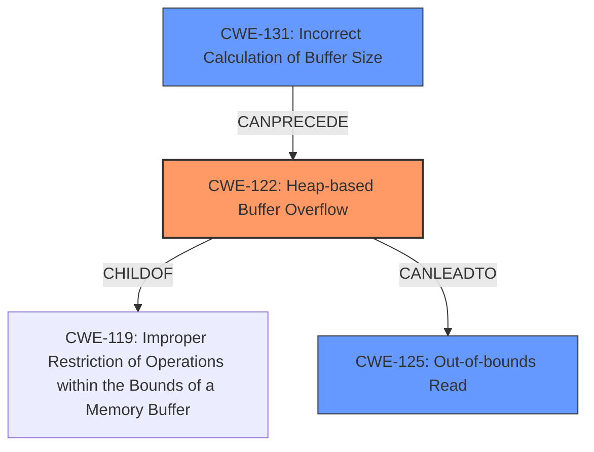

# Final Resolution for CVE-2022-1270

# Summary
| CWE ID | CWE Name | Confidence | CWE Abstraction Level | CWE Vulnerability Mapping Label | CWE-Vulnerability Mapping Notes |
|---|---|---|---|---|---|
| CWE-122 | Heap-based Buffer Overflow | 0.95 | Variant | Allowed | Primary CWE |
| CWE-125 | Out-of-bounds Read | 0.65 | Base | Allowed | Secondary Candidate |
| CWE-131 | Incorrect Calculation of Buffer Size | 0.60 | Base | Allowed | Secondary Candidate |

## Evidence and Confidence

*   **Confidence Score:** 0.92
*   **Evidence Strength:** HIGH

## Relationship Analysis
The primary CWE, CWE-122 (**CWE-122: Heap-based Buffer Overflow**), is a variant of a buffer overflow, specifically occurring on the heap. It is related to the base class CWE-119 (**CWE-119: Improper Restriction of Operations within the Bounds of a Memory Buffer**). CWE-125 (**CWE-125: Out-of-bounds Read**) can result from the overflow described by CWE-122. CWE-131 (**CWE-131: Incorrect Calculation of Buffer Size**) can precede CWE-122 by causing an undersized buffer to be allocated on the heap, which is then overflowed. All CWEs are at acceptable levels of abstraction.

## Vulnerability Chain
The vulnerability chain starts with **CWE-131 (Incorrect Calculation of Buffer Size)**, where the buffer size for an image is incorrectly calculated based on header data from a malformed MIFF file. This leads to **CWE-122 (Heap-based Buffer Overflow)**, where the program attempts to write more data to the heap buffer than allocated. The overflow may then result in **CWE-125 (Out-of-bounds Read)** if the code attempts to access memory beyond the allocated buffer.

## Summary of Analysis
The initial analysis and criticism both align well, accurately identifying **CWE-122 (Heap-based Buffer Overflow)** as the primary weakness. The supporting CWEs, **CWE-125 (Out-of-bounds Read)** and **CWE-131 (Incorrect Calculation of Buffer Size)**, are also valid contributing factors. The evidence provided in the vulnerability description clearly points to a heap buffer overflow when parsing MIFF files: "In GraphicsMagick, a heap buffer overflow was found when parsing MIFF."

The relationship analysis confirms the hierarchical and chain relationships between the selected CWEs. **CWE-131 (Incorrect Calculation of Buffer Size)** can lead to **CWE-122 (Heap-based Buffer Overflow)**, which in turn can result in **CWE-125 (Out-of-bounds Read)**. These relationships support the classification decisions.

The chosen CWEs are at an appropriate level of specificity. **CWE-122 (Heap-based Buffer Overflow)** is a variant that accurately describes the type of buffer overflow. **CWE-125 (Out-of-bounds Read)** and **CWE-131 (Incorrect Calculation of Buffer Size)** are base-level CWEs that describe contributing factors to the vulnerability.