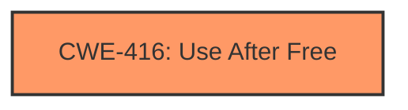

# Final Resolution for CVE-2022-1305

# Summary
| CWE ID | CWE Name | Confidence | CWE Abstraction Level | CWE Vulnerability Mapping Label | CWE-Vulnerability Mapping Notes |
|---|---|---|---|---|---|
| CWE-416 | Use After Free | 1.0 | Variant | Allowed | Primary CWE |

## Evidence and Confidence

*   **Confidence Score:** 1.0
*   **Evidence Strength:** HIGH

## Relationship Analysis
The analysis focuses on the primary weakness, **CWE-416 (Use After Free)**. While other CWEs like **CWE-787 (Out-of-bounds Write)** could potentially arise as secondary consequences due to heap corruption, **CWE-416** directly addresses the vulnerability's root cause as stated in the description. There were no direct relationships found in the provided information that would influence the classification. The variant level of abstraction is appropriate given the specificity of the vulnerability.

## Vulnerability Chain
The vulnerability chain is straightforward: the **root cause** is a "**use after free**" (CWE-416), leading to heap corruption, which is the impact.

## Summary of Analysis
The initial analysis and criticism both agree that **CWE-416 (Use After Free)** is the most accurate representation of the vulnerability. The vulnerability description explicitly states "Use after free," and the **CWE-416** description aligns perfectly: "The product reuses or references memory after it has been freed." The high confidence is justified due to the direct match.

The analysis is based on the provided evidence from the vulnerability description, which is sufficient to make a clear determination.

The selected CWE is at the optimal level of specificity (Variant) because it directly describes the specific type of memory management error.