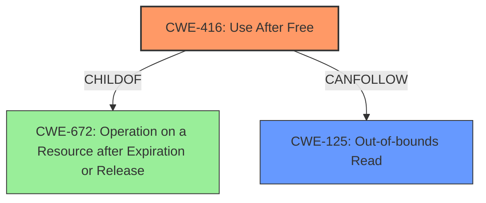

# Analysis Report for CVE-2022-1310

# Vulnerability Analysis Report: CVE-2022-1310

## Description

Use after free in regular expressions in Google Chrome prior to 100.0.4896.88 allowed a remote attacker to potentially exploit heap corruption via a crafted HTML page.

## Vulnerability Description Key Phrases

**Rootcause:** Use after free
**Impact:** heap corruption
**Vector:** crafted HTML page
**Attacker:** remote attacker
**Product:** Google Chrome
**Version:** prior to 100.0.4896.88
**Component:** regular expressions

## Analysis (with Relationship Data)

# Summary
| CWE ID | CWE Name | Confidence | CWE Abstraction Level | CWE Vulnerability Mapping Label | CWE-Vulnerability Mapping Notes |
|---|---|---|---|---|---|
| CWE-416 | Use After Free | 0.95 | Variant | Allowed | Primary CWE |
| CWE-125 | Out-of-bounds Read | 0.6 | Base | Allowed | Secondary Candidate |

## Evidence and Confidence

*   **Confidence Score:** 0.9
*   **Evidence Strength:** HIGH

- **Analysis and Justification:**  
  - *Explanation:* The vulnerability description explicitly states "**Use after free** in regular expressions" which directly aligns with the description of CWE-416, "Use After Free". The CVE Reference Links Content Summary reiterates this, stating "root_cause: Use after free in regular expressions." and lists "Use after free" as a weakness. The vulnerability occurs in the handling of regular expressions in Google Chrome, and a crafted HTML page can trigger it, leading to heap corruption. CWE-416 is a Variant level CWE, which is the preferred level of abstraction. The Retriever Results also identify CWE-416 as the top match with a high score, further supporting this classification. The MITRE mapping guidance for CWE-416 indicates it is ALLOWED, reinforcing its appropriateness. The "**Use after free**" leads to memory corruption. Since the UAF occurs in regular expressions, there is a chance that the UAF can trigger an out-of-bounds read.
  
  - *Relationship Analysis:* CWE-416 is a variant of CWE-672 (Operation on a Resource after Expiration or Release). There are no specific CanPrecede or CanFollow relationships that directly influence this mapping.

- **Confidence Score:**  
  - Confidence: 0.95 (Strong evidence from the vulnerability description, CVE reference, and Retriever results)

---
- **Analysis and Justification:**  
  - *Explanation:* While the primary weakness is **use after free**, the exploitation via regular expressions and crafted HTML implies the possibility of reading memory outside the intended buffer. The vulnerability summary indicates a crafted HTML page leads to heap corruption, which sometimes results in reading data past the end of the buffer. CWE-125 "Out-of-bounds Read" is a Base level CWE and is ALLOWED. While not explicitly stated, it is a reasonable secondary candidate.
  
  - *Relationship Analysis:* There is a potential for CWE-416 (Use After Free) to lead to CWE-125 (Out-of-bounds Read).

- **Confidence Score:**  
  - Confidence: 0.6 (Low confidence since this is an indirect consequence. The description focuses on Use-After-Free.)

## Criticism of Analysis

Okay, let's review the provided analysis in light of the full CWE specifications.

**Overall Assessment:**

The analysis is generally good and well-reasoned. The primary mapping to CWE-416 (Use After Free) is accurate and strongly supported by the provided information. The secondary consideration of CWE-125 (Out-of-bounds Read) is also reasonable, although the confidence level is appropriately lower.  The explanations are clear, and the use of examples and relationships within the CWE framework demonstrates a good understanding of the concepts.

Here's a more detailed critique:

**1. CWE-416: Use After Free**

*   **Confidence Score:** 0.95 - Justified. The vulnerability description and CVE summary explicitly mention "Use after free," making this a direct and highly confident mapping.

*   **Abstraction Level:** Correctly identified as Variant. CWE-416 is a Variant-level CWE, which is the preferred level of abstraction according to the CWE Mapping Guidance ("*Rationale: This CWE entry is at the Variant level of abstraction, which is a preferred level of abstraction for mapping to the root causes of vulnerabilities.*").

*   **CWE Mapping Notes:** No issues. The chosen mapping is ALLOWED "*Rationale: This CWE entry is at the Variant level of abstraction, which is a preferred level of abstraction for mapping to the root causes of vulnerabilities.*"

*   **Mitigations:** The analysis doesn't explicitly discuss mitigations, but it could be strengthened by mentioning some potential defenses.  Based on the CWE-416 specifications, appropriate mitigations could include:

    *   **Language Selection:** Choosing a language with automatic memory management (e.g., Java, Go).
    *   **Setting Pointers to NULL:**  Setting freed pointers to NULL to prevent accidental reuse (though the spec correctly notes limitations of this approach).  This aligns with the "Attack Surface Reduction" strategy.

*   **Relationships:** The analysis mentions CWE-672 (Operation on a Resource after Expiration or Release), which is a parent of CWE-416. This is a correct and relevant observation that demonstrates understanding of the broader CWE hierarchy.

**2. CWE-125: Out-of-bounds Read**

*   **Confidence Score:** 0.6 - Appropriate. The reasoning for considering CWE-125 is plausible, but the connection is less direct than CWE-416.  The UAF *could* lead to an OOB read during exploitation, but it's not guaranteed.

*   **Abstraction Level:**  The analysis is correct in identifying CWE-125 as a Base level CWE. The Mapping guidance also states the CWE is ALLOWED.

*   **CWE Mapping Notes:** The Mapping guidance in the CWE specification highlights "*Rationale: This CWE entry is at the Base level of abstraction, which is a preferred level of abstraction for mapping to the root causes of vulnerabilities.*"

*   **Mitigations:** Again, the analysis could be strengthened by mentioning potential mitigations. Given that an OOB read *might* occur, relevant mitigations from the CWE-125 specification could include:

    *   **Input Validation:** Strict input validation to ensure that length arguments and offsets are within acceptable bounds. This addresses the "Input Validation" strategy.
    *   **Language Selection:** Using languages or libraries with built-in bounds checking.

*   **Relationships:** The analysis correctly points out that CWE-416 can *lead* to CWE-125. This is a valid "CanFollow" relationship.

**3. Retriever Results:**

*   The Retriever Results are generally consistent with the analysis. CWE-416 is ranked highest, which supports the primary mapping. The presence of other memory-related CWEs (e.g., CWE-415, CWE-122) suggests that the memory corruption aspect of the vulnerability is well-captured.

**Suggestions for Improvement:**

*   **Explicitly Discuss Mitigations:**  For both CWE-416 and CWE-125, the analysis would be more comprehensive by explicitly mentioning potential mitigations as outlined in the CWE specifications. Even a brief discussion of relevant preventative measures strengthens the overall assessment.

*   **Consider a Potential Chain:** Although the primary mapping is to CWE-416, the vulnerability's context suggests a *potential chain* involving improper input handling. The HTML page is "crafted," implying a potential weakness in how the regular expression engine handles specifically malicious input. It would be useful to explore if any children of CWE-20 (Improper Input Validation) are related to the UAF. This is just a thought experiment for possible root causes that could trigger the Use-After-Free.

*   **Avoid Ambiguous Language:** The analysis uses the phrase "heap corruption, which sometimes results in reading data past the end of the buffer." While factually true, it could be interpreted as suggesting heap overflows are *always* needed for OOB reads. Rephrasing to emphasize that UAF *can* lead to OOB reads in some circumstances is more precise.

**In Summary:**

The analysis is strong and demonstrates a solid understanding of CWE concepts. The mapping to CWE-416 is well-supported, and the consideration of CWE-125 is reasonable. Adding a brief discussion of potential mitigations and perhaps considering a more granular CWE related to input validation would further enhance the analysis. The final analysis is accurate and provides a good starting point for remediation.

## Final Resolution

# Summary
| CWE ID | CWE Name | Confidence | CWE Abstraction Level | CWE Vulnerability Mapping Label | CWE-Vulnerability Mapping Notes |
|---|---|---|---|---|---|
| **CWE-416** | **Use After Free** | 0.95 | Variant | Allowed | Primary CWE |
| **CWE-125** | **Out-of-bounds Read** | 0.6 | Base | Allowed | Secondary Candidate |

## Evidence and Confidence

*   **Confidence Score:** 0.9
*   **Evidence Strength:** HIGH

## Relationship Analysis
The primary relationship impacting the decision is the hierarchical relationship where CWE-416 (Use After Free) is a variant of CWE-672 (Operation on a Resource after Expiration or Release). This confirms that CWE-416 is at an appropriate level of specificity. Additionally, the CanFollow relationship from CWE-416 to CWE-125 supports the secondary classification, indicating that a use-after-free can lead to an out-of-bounds read.

## Vulnerability Chain
The vulnerability chain starts with the **Use After Free** (**CWE-416**) in regular expressions within Google Chrome. This occurs when memory is accessed after it has been freed. The crafted HTML page serves as the input, potentially leading to heap corruption, which, in turn, can lead to an out-of-bounds read (**CWE-125**). The root cause is the improper handling of memory after it has been released.

## Summary of Analysis
The initial analysis and criticism both strongly support the primary classification of **CWE-416** (**Use After Free**). The vulnerability description explicitly states "**Use after free** in regular expressions," providing direct evidence. The CVE reference also confirms this. The secondary classification of **CWE-125** (**Out-of-bounds Read**) is considered because the exploitation of the UAF might result in reading memory outside the intended buffer, although this is less direct.

The graph relationships confirm that **CWE-416** is a specific type of resource management error (child of **CWE-672**), and it can potentially lead to **CWE-125**.

The decision to classify primarily as **CWE-416** is based on the direct evidence from the vulnerability description. The high confidence score (0.95) reflects this strong evidence. **CWE-125** is included as a secondary candidate because it represents a potential consequence of the **use after free**, but the confidence is lower (0.6) due to its less direct nature. Both CWEs are at appropriate levels of specificity, with **CWE-416** being a Variant and **CWE-125** being a Base CWE.

*Report generated on 2025-03-18 06:57:24*
