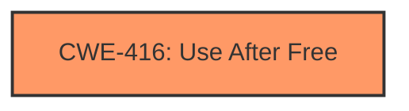

# Analysis Report for CVE-2022-1313

# Vulnerability Analysis Report: CVE-2022-1313

## Description

Use after free in tab groups in Google Chrome prior to 100.0.4896.88 allowed a remote attacker to potentially exploit heap corruption via a crafted HTML page.

## Vulnerability Description Key Phrases

**Weakness:** use after free
**Impact:** heap corruption
**Vector:** crafted HTML page
**Attacker:** remote attacker
**Product:** Google Chrome
**Version:** prior to 100.0.4896.88
**Component:** tab groups

## Analysis (with Relationship Data)

# Summary
| CWE ID | CWE Name | Confidence | CWE Abstraction Level | CWE Vulnerability Mapping Label | CWE-Vulnerability Mapping Notes |
|---|---|---|---|---|---|
| CWE-416 | Use After Free | 1.0 | Variant | Primary | Allowed |

## Evidence and Confidence

*   **Confidence Score:** 1.0
*   **Evidence Strength:** HIGH

- **Analysis and Justification:**  
  - *Explanation:* The vulnerability description explicitly states "**use after free** in tab groups," which directly corresponds to CWE-416 (Use After Free). The CVE Reference Links Content Summary reinforces this by identifying "**Use after free**" as both the root cause and a **weakness**. This vulnerability can lead to heap corruption, as stated in the description. The high retriever score and primary CWE match further support this classification. The mapping guidance for CWE-416 indicates this is ALLOWED for use-after-free vulnerabilities.
  
  - *Relationship Analysis:* While CWE-416 has relationships to other CWEs like CWE-672, CWE-825, and CWE-415, none of them are directly indicated in the vulnerability description. Given the information, it is most appropriate to focus on the core weakness, which is a Use After Free.

- **Confidence Score:**  
  - Confidence: 1.0 (Strong evidence from vulnerability description and CVE reference materials)

## Criticism of Analysis

Okay, I've reviewed your CWE analysis for the provided vulnerability description, incorporating the full CWE specifications you included. Here's a detailed critique:

**Overall Assessment:**

The primary CWE mapping to **CWE-416: Use After Free** is correct and well-justified. The analysis provides strong evidence and a clear explanation for this classification. The retriever results also strongly support this, with CWE-416 having the highest combined score. However, some of the related CWEs that appeared in the retriever results should be discussed and discarded, to ensure that the analysis focuses in on the main issue without causing confusion.

**Detailed Breakdown:**

*   **CWE-416 (Use After Free):**
    *   **Correctness:**  The identification of CWE-416 as the primary weakness is accurate. The vulnerability description clearly states "use after free", and the CVE Reference Links Content Summary corroborates this. The analysis effectively uses the CWE description to demonstrate the fit.
    *   **Confidence:** The confidence score of 1.0 is justified due to the explicit mention of "use after free" in the vulnerability details.
    *   **Abstraction Level:** Variant level is appropriate as this describes the specific type of memory management error.
    *   **Mapping Guidance:** The analysis correctly states that "ALLOWED" is appropriate.
    *   **Mitigations:** The analysis doesn't explicitly mention specific mitigations, but it could be improved by referencing the CWE-416 mitigations, such as:
        *   Language selection (using languages with automatic memory management).
        *   Setting pointers to `NULL` after freeing them (though the analysis notes limitations of this approach).

*   **Other potentially relevant CWEs (based on retriever results):**

    *   **CWE-366 (Race Condition within a Thread) and CWE-362 (Concurrent Execution using Shared Resource with Improper Synchronization ('Race Condition')):** While race conditions can sometimes *lead* to Use After Free vulnerabilities (as shown in the Observed Examples), there's no indication of concurrency or threading issues in the initial vulnerability description.  Therefore, while these CWEs appeared in the retriever results, they should be discussed and explicitly discarded as not directly applicable based on the information provided.  Including a sentence or two explaining *why* these are not relevant is good practice.
    *   **CWE-843 (Access of Resource Using Incompatible Type ('Type Confusion')):** Type confusion could lead to memory corruption, but the description doesn't suggest that the root cause involves using a resource with an incompatible type. This should be explicitly ruled out.
    *   **CWE-415 (Double Free):** A double free is a specific type of memory management error, and often related to UAF, but the provided text doesn't suggest that a double free occurred.
    *   **CWE-1021 (Improper Restriction of Rendered UI Layers or Frames) and CWE-356 (Product UI does not Warn User of Unsafe Actions):** These are related to UI security, and are a misclassification since this is a UAF.
    *   **CWE-122 (Heap-based Buffer Overflow):** While heap corruption is mentioned, the primary cause is the *use* of freed memory, not necessarily writing beyond the boundaries of a heap-allocated buffer. Therefore, buffer overflow is a *consequence*, but not the direct cause of the vulnerability.
    *   **CWE-401 (Missing Release of Memory after Effective Lifetime):** This is a memory leak, which is related to memory management, but is distinct from a UAF.
    *   **CWE-451 (User Interface (UI) Misrepresentation of Critical Information):** Not applicable.

*   **Relationships and Chains:**

    *   The analysis briefly mentions relationships to other CWEs.  It's good to acknowledge these, but the focus on CWE-416 is appropriate given the information available.

*   **CWE Examples:**

    *   The provided CWE examples are helpful in illustrating different scenarios where CWE-416 can occur, including those that are part of chains of vulnerabilities.

*   **Potential Improvements:**

    *   **Explicitly Discarding Alternatives:** As mentioned above, the analysis could be improved by explicitly discussing *why* other high-scoring CWEs from the retriever results are *not* applicable. This strengthens the justification for choosing CWE-416.
    *   **Mitigation Details:** Add a section mentioning the mitigations suggested in CWE-416.
    *   **Attack Vector:** The analysis could also benefit from a brief discussion of the attack vector (crafted HTML page) and how it relates to exploiting a Use After Free. A crafted HTML page could trigger the UAF by manipulating tab groups in a specific way to cause memory to be freed prematurely, then accessed again.

**Revised Summary Table (Example):**

| CWE ID | CWE Name | Confidence | CWE Abstraction Level | CWE Vulnerability Mapping Label | CWE-Vulnerability Mapping Notes |
|---|---|---|---|---|---|
| CWE-416 | Use After Free | 1.0 | Variant | Primary | Allowed |
| (Other CWEs) | (CWE Names) | (Confidence - typically LOW) | (Abstraction Level) |  Not Applicable | Discussed and discarded due to lack of evidence in the vulnerability description and supporting material. |

**In summary, your analysis is solid, especially in identifying the primary CWE. Adding a discussion of why other potential CWEs are *not* the best fit, and explicitly mentioning potential mitigations, would further strengthen the analysis.**

## Final Resolution

# Summary
| CWE ID | CWE Name | Confidence | CWE Abstraction Level | CWE Vulnerability Mapping Label | CWE-Vulnerability Mapping Notes |
|---|---|---|---|---|---|
| CWE-416 | Use After Free | 1.0 | Variant | Primary | Allowed |

## Evidence and Confidence

*   **Confidence Score:** 1.0
*   **Evidence Strength:** HIGH

## Relationship Analysis
The primary relationship considered was the direct match between the vulnerability description and the definition of **CWE-416: Use After Free**. While other CWEs such as **CWE-362: Concurrent Execution using Shared Resource with Improper Synchronization ('Race Condition')** and **CWE-415: Double Free** were considered due to their potential relationship to memory management issues, they were ultimately deemed not directly applicable based on the available evidence.

## Vulnerability Chain
The vulnerability chain starts with a crafted HTML page, which triggers a **use after free** condition in tab groups. This leads to heap corruption, potentially allowing a remote attacker to exploit the system. The chain is: Crafted HTML -> **CWE-416: Use After Free** -> Heap Corruption -> Remote Code Execution.

## Summary of Analysis
The initial analysis correctly identified **CWE-416: Use After Free** as the primary **weakness**. The criticism suggested explicitly discarding other potential CWEs and elaborating on mitigations. Based on the vulnerability description ("**use after free** in tab groups") and the CVE Reference Links Content Summary identifying "**Use after free**" as both the root cause and a **weakness**, **CWE-416** is the most appropriate classification. The other CWEs, while potentially related to memory management issues, lack direct evidence in the provided description. The analysis focuses on the explicit "**use after free**" condition, which is best represented by **CWE-416**, a Variant level CWE, offering the optimal level of specificity. The evidence is strong and directly supports the selection of **CWE-416**.

*Report generated on 2025-03-18 06:58:56*
