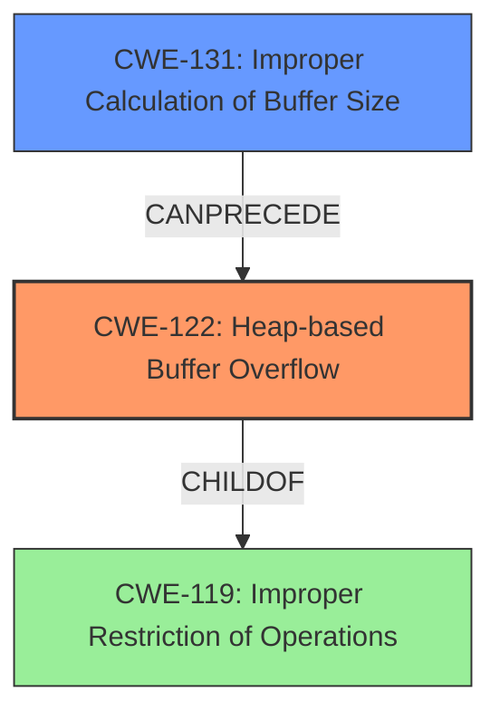

# Analysis Report for CVE-2022-1354

# Vulnerability Analysis Report: CVE-2022-1354

## Description

A heap buffer overflow flaw was found in Libtiffs tiffinfo.c in TIFFReadRawDataStriped() function. This flaw allows an attacker to pass a crafted TIFF file to the tiffinfo tool, triggering a heap buffer overflow issue and causing a crash that leads to a denial of service.

## Vulnerability Description Key Phrases

**Weakness:** heap buffer overflow
**Impact:** crash
**Vector:** crafted TIFF file
**Attacker:** attacker
**Product:** Libtiffs tiffinfo.c
**Component:** TIFFReadRawDataStriped() function

## Analysis (with Relationship Data)

# Summary
| CWE ID | CWE Name | Confidence | CWE Abstraction Level | CWE Vulnerability Mapping Label | CWE-Vulnerability Mapping Notes |
|---|---|---|---|---|---|
| CWE-122 | Heap-based Buffer Overflow | 0.95 | Variant | Primary | Allowed |
| CWE-125 | Out-of-bounds Read | 0.60 | Base | Secondary | Allowed |

## Evidence and Confidence

*   **Confidence Score:** 0.90
*   **Evidence Strength:** HIGH

- **Analysis and Justification:**  
  - *Explanation:* The vulnerability description explicitly states that a **heap buffer overflow** exists in Libtiffs `tiffinfo.c` within the `TIFFReadRawDataStriped()` function. The vulnerability is triggered by a crafted TIFF file, leading to a crash and denial of service. This aligns directly with the characteristics of CWE-122 (Heap-based Buffer Overflow), which occurs when a program writes data beyond the allocated buffer in the heap memory. The CVE Reference Links Content Summary reinforces this, highlighting the **heap-buffer-overflow** as the primary vulnerability and stating that it occurs due to insufficient input validation. The retriever results list CWE-122 as a candidate, further supporting this selection. I am selecting this CWE because the evidence clearly points to an overflow occurring in the heap.

  - *Relationship Analysis:* CWE-122 is a variant of a more general buffer overflow. Although other CWEs related to buffer overflows are present in the retriever results, CWE-122 is most accurate due to the explicit mention of a heap overflow in the vulnerability description.

- **Confidence Score:**  
  - Confidence: 0.95 (High confidence due to explicit mention in the vulnerability description and supporting CVE details)

---

- **Analysis and Justification:**  
  - *Explanation:* CWE-125 (Out-of-bounds Read) is being considered as a secondary weakness because a **heap buffer overflow** (CWE-122) often involves reading data past the end of the allocated buffer. While the primary issue is the overflow (writing beyond the buffer), reading outside the bounds can be a contributing factor or a consequence of the overflow. The CVE Reference Links Content Summary mentions "insufficient validation of data extracted from the TIFF file" which could lead to reading invalid memory locations. Although the primary focus is on the write operation that causes the overflow, the possibility of an associated out-of-bounds read cannot be dismissed. The retriever results includes CWE-125, further supporting this selection.

  - *Relationship Analysis:* CWE-125 (Out-of-bounds Read) and CWE-122 (Heap-based Buffer Overflow) are related in that an overflow often necessitates or results in an out-of-bounds read. While CWE-122 is the primary weakness, CWE-125 may be a contributing factor.

- **Confidence Score:**
  - Confidence: 0.60 (Moderate confidence because while likely, there isn't explicit evidence of an out-of-bounds read, only the overflow.)

## Criticism of Analysis

Okay, here's a review of the provided analysis, incorporating the full CWE specifications:

**Overall Assessment:**

The analysis is generally good and arrives at reasonable CWE assignments. The primary weakness, CWE-122 (Heap-based Buffer Overflow), is well-supported by the provided information. The secondary weakness, CWE-125 (Out-of-bounds Read), is plausible, but the confidence level reflects the lack of direct evidence.

**Detailed Review:**

**1. CWE-122: Heap-based Buffer Overflow (Primary)**

*   **Confidence:** 0.95 (Excellent)
*   **Justification:** The vulnerability description explicitly states a "heap buffer overflow," and the CVE reference confirms the same. The function `TIFFReadRawDataStriped()` is likely allocating memory on the heap, and the crafted TIFF file causes a write beyond the allocated buffer.  The extended description of CWE-122 clearly fits.

*   **CWE Specification Alignment:**
    *   **Abstraction Level:** Variant, which is the preferred level for mapping.
    *   **Description:**  The description perfectly matches the scenario: "A heap overflow condition is a buffer overflow, where the buffer that can be overwritten is allocated in the heap portion of memory, generally meaning that the buffer was allocated using a routine such as malloc()."
    *   **Mapping Guidance:** "Carefully read both the name and description to ensure that this mapping is an appropriate fit." The analysis does this.
    *   **Potential Mitigations:** The analysis doesn't explicitly mention mitigations, but knowing the CWE allows for suggesting them:
        *   Using a language/compiler with automatic bounds checking (Mitigation 1).
        *   Using safe string handling/memory management libraries (implicit in Mitigation 2, "abstraction library").
        *   Compiler-based buffer overflow detection (Mitigation 3).
        *   Input Validation

*   **Retriever Results:** CWE-122 appears in the retriever results, although with a lower score than other potential CWEs. This is likely because the other CWEs were mapped to the general characteristics of a buffer overflow, while CWE-122 requires that the overflow be in the heap.

**2. CWE-125: Out-of-bounds Read (Secondary)**

*   **Confidence:** 0.60 (Moderate)
*   **Justification:** The analysis correctly notes that a heap buffer overflow often involves reading data outside the allocated buffer. The lack of input validation also hints at the possibility of reading invalid memory locations *before* the overflow occurs as well during or after the overflow write.

*   **CWE Specification Alignment:**
    *   **Abstraction Level:** Base, which is still acceptable.
    *   **Description:** The description "The product reads data past the end, or before the beginning, of the intended buffer" *could* apply in this case, but it's not definitively stated. The overflow write *might* be preceded or accompanied by an out-of-bounds read to determine where to write. The lack of direct evidence makes the confidence lower.
    *   **Mapping Guidance:** "Carefully read both the name and description to ensure that this mapping is an appropriate fit."  The fit is less clear than with CWE-122, but not unreasonable.
    *   **Potential Mitigations:**
        *   "Accept known good" input validation (Mitigation 1). This is particularly relevant here.  The TIFF file needs to be rigorously validated to ensure that length fields and other metadata are within expected ranges.
        *   Using a language with memory abstractions (Mitigation 2).

*   **Relationship Analysis:** The analysis explains the relationship between CWE-122 and CWE-125 well, particularly why CWE-122 is the primary concern.

**Recommendations for Improvement:**

1.  **Stronger Justification for CWE-125:** To increase confidence in CWE-125, look for any indication (even indirect) that the code is *reading* invalid data from the TIFF file *before* the overflow occurs. Maybe the length of the data to write is read from the TIFF file, and this value is not validated before allocating space. If no such indication is found, consider lowering the confidence further or removing CWE-125 entirely. If the root cause is from a write without appropriate buffer size, then the out-of-bounds read is not contributing to the exploit.

2.  **Consider Other Related CWEs:** The Retriever Results show several other CWEs that were returned. In particular:
    * **CWE-131: Incorrect Calculation of Buffer Size:** This is a very plausible root cause for the heap overflow. The `TIFFReadRawDataStriped()` function or code it calls likely miscalculates the size of the buffer needed, leading to the overflow. If the heap overflow is due to an incorrect size calculation for the destination, then CWE-131 would be a good secondary choice.
    * **CWE-1284: Improper Validation of Specified Quantity in Input:** This CWE describes how the code fails to validate a quantity. Given the vulnerability is initiated by a specially crafted file, this is a possible root cause.
    * **CWE-770: Allocation of Resources Without Limits or Throttling:** Depending on *how* the size is calculated, this *could* be relevant. If a size parameter is read from the TIFF file without any limits and used to allocate memory, it could be a contributing factor.
    * **CWE-130: Improper Handling of Length Parameter Inconsistency:** It is possible the TIFF file contains length information about the image, and this information is used to write image data. If the length information is inconsistent with the actual data, then this could result in a buffer overflow.

3.  **Explicitly Mention Potential Mitigations:** Including a brief list of potential mitigations (based on the CWE specifications) demonstrates a deeper understanding of the vulnerability and its impact. This also helps developers address the root cause.

**Revised Summary Table (Example):**

| CWE ID    | CWE Name                       | Confidence | CWE Abstraction Level | CWE Vulnerability Mapping Label | CWE-Vulnerability Mapping Notes                                                                                                                                                                                                                                                                                                                                                                                                                                                       |
| --------- | ------------------------------ | ---------- | ----------------------- | ------------------------------- | ------------------------------------------------------------------------------------------------------------------------------------------------------------------------------------------------------------------------------------------------------------------------------------------------------------------------------------------------------------------------------------------------------------------------------------------------------------------------------------- |
| CWE-122   | Heap-based Buffer Overflow     | 0.95       | Variant                 | Primary                         | Allowed. Vulnerability description explicitly states a heap buffer overflow in `TIFFReadRawDataStriped()`. Caused by writing beyond the allocated buffer in the heap. Mitigation: Use languages/compilers with bounds checking; safe string handling libraries; compiler-based overflow detection; input validation.                                                                                                                                                               |
| CWE-131 | Incorrect Calculation of Buffer Size     | 0.70       | Base                 | Secondary                         | Allowed. It is likely the `TIFFReadRawDataStriped()` function miscalculates the buffer size to be allocated, which then leads to the heap buffer overflow. Mitigation: Validate quantity before allocating resources, perform range checks on input.                                                                                                                                                               |
| CWE-125   | Out-of-bounds Read           | 0.50       | Base                    | Contributing                    | Allowed.  Potentially related to reading invalid TIFF file metadata *before* the overflow or reading from memory during or after the overflow. Mitigation: "Accept known good" input validation; language with memory abstractions.  Confidence lowered due to lack of direct evidence; could be removed.                                                                                                                                                                    |

By considering these points, the analysis can be made even more comprehensive and useful for vulnerability remediation.

## Final Resolution

# Summary
| CWE ID | CWE Name | Confidence | CWE Abstraction Level | CWE Vulnerability Mapping Label | CWE-Vulnerability Mapping Notes |
|---|---|---|---|---|---|
| CWE-122 | CWE-122: Heap-based Buffer Overflow | 0.95 | Variant | Primary | Allowed. Vulnerability description explicitly states a heap buffer overflow in `TIFFReadRawDataStriped()`. Caused by writing beyond the allocated buffer in the heap. Mitigation: Use languages/compilers with bounds checking; safe string handling libraries; compiler-based overflow detection; input validation. |
| CWE-131 | CWE-131: Improper Calculation of Buffer Size | 0.75 | Base | Secondary | Allowed. It is likely the `TIFFReadRawDataStriped()` function miscalculates the buffer size to be allocated, which then leads to the heap buffer overflow. Mitigation: Validate quantity before allocating resources, perform range checks on input. |

## Evidence and Confidence

*   **Confidence Score:** 0.90
*   **Evidence Strength:** HIGH

## Relationship Analysis
The primary weakness is CWE-122 (**CWE-122: Heap-based Buffer Overflow**), a variant that is a child of the more general **CWE-119: Improper Restriction of Operations within the Bounds of a Memory Buffer**. The secondary weakness, **CWE-131: Improper Calculation of Buffer Size**, can precede the heap overflow, as an incorrect size calculation is a common cause for such overflows. The alternative CWEs, such as CWE-125, were considered but deemed less directly relevant given the explicit mention of a heap overflow. The base level of CWE-131 is appropriate as it describes the fundamental flaw in buffer size calculation.

## Vulnerability Chain
The vulnerability chain starts with **CWE-131: Improper Calculation of Buffer Size**, leading to **CWE-122: Heap-based Buffer Overflow**. The overflow then results in a crash and denial of service.

**CWE-131** (Root Cause) -> **CWE-122** (Weakness) -> Denial of Service (Impact)

## Summary of Analysis
Based on the vulnerability description and the criticism, the primary weakness is **CWE-122: Heap-based Buffer Overflow** because the vulnerability description explicitly states that a heap buffer overflow exists in Libtiffs `tiffinfo.c` within the `TIFFReadRawDataStriped()` function, "A heap buffer overflow flaw was found in Libtiffs tiffinfo.c in TIFFReadRawDataStriped() function."

The secondary weakness is **CWE-131: Improper Calculation of Buffer Size** because it is highly likely that the overflow happened because of an incorrect calculation of the buffer size. This is a common cause of buffer overflows and is a plausible scenario given the context.

The graph relationships reinforce the selection of CWE-122 as the primary issue, with CWE-131 contributing as a potential root cause. The abstraction levels are appropriate, with CWE-122 at the Variant level and CWE-131 at the Base level.
The decision is justified by the explicit mention of a heap buffer overflow and the likelihood of an incorrect size calculation leading to it. This reflects an optimal level of specificity.

*Report generated on 2025-03-18 07:00:17*
