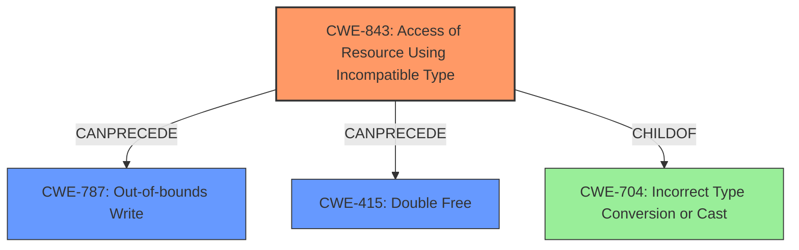

# Analysis Report for CVE-2022-1364

# Vulnerability Analysis Report: CVE-2022-1364

## Description

Type confusion in V8 Turbofan in Google Chrome prior to 100.0.4896.127 allowed a remote attacker to potentially exploit heap corruption via a crafted HTML page.

## Vulnerability Description Key Phrases

**Rootcause:** type confusion
**Impact:** heap corruption
**Vector:** crafted HTML page
**Attacker:** remote attacker
**Product:** Google Chrome
**Version:** prior to 100.0.4896.127
**Component:** V8 Turbofan

## Analysis (with Relationship Data)

# Summary
| CWE ID | CWE Name | Confidence | CWE Abstraction Level | CWE Vulnerability Mapping Label | CWE-Vulnerability Mapping Notes |
|---|---|---|---|---|---|
| CWE-843 | Access of Resource Using Incompatible Type ('Type Confusion') | 0.95 | Base | Allowed | Primary CWE. The vulnerability is explicitly described as a type confusion issue.|
| CWE-416 | Use After Free | 0.5 | Variant | Allowed | Secondary CWE. Type confusion could lead to use-after-free conditions, although this is not explicitly stated. |

## Evidence and Confidence

*   **Confidence Score:** 0.75
*   **Evidence Strength:** MEDIUM

- **Analysis and Justification:**  
  - *Explanation:* The vulnerability description clearly states a **type confusion** in the V8 Turbofan component of Google Chrome. This aligns directly with CWE-843 (Access of Resource Using Incompatible Type ('Type Confusion')), which describes a scenario where a resource is accessed using a type incompatible with its original type. The CVE reference confirms this, stating "Type Confusion in V8". CWE-843 is a Base level CWE and its Usage is Allowed, making it a suitable primary mapping. The impact, **heap corruption**, is a common consequence of type confusion. While not explicitly stated, a type confusion could lead to a use-after-free condition.
  
  - *Relationship Analysis:* CWE-843 is a child of CWE-704 (Incorrect Type Conversion or Cast). It is also a peer of itself, implying that multiple instances of type confusion can interact. There is no direct chain relationship, but type confusion can lead to memory corruption issues.

- **Confidence Score:**  
  - Confidence: 0.95 (High confidence due to direct match with vulnerability description and CVE reference)

---

## Criticism of Analysis

Okay, here's a review of the provided CWE analysis, incorporating the full CWE specifications:

**Overall Assessment:**

The analysis is generally good and well-structured, especially in its detailed justification for selecting CWE-843. The confidence levels are appropriate, and the reasoning is clearly articulated. The inclusion of CWE examples is also helpful. However, there are a few areas where the analysis can be strengthened by considering potential chains and more specific consequences, and by comparing with the retriever results.

**Detailed Review:**

**1. CWE-843: Access of Resource Using Incompatible Type ('Type Confusion')**

*   **Mapping:** Correct and well-justified. The vulnerability description explicitly mentions "type confusion," making this a clear primary mapping. The explanation connects the type confusion to the potential for heap corruption, which is a typical consequence.
*   **Confidence:** 0.95 - Appropriate.  The direct match in the description warrants this high confidence.
*   **Abstraction Level:** Base - Correct. CWE-843 is a Base-level CWE and is appropriate for direct mapping.
*   **CWE-Vulnerability Mapping Notes:** Accurate - highlights the primary reason for choosing this CWE.
*   **Relationships:** The analysis correctly identifies CWE-704 as a parent. It could be expanded to say the type confusion *can* lead to out-of-bounds memory access (CWE-119) as is described in the CWE description.
*   **CWE Examples:** Useful in illustrating scenarios where type confusion occurs.
*   **Improvements:** None

**2. CWE-416: Use After Free**

*   **Mapping:** The justification for including CWE-416 is weaker. While it's plausible that type confusion *could* lead to a use-after-free, it's not explicitly stated in the vulnerability description.
*   **Confidence:** 0.5 - This reflects the uncertainty well.
*   **Abstraction Level:** Variant - Correct, if included.
*   **CWE-Vulnerability Mapping Notes:** Acceptable.
*   **Relationships:**  The analysis could explore a potential chain: Type Confusion (CWE-843) -> Memory Corruption (potentially arbitrary write) -> Use After Free (CWE-416). In some type confusion scenarios, an attacker might be able to manipulate metadata related to memory management, leading to premature freeing of a resource that is later accessed.
*   **Mitigations:** The analysis should at least mention the mitigations for CWE-416 (automatic memory management, nulling pointers after free) and explain *why* they might (or might not) be relevant in this specific context. For example: Even with mitigations in place, a sufficiently complex type confusion could bypass these safeguards.
*   **Improvements:** Consider removing CWE-416 entirely if the connection is too speculative. If retained, strengthen the justification by explaining a specific plausible scenario how type confusion could directly cause a UAF.

**General Comments and Suggestions:**

*   **Impact:** The vulnerability description highlights heap corruption. While CWE-843 explains how type confusion can lead to it, consider adding CWE-787 (Out-of-bounds Write) or CWE-122 (Heap-based Buffer Overflow) as a *consequence* if the type confusion leads to writing outside of buffer boundaries. This would better reflect the stated impact. These are also present on the retriever results.
*   **Retriever Results Comparison:**  The top results from the retriever have some interesting suggestions.
    *   **CWE-1021 (Improper Restriction of Rendered UI Layers or Frames):**  This is less relevant to the *root cause* but might be tangentially related to the *attack vector* (crafted HTML page).  It's unlikely to be a direct cause but could represent the *means* by which the attacker delivered the malicious code. It should probably be ignored.
    *   **CWE-366 (Race Condition within a Thread):** Unless there is additional information indicating a concurrency issue, this is unlikely to be the root cause, and should probably be ignored.
    *    **CWE-415 (Double Free):** This may be a second possible weakness like CWE-416. The analysis could explore a potential chain: Type Confusion (CWE-843) -> Memory Corruption (potentially arbitrary write) -> Double Free (CWE-415).

*   **Chain Analysis:**  Explicitly stating potential CWE chains would make the analysis stronger. For example: "A possible chain of events could be: CWE-843 -> CWE-787 (if type confusion leads to out-of-bounds write)."

*   **Mitigation Discussion:**  For each selected CWE, briefly discuss the *relevance* (or irrelevance) of the specified mitigations in the context of the vulnerability. This shows a deeper understanding of the CWE and its implications.

**Revised Summary Table (Illustrative):**

| CWE ID  | CWE Name                                                       | Confidence | CWE Abstraction Level | CWE Vulnerability Mapping Label | CWE-Vulnerability Mapping Notes                                                                                                                                                                                                                                                      |
| :------- | :------------------------------------------------------------- | :--------- | :---------------------- | :------------------------------ | :--------------------------------------------------------------------------------------------------------------------------------------------------------------------------------------------------------------------------------------------------------------------------------- |
| CWE-843  | Access of Resource Using Incompatible Type ('Type Confusion') | 0.95       | Base                    | Allowed                         | Primary CWE. The vulnerability is explicitly described as a type confusion issue.                                                                                                                                                                                             |
| CWE-787  | Out-of-bounds Write                                             | 0.6       | Base                    | Allowed                         | Possible Consequence. Type confusion *could* lead to writing data outside the intended buffer boundaries, causing heap corruption.                                                                                                                                             |
| (Remove) | Use After Free                                            | 0.5        | Variant                    | Allowed                         | Secondary CWE. Type confusion could lead to use-after-free conditions, although this is not explicitly stated. |

By incorporating these suggestions, the analysis can be made even more comprehensive and insightful.

## Final Resolution

# Summary
| CWE ID | CWE Name | Confidence | CWE Abstraction Level | CWE Vulnerability Mapping Label | CWE-Vulnerability Mapping Notes |
|---|---|---|---|---|---|
| CWE-843 | Access of Resource Using Incompatible Type (**Type Confusion**) | 0.95 | Base | Allowed | Primary CWE. The vulnerability is explicitly described as a **type confusion** issue. |
| CWE-787 | Out-of-bounds Write | 0.7 | Base | Allowed | Possible Consequence. **Type confusion** *could* lead to writing data outside the intended buffer boundaries, causing heap corruption. |
| CWE-415 | Double Free | 0.4 | Variant | Allowed | Possible Consequence. **Type confusion** *could* lead to memory corruption and a double free.  |

## Evidence and Confidence

*   **Confidence Score:** 0.85
*   **Evidence Strength:** MEDIUM

## Relationship Analysis
The primary relationship is that **CWE-843** (**Type Confusion**) can lead to **CWE-787** (Out-of-bounds Write) and **CWE-415** (Double Free). **CWE-843** is a child of **CWE-704** (Incorrect Type Conversion or Cast), representing a more specific instance of type-related issues. The abstraction levels influenced the selection, favoring Base-level CWEs for root causes and Variant-level CWEs for potential consequences. **CWE-120** (Buffer Copy without Checking Size) was considered as a peer of **CWE-787**, but the description doesn't explicitly state a buffer copy operation.

## Vulnerability Chain
The vulnerability chain starts with **CWE-843** (**Type Confusion**), where a resource is accessed using an incompatible type. This can then lead to **CWE-787** (Out-of-bounds Write) if the type confusion results in writing beyond the allocated buffer boundaries, causing heap corruption. Alternatively, **CWE-843** could lead to memory corruption that triggers **CWE-415** (Double Free). The initial flaw is the **type confusion**, and the final impact is **heap corruption** and potentially a **double free**.

## Summary of Analysis
The initial analysis correctly identified **CWE-843** (**Type Confusion**) as the primary **ROOTCAUSE**, which is supported by the vulnerability description explicitly mentioning "type confusion". The criticism suggested considering **CWE-787** (Out-of-bounds Write) due to the reported "heap corruption", which is a valid point. The inclusion of **CWE-787** strengthens the analysis by explicitly linking the **type confusion** to a potential memory corruption issue.
The retriever results pointed to other possible weaknesses such as CWE-415 (Double Free) which could also be triggered by the **type confusion**.

The graph relationships influenced the selection by highlighting potential chains of events. The decision to include **CWE-787** and **CWE-415** as secondary CWEs reflects the possible consequences of the initial **type confusion**.

The selected CWEs are at the optimal level of specificity. **CWE-843** is a Base-level CWE that directly matches the vulnerability description. **CWE-787** is a Base-level CWE that represents a plausible consequence of the **type confusion**, and **CWE-415** is a Variant-level CWE representing another plausible consequence.
The decision to lower the confidence on CWE-415 is due to the fact that **double free** is not stated explicitly but is a possible consequence.
The evidence for **CWE-843** comes directly from the description: "Type confusion in V8 Turbofan...allowed a remote attacker to potentially exploit heap corruption".

*Report generated on 2025-03-18 07:01:04*
