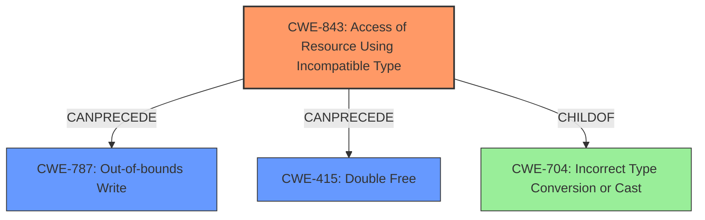

# Final Resolution for CVE-2022-1364

# Summary
| CWE ID | CWE Name | Confidence | CWE Abstraction Level | CWE Vulnerability Mapping Label | CWE-Vulnerability Mapping Notes |
|---|---|---|---|---|---|
| CWE-843 | Access of Resource Using Incompatible Type (**Type Confusion**) | 0.95 | Base | Allowed | Primary CWE. The vulnerability is explicitly described as a **type confusion** issue. |
| CWE-787 | Out-of-bounds Write | 0.7 | Base | Allowed | Possible Consequence. **Type confusion** *could* lead to writing data outside the intended buffer boundaries, causing heap corruption. |
| CWE-415 | Double Free | 0.4 | Variant | Allowed | Possible Consequence. **Type confusion** *could* lead to memory corruption and a double free.  |

## Evidence and Confidence

*   **Confidence Score:** 0.85
*   **Evidence Strength:** MEDIUM

## Relationship Analysis
The primary relationship is that **CWE-843** (**Type Confusion**) can lead to **CWE-787** (Out-of-bounds Write) and **CWE-415** (Double Free). **CWE-843** is a child of **CWE-704** (Incorrect Type Conversion or Cast), representing a more specific instance of type-related issues. The abstraction levels influenced the selection, favoring Base-level CWEs for root causes and Variant-level CWEs for potential consequences. **CWE-120** (Buffer Copy without Checking Size) was considered as a peer of **CWE-787**, but the description doesn't explicitly state a buffer copy operation.

## Vulnerability Chain
The vulnerability chain starts with **CWE-843** (**Type Confusion**), where a resource is accessed using an incompatible type. This can then lead to **CWE-787** (Out-of-bounds Write) if the type confusion results in writing beyond the allocated buffer boundaries, causing heap corruption. Alternatively, **CWE-843** could lead to memory corruption that triggers **CWE-415** (Double Free). The initial flaw is the **type confusion**, and the final impact is **heap corruption** and potentially a **double free**.

## Summary of Analysis
The initial analysis correctly identified **CWE-843** (**Type Confusion**) as the primary **ROOTCAUSE**, which is supported by the vulnerability description explicitly mentioning "type confusion". The criticism suggested considering **CWE-787** (Out-of-bounds Write) due to the reported "heap corruption", which is a valid point. The inclusion of **CWE-787** strengthens the analysis by explicitly linking the **type confusion** to a potential memory corruption issue.
The retriever results pointed to other possible weaknesses such as CWE-415 (Double Free) which could also be triggered by the **type confusion**.

The graph relationships influenced the selection by highlighting potential chains of events. The decision to include **CWE-787** and **CWE-415** as secondary CWEs reflects the possible consequences of the initial **type confusion**.

The selected CWEs are at the optimal level of specificity. **CWE-843** is a Base-level CWE that directly matches the vulnerability description. **CWE-787** is a Base-level CWE that represents a plausible consequence of the **type confusion**, and **CWE-415** is a Variant-level CWE representing another plausible consequence.
The decision to lower the confidence on CWE-415 is due to the fact that **double free** is not stated explicitly but is a possible consequence.
The evidence for **CWE-843** comes directly from the description: "Type confusion in V8 Turbofan...allowed a remote attacker to potentially exploit heap corruption".