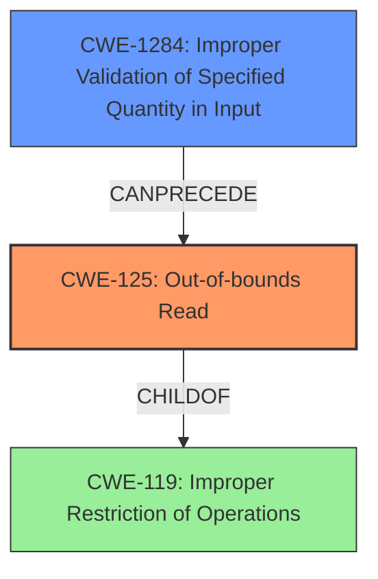

# Final Resolution for CVE-2022-1383

# Summary
| CWE ID  | CWE Name                     | Confidence | CWE Abstraction Level | CWE Vulnerability Mapping Label | CWE-Vulnerability Mapping Notes |
| ------- | ---------------------------- | ---------- | ----------------------- | ------------------------------- | ------------------------------- |
| CWE-125 | Out-of-bounds Read           | 0.95       | Base                    | Allowed                         | Primary CWE                    |
| CWE-1284 | Improper Validation of Specified Quantity in Input | 0.75       | Base                    | Allowed                         | Secondary Candidate                    |

## Evidence and Confidence

*   **Confidence Score:** 0.9
*   **Evidence Strength:** HIGH

## Relationship Analysis
The primary CWE is CWE-125 (**Out-of-bounds Read**).
- CWE-125 is a Base level CWE, which is appropriate here for the **out-of-bounds read**
- CWE-125 is a child of CWE-119 (**Improper Restriction of Operations within the Bounds of a Memory Buffer**), but CWE-125 is more specific.

The secondary CWE is CWE-1284 (**Improper Validation of Specified Quantity in Input**).
- CWE-1284 is a Base level CWE and can **precede** CWE-125 in a vulnerability chain.

## Vulnerability Chain
The vulnerability chain starts with **CWE-1284 (Improper Validation of Specified Quantity in Input)** where the `sect_name_off` value is not validated. This leads to **CWE-125 (Out-of-bounds Read)** when the program attempts to read data past the end of the intended buffer using the unvalidated offset.

## Summary of Analysis
The initial analysis correctly identified **CWE-125 (Out-of-bounds Read)** as the primary weakness. The criticism suggests adding **CWE-1284 (Improper Validation of Specified Quantity in Input)** as a secondary weakness because the `sect_name_off` value is not validated, leading to the out-of-bounds read. The evidence for **CWE-125** is: "The vulnerability description clearly states a **Heap-based Buffer Overflow** leads to reading data past the end of the intended buffer" and "The CVE Reference Links Content Summary confirms this, detailing an **out-of-bounds read** in the NE parser due to an invalid offset calculation (`sect_name_off`) without proper bounds checking. This allows attackers to provide a large value for `sect_name_off`, causing a read outside the buffer's bounds".

I agree with the criticism and am adding **CWE-1284** to the analysis as a secondary weakness and adjusting the confidence score to 0.95 for **CWE-125** and 0.75 for **CWE-1284**. The selected CWEs are at the optimal level of specificity because they accurately describe the **root cause** and the direct consequence of the vulnerability.