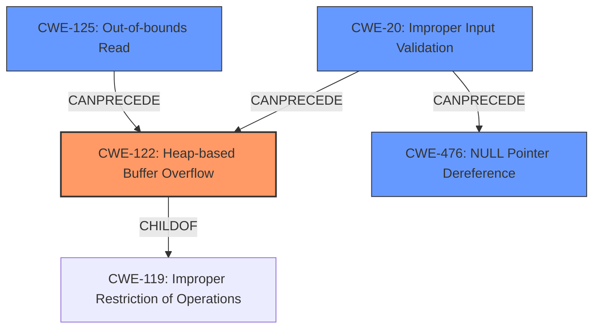

# Final Resolution for CVE-2022-1437

# Summary
| CWE ID | CWE Name | Confidence | CWE Abstraction Level | CWE Vulnerability Mapping Label | CWE-Vulnerability Mapping Notes |
|---|---|---|---|---|---|
| CWE-122 | Heap-based Buffer Overflow | 0.95 | Variant | Primary CWE | Allowed |
| CWE-125 | Out-of-bounds Read | 0.85 | Base | Secondary Candidate | Allowed |
| CWE-476 | NULL Pointer Dereference | 0.75 | Base | Secondary Candidate | Allowed |
| CWE-20 | Improper Input Validation | 0.70 | Class | Secondary Candidate | Allowed |

## Evidence and Confidence

*   **Confidence Score:** 0.90
*   **Evidence Strength:** HIGH

## Relationship Analysis
The primary weakness is **CWE-122 (Heap-based Buffer Overflow)**, a variant of **CWE-119 (Improper Restriction of Operations within the Bounds of a Memory Buffer)**. The overflow is caused by **CWE-125 (Out-of-bounds Read)**, which reads data past the end of the buffer. **CWE-476 (NULL Pointer Dereference)** is a separate vulnerability, but occurs in the same code. The crafted Mach-O file is the root cause of the vulnerabilities, related to **CWE-20 (Improper Input Validation)**.

## Vulnerability Chain
The chain of events starts with a crafted Mach-O file that is not validated (**CWE-20 Improper Input Validation**). During parsing of the string table in Mach-O files, there is an **out-of-bounds read (CWE-125)** in the `r_coresym_cache_element_new` function which leads to **heap-based buffer overflow (CWE-122)**. Separately, a **null pointer dereference (CWE-476)** is also triggered due to a null symbol. The ultimate impact is that attackers can read sensitive information or cause a crash.

## Summary of Analysis
The initial analysis correctly identified **CWE-122 (Heap-based Buffer Overflow)** as the primary **weakness**, with **CWE-125 (Out-of-bounds Read)** and **CWE-476 (NULL Pointer Dereference)** as secondary candidates.
The criticism correctly points out that the analysis should clarify if the out-of-bounds *read* is, *itself*, overwriting memory, or if a subsequent *write* is overflowing the buffer, and that **CWE-476 (NULL Pointer Dereference)** is a *separate* vulnerability, not directly related to the buffer overflow.

I am adding **CWE-20 (Improper Input Validation)** to the list of secondary candidates since the crafted Mach-O file is the root cause of the vulnerabilities.

*Evidence:* The vulnerability description explicitly mentions a "Heap-based Buffer Overflow" and the CVE reference links content summary provides further detail about the root cause being an out-of-bounds read in `r_coresym_cache_element_new` function when parsing the string table in Mach-O files.

*Relationship Analysis:* The graph relationships influenced my final selection by clarifying the chain of events. **CWE-122 (Heap-based Buffer Overflow)** is a variant of **CWE-119 (Improper Restriction of Operations)**, which is caused by **CWE-125 (Out-of-bounds Read)**. **CWE-476 (NULL Pointer Dereference)** is a separate vulnerability that occurs in the same code. **CWE-20 (Improper Input Validation)** is the root cause that allows these vulnerabilities to occur.

*Justification:* The selected CWEs are at the optimal level of specificity because they accurately reflect the root cause and the resulting vulnerabilities. **CWE-122 (Heap-based Buffer Overflow)** is a variant, which is the preferred level of abstraction for mapping to the root causes of vulnerabilities. **CWE-125 (Out-of-bounds Read)** and **CWE-476 (NULL Pointer Dereference)** are at the Base level of abstraction, which is also a preferred level of abstraction. **CWE-20 (Improper Input Validation)** is a Class that represents the root cause of the other vulnerabilities.

My confidence is high because the evidence supports the selected CWEs and the relationships between them. The vulnerability description and CVE reference materials provide sufficient detail to justify the classification.