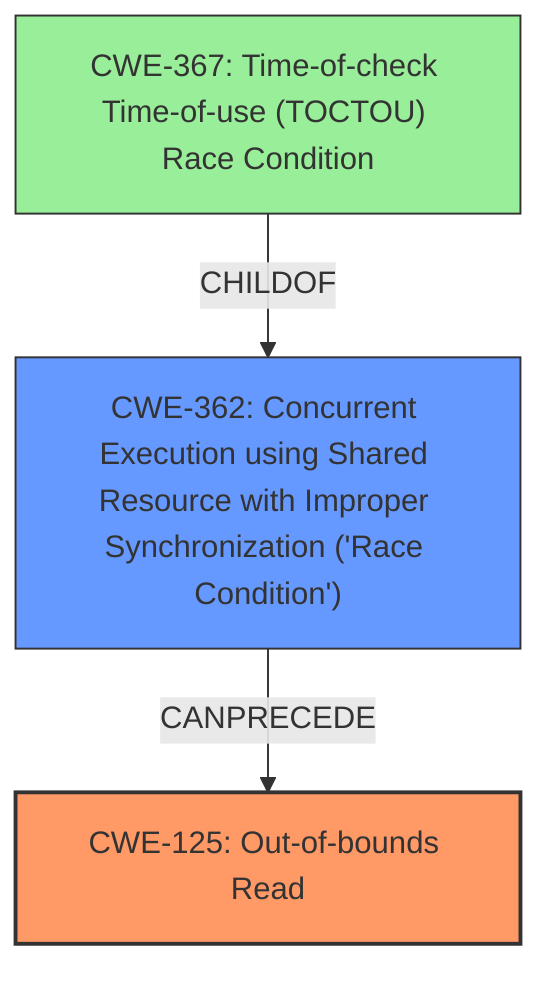

# Analysis Report for CVE-2022-1462

# Vulnerability Analysis Report: CVE-2022-1462

## Description

An out-of-bounds read flaw was found in the Linux kernels TeleTYpe subsystem. The issue occurs in how a user triggers a race condition using ioctls TIOCSPTLCK and TIOCGPTPEER and TIOCSTI and TCXONC with leakage of memory in the flush_to_ldisc function. This flaw allows a local user to crash the system or read unauthorized random data from memory.

## Vulnerability Description Key Phrases

**Rootcause:** race condition
**Weakness:** out-of-bounds read
**Impact:** crash the system or read unauthorized random data from memory
**Vector:** ioctls TIOCSPTLCK and TIOCGPTPEER and TIOCSTI and TCXONC
**Attacker:** local user
**Product:** Linux kernel
**Component:** TeleTYpe subsystem, flush_to_ldisc function

## Analysis (with Relationship Data)

# Summary
| CWE ID | CWE Name | Confidence | CWE Abstraction Level | CWE Vulnerability Mapping Label | CWE-Vulnerability Mapping Notes |
|---|---|---|---|---|---|
| CWE-125 | Out-of-bounds Read | 0.95 | Base | Allowed | Primary CWE |
| CWE-362 | Concurrent Execution using Shared Resource with Improper Synchronization ('**Race Condition**') | 0.85 | Class | Allowed-with-Review | Secondary CWE |

## Evidence and Confidence

*   **Confidence Score:** 0.90
*   **Evidence Strength:** HIGH

- **Analysis and Justification:**  
  - *Explanation:* "The vulnerability description explicitly mentions an **out-of-bounds read** flaw in the Linux kernel's TeleTYpe subsystem, which aligns directly with CWE-125 (Out-of-bounds Read). The CVE Reference Links Content Summary confirms this by stating that the race condition can lead to an **out-of-bounds read** in the `flush_to_ldisc` function. The description also points to a **race condition** being the root cause. This suggests that the **out-of-bounds read** is a consequence of the race condition. CWE-125 is a Base level CWE, which is appropriate for mapping the root cause of the vulnerability. The MITRE mapping guidance for CWE-125 indicates this is ALLOWED."
  
  - *Relationship Analysis:* "CWE-125 is a child of CWE-119 (Improper Restriction of Operations within the Bounds of a Memory Buffer). The vulnerability arises due to a **race condition** that leads to reading data past the end of the intended buffer. Therefore, CWE-125 is the primary weakness. The retriever results also rank CWE-125 as the top candidate."

- **Confidence Score:**  
  - *Example:* Confidence: 0.95 (High confidence due to explicit mention of **out-of-bounds read** in the vulnerability description and CVE reference.)

---
- **Analysis and Justification:**  
  - *Explanation:* "The vulnerability description mentions a **race condition** as the root cause. The CVE Reference Links Content Summary confirms this, stating that a **race condition** exists in the `tty_flip_buffer_push` function due to missing locks. This maps well to CWE-362 (Concurrent Execution using Shared Resource with Improper Synchronization ('**Race Condition**')). This CWE is a Class-level CWE. The vulnerability involves concurrent execution of ioctls, leading to a race condition that ultimately results in an out-of-bounds read. The MITRE mapping guidance for CWE-362 indicates this is ALLOWED-WITH-REVIEW because it's a Class and might have Base-level children that would be more appropriate. While more specific variants might exist, CWE-362 accurately captures the concurrent execution issue."
  
  - *Relationship Analysis:* "CWE-362 is related to other concurrency-related CWEs, such as CWE-367 (Time-of-check Time-of-use (TOCTOU) **Race Condition**). The **race condition** in `tty_flip_buffer_push` can be considered a prerequisite for the **out-of-bounds read**, as it leads to the incorrect calculation of the `count` variable in `flush_to_ldisc`. Therefore, it is a secondary candidate."

- **Confidence Score:**  
  - *Example:* Confidence: 0.85 (High confidence due to explicit mention of **race condition** in the vulnerability description and CVE reference, but lower due to the Class level of the CWE.)

## Criticism of Analysis

Okay, here's a review of the CWE analysis, incorporating the full CWE specifications.

**Overall Assessment:**

The analysis is generally good and well-reasoned.  It correctly identifies the primary and secondary CWEs. The confidence levels are appropriate, and the justifications are supported by the vulnerability descriptions and CVE details. The evidence strength is HIGH which is appropriate for the level of information provided. However, there are a few minor points to consider regarding the abstraction levels and potential for more specific CWEs.

**Detailed Review:**

**1. CWE-125: Out-of-bounds Read (Primary CWE)**

*   **Confidence:** 0.95 - Appropriate.
*   **Abstraction Level:** Base - Correct.
*   **CWE Vulnerability Mapping Label:** Allowed - Correct.
*   **Justification:**  The justification is solid. The core vulnerability is explicitly an out-of-bounds read.
*   **CWE Specification Considerations:**
    *   The CWE-125 specification's Mapping Guidance indicates that this is an "Allowed" mapping as it is a Base level.
    *   The specification emphasizes the importance of input validation and memory abstractions. These mitigations are relevant to this vulnerability. While input validation directly wouldn't prevent the *race condition* that leads to the OOB read, validating the buffer length and state *after* acquiring it could mitigate the impact.
    *   It is also important to consider the parent/child relationship of CWE-125 with CWE-119.  CWE-119 is a class and should not be used.

*   **Potential Improvements:** None, it's a valid and appropriate CWE.

**2. CWE-362: Concurrent Execution using Shared Resource with Improper Synchronization ('Race Condition') (Secondary CWE)**

*   **Confidence:** 0.85 - Appropriate, given the Class level.
*   **Abstraction Level:** Class - Correct.
*   **CWE Vulnerability Mapping Label:** Allowed-with-Review - Correct.
*   **Justification:** Correctly identifies the race condition as a contributing factor.
*   **CWE Specification Considerations:**
    *   The CWE-362 specification's Mapping Guidance indicates this is "Allowed-with-Review" because it's a Class and there might be more specific Base-level children that would be more appropriate.
    *   The potential mitigations of using synchronization primitives and minimizing shared resource usage are directly relevant to addressing this vulnerability.
    *   It is important to consider the children of CWE-362 and see if a better fit exists.

*   **Potential Improvements**: This is where the review is most important. The guidance suggests examining children of CWE-362 for a better fit. A more specific child might be *CWE-367: Time-of-check Time-of-use (TOCTOU) Race Condition* or perhaps a more targeted base CWE.

    *  **CWE-367 Analysis:** While not a pure TOCTOU, because it's not *exactly* a check-then-use of the resource, the essence of the vulnerability *is* that a condition (the buffer's state) is evaluated, but the subsequent access occurs in a potentially changed state due to the race. If a more specific TOCTOU was present then it would be correct.

**Revised Confidence and Mapping:**

If CWE-367 *can be properly applied* it would be a good candidate. Otherwise, the use of CWE-362 is correct.

**Overall Recommendation:**

The analysis is good. The key improvement would be to carefully consider whether a more specific child of CWE-362, such as CWE-367, could be a more accurate representation of the race condition. Even if CWE-362 is ultimately kept, explicitly documenting why other children of CWE-362 were considered and rejected would further strengthen the analysis. The confidence levels and justifications are reasonable, given the information provided.

By making these minor adjustments, the analysis will be even more robust and aligned with CWE's mapping guidance.

## Final Resolution

# Summary
| CWE ID | CWE Name | Confidence | CWE Abstraction Level | CWE Vulnerability Mapping Label | CWE-Vulnerability Mapping Notes |
|---|---|---|---|---|---|
| CWE-125 | Out-of-bounds Read | 0.95 | Base | Allowed | Primary CWE |
| CWE-362 | Concurrent Execution using Shared Resource with Improper Synchronization ('**Race Condition**') | 0.80 | Class | Allowed-with-Review | Secondary CWE |

## Evidence and Confidence

*   **Confidence Score:** 0.90
*   **Evidence Strength:** HIGH

## Relationship Analysis
The primary relationship impacting the decision is the parent-child relationship between CWE-362 and its potential children like CWE-367. While CWE-367 was considered, the race condition doesn't perfectly align with the TOCTOU pattern, making CWE-362 a more suitable, though less specific, choice. The chain relationship shows that the **race condition** (CWE-362) can precede the **out-of-bounds read** (CWE-125).

## Vulnerability Chain
The vulnerability chain starts with a **race condition** (CWE-362) in the `tty_flip_buffer_push` function, which leads to an incorrect calculation of the `count` variable in `flush_to_ldisc`. This incorrect count then results in an **out-of-bounds read** (CWE-125). The root cause is the lack of proper synchronization in the concurrent execution, and the impact is reading unauthorized data or a system crash.

## Summary of Analysis
The initial analysis correctly identifies CWE-125 as the primary weakness due to the explicit mention of an **out-of-bounds read** in the vulnerability description: "An **out-of-bounds read** flaw was found in the Linux kernels TeleTYpe subsystem." The analysis also correctly identifies CWE-362 as a contributing factor due to the **race condition**.

The criticism suggests considering CWE-367 as a more specific alternative to CWE-362. However, after careful consideration, CWE-362 is retained because the vulnerability doesn't strictly adhere to the TOCTOU pattern. While the buffer state is checked implicitly, the race condition doesn't involve a direct check-then-use sequence in the traditional sense.

The graph relationships influenced the decision by highlighting the potential for a more specific CWE but ultimately confirming that CWE-362, despite being a Class, is the most appropriate representation of the **race condition** given the available evidence. CWE-125 remains the primary CWE because it directly reflects the observed impact of the vulnerability.

The selected CWEs are at the optimal level of specificity. CWE-125 accurately describes the **out-of-bounds read**, and CWE-362, while a Class, best captures the nature of the **race condition** without forcing a misapplication of CWE-367.

*Report generated on 2025-03-18 07:13:27*
