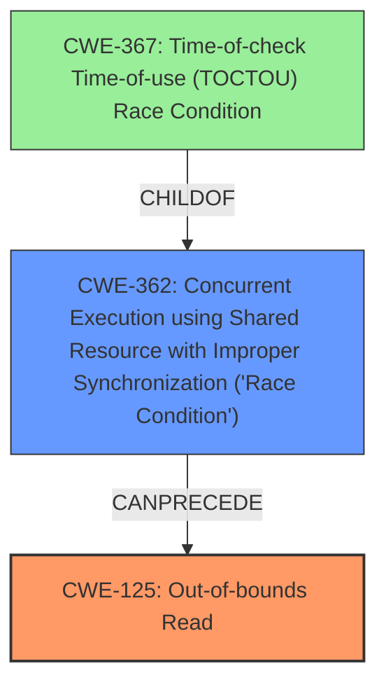

# Final Resolution for CVE-2022-1462

# Summary
| CWE ID | CWE Name | Confidence | CWE Abstraction Level | CWE Vulnerability Mapping Label | CWE-Vulnerability Mapping Notes |
|---|---|---|---|---|---|
| CWE-125 | Out-of-bounds Read | 0.95 | Base | Allowed | Primary CWE |
| CWE-362 | Concurrent Execution using Shared Resource with Improper Synchronization ('**Race Condition**') | 0.80 | Class | Allowed-with-Review | Secondary CWE |

## Evidence and Confidence

*   **Confidence Score:** 0.90
*   **Evidence Strength:** HIGH

## Relationship Analysis
The primary relationship impacting the decision is the parent-child relationship between CWE-362 and its potential children like CWE-367. While CWE-367 was considered, the race condition doesn't perfectly align with the TOCTOU pattern, making CWE-362 a more suitable, though less specific, choice. The chain relationship shows that the **race condition** (CWE-362) can precede the **out-of-bounds read** (CWE-125).

## Vulnerability Chain
The vulnerability chain starts with a **race condition** (CWE-362) in the `tty_flip_buffer_push` function, which leads to an incorrect calculation of the `count` variable in `flush_to_ldisc`. This incorrect count then results in an **out-of-bounds read** (CWE-125). The root cause is the lack of proper synchronization in the concurrent execution, and the impact is reading unauthorized data or a system crash.

## Summary of Analysis
The initial analysis correctly identifies CWE-125 as the primary weakness due to the explicit mention of an **out-of-bounds read** in the vulnerability description: "An **out-of-bounds read** flaw was found in the Linux kernels TeleTYpe subsystem." The analysis also correctly identifies CWE-362 as a contributing factor due to the **race condition**.

The criticism suggests considering CWE-367 as a more specific alternative to CWE-362. However, after careful consideration, CWE-362 is retained because the vulnerability doesn't strictly adhere to the TOCTOU pattern. While the buffer state is checked implicitly, the race condition doesn't involve a direct check-then-use sequence in the traditional sense.

The graph relationships influenced the decision by highlighting the potential for a more specific CWE but ultimately confirming that CWE-362, despite being a Class, is the most appropriate representation of the **race condition** given the available evidence. CWE-125 remains the primary CWE because it directly reflects the observed impact of the vulnerability.

The selected CWEs are at the optimal level of specificity. CWE-125 accurately describes the **out-of-bounds read**, and CWE-362, while a Class, best captures the nature of the **race condition** without forcing a misapplication of CWE-367.