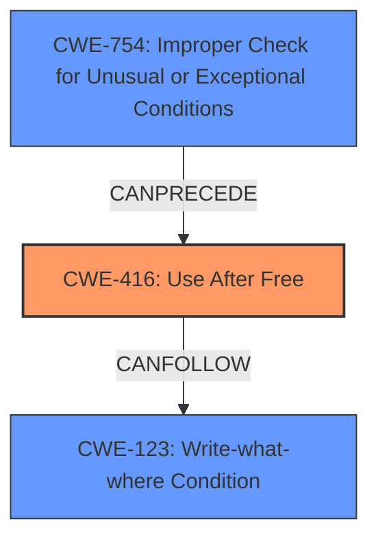

# Final Resolution for CVE-2022-1478

# Summary
| CWE ID | CWE Name | Confidence | CWE Abstraction Level | CWE Vulnerability Mapping Label | CWE-Vulnerability Mapping Notes |
|---|---|---|---|---|---|
| CWE-416 | Use After Free | 1.0 | Variant | Allowed | Primary CWE: The vulnerability aligns directly with the CWE description of reusing memory after it has been freed. The description explicitly states "Use after free" as the root cause.|
| CWE-754 | Improper Check for Unusual or Exceptional Conditions | 0.6 | Class | Allowed-with-Review | Secondary Candidate: A use-after-free can occur if a developer fails to adequately handle an unusual or exceptional condition related to memory management. |
| CWE-123 | Write-what-where Condition | 0.5 | Base | Allowed | Secondary Candidate: An attacker who can trigger a use-after-free condition might then be able to control the content written to the memory location when it's reallocated, leading to a write-what-where condition. |

## Evidence and Confidence

*   **Confidence Score:** 0.9
*   **Evidence Strength:** HIGH

## Relationship Analysis
The primary relationship influencing the decision is the direct match between the vulnerability description and **CWE-416 (Use After Free)**. The secondary relationships considered include **CWE-754 (Improper Check for Unusual or Exceptional Conditions)**, which can lead to a UAF if error conditions related to memory management are not properly handled, and **CWE-123 (Write-what-where Condition)**, which can result from exploiting a UAF. The abstraction levels (Variant for CWE-416, Class for CWE-754, and Base for CWE-123) provide appropriate specificity.

## Vulnerability Chain
The vulnerability chain starts with a potential **ROOTCAUSE** of **CWE-754 (Improper Check for Unusual or Exceptional Conditions)**, where a failure to handle error conditions related to memory management leads to a **WEAKNESS** of **CWE-416 (Use After Free)**. Exploitation of this **WEAKNESS** allows an attacker to perform a **WEAKNESS** of **CWE-123 (Write-what-where Condition)**, potentially leading to arbitrary code execution.

## Summary of Analysis
The initial analysis correctly identified **CWE-416 (Use After Free)** as the primary **WEAKNESS** given the explicit description in the CVE. The criticism highlighted the importance of considering related CWEs and providing more context. The inclusion of **CWE-754 (Improper Check for Unusual or Exceptional Conditions)** as a potential root cause, and **CWE-123 (Write-what-where Condition)** as a potential consequence, strengthens the analysis by illustrating the vulnerability chain. The evidence provided is strong, and the decision is justified by the direct match to the vulnerability description and the consideration of related weaknesses. The selected CWEs are at an optimal level of specificity, with CWE-416 being a Variant, CWE-754 being a Class, and CWE-123 being a Base. The analysis is based on the provided evidence and relationship insights and demonstrates a deeper understanding of the vulnerability context.

The selection of CWEs reflects the optimal level of specificity, with **CWE-416 (Use After Free)** being a Variant that directly matches the vulnerability, **CWE-754 (Improper Check for Unusual or Exceptional Conditions)** being a Class that highlights the potential for error handling issues, and **CWE-123 (Write-what-where Condition)** being a Base that represents the potential impact of the vulnerability.