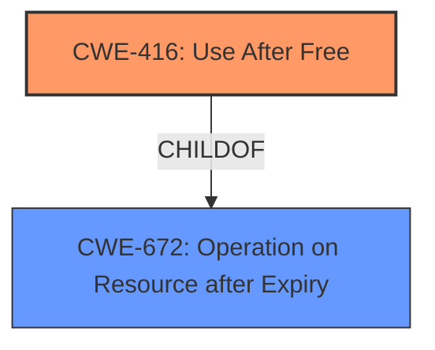

# Final Resolution for CVE-2022-1481

# Summary
| CWE ID | CWE Name | Confidence | CWE Abstraction Level | CWE Vulnerability Mapping Label | CWE-Vulnerability Mapping Notes |
|---|---|---|---|---|---|
| CWE-416 | Use After Free | 1.0 | Variant | Primary | Allowed |

## Evidence and Confidence

*   **Confidence Score:** 1.0
*   **Evidence Strength:** HIGH

## Relationship Analysis
The primary relationship is that CWE-416 **Use After Free** is a variant of CWE-672 Operation on Resource after Expiry. Given that CWE-416 is a variant, this is the optimal level of specificity. There are no other relevant relationships based on the description provided.

## Vulnerability Chain
The vulnerability chain starts with the **ROOTCAUSE** being a **CWE-416 Use After Free**. This leads to **heap corruption**, and the impact is that a remote attacker can exploit this via a crafted HTML page.

## Summary of Analysis
The initial analysis and criticism both strongly support CWE-416 **Use After Free** as the primary **WEAKNESS**. The vulnerability description explicitly states "Use after free". The high retriever scores, combined with the direct match of the vulnerability description to the CWE description, provide strong evidence for this classification. The relationship analysis confirms that CWE-416 is at an appropriate level of specificity, being a variant of CWE-672. The mapping guidance for CWE-416 indicates it is ALLOWED. The analysis is based heavily on the provided evidence, specifically the vulnerability description: "Use after free in Sharing in Google Chrome on Mac prior to 101.0.4951.41 allowed a remote attacker who convinced a user to engage in specific user interaction to potentially exploit heap corruption via a crafted HTML page." The selection of CWE-416 is at the optimal level of specificity because it is a Variant-level CWE that directly describes the **ROOTCAUSE** of the vulnerability, as stated in the vulnerability description.