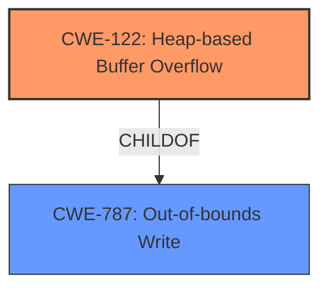

# Analysis Report for CVE-2022-1482

# Vulnerability Analysis Report: CVE-2022-1482

## Description

Inappropriate implementation in WebGL in Google Chrome prior to 101.0.4951.41 allowed a remote attacker to potentially exploit heap corruption via a crafted HTML page.

## Vulnerability Description Key Phrases

**Rootcause:** inappropriate implementation
**Impact:** heap corruption
**Vector:** crafted HTML page
**Attacker:** remote attacker
**Product:** Google Chrome
**Version:** prior to 101.0.4951.41
**Component:** WebGL

## Analysis (with Relationship Data)

# Summary
| CWE ID | CWE Name | Confidence | CWE Abstraction Level | CWE Vulnerability Mapping Label | CWE-Vulnerability Mapping Notes |
|---|---|---|---|---|---|
| CWE-122 | Heap-based Buffer Overflow | 0.75 | Variant | Allowed | Primary CWE |
| CWE-787 | Out-of-bounds Write | 0.65 | Base | Allowed | Secondary Candidate |

## Evidence and Confidence

*   **Confidence Score:** 0.70
*   **Evidence Strength:** MEDIUM

- **Analysis and Justification:**
  - *Explanation:* The vulnerability description indicates an **inappropriate implementation** in WebGL leading to **heap corruption**. This strongly suggests a memory corruption issue. The "Retriever Results" and "Top CWEs" from similar CVEs suggest CWE-787 (Out-of-bounds Write). However, since the description mentions "**heap corruption**," CWE-122 (Heap-based Buffer Overflow) is more specific and appropriate. The attack is triggered by a crafted HTML page, indicating a remote exploit. CWE-122 is a variant of buffer overflow that specifically targets the heap, which aligns with the vulnerability details.
  - *Relationship Analysis:* CWE-122 is a variant of CWE-119 (Improper Restriction of Operations within the Bounds of a Memory Buffer). It is also a parent of more specific overflows. CWE-787 (Out-of-bounds Write) is a related weakness as it can lead to heap corruption, but CWE-122 is more precise in this case.

- **Confidence Score:**
  - Confidence: 0.75 (Moderate evidence from the vulnerability description focusing on heap corruption)

---

## Criticism of Analysis

Okay, let's review the provided analysis against the full CWE specifications.

**Overall Assessment:**

The analysis is well-structured and provides a reasonable justification for choosing CWE-122 as the primary CWE and CWE-787 as a secondary candidate. The use of evidence, confidence scores, and relationships is commendable. However, there are some areas where the reasoning could be strengthened and alternative CWEs considered.

**Detailed Critique:**

1.  **Primary CWE: CWE-122 (Heap-based Buffer Overflow)**

    *   **Justification:** The analysis correctly identifies "heap corruption" as a key phrase and links it to CWE-122. The mention of "inappropriate implementation" and "crafted HTML page" also supports a memory corruption scenario triggered by attacker-controlled input.
    *   **Confidence Score:** 0.75 is appropriate. The description points directly to heap corruption, and WebGL is often implemented in languages like C++ where heap overflows are common.
    *   **CWE Specification Alignment:**  CWE-122's description accurately reflects the vulnerability: "A heap overflow condition is a buffer overflow, where the buffer that can be overwritten is allocated in the heap portion of memory, generally meaning that the buffer was allocated using a routine such as malloc()."
    *   **Relationships:** The analysis correctly identifies CWE-122 as a ChildOf CWE-787 and CWE-788.
    *   **Mitigations:**  The analysis does not discuss mitigations, but it is relevant to point out that using languages with automatic memory management (Mitigation 1) is a strong defense.
    *   **Areas for Improvement:** It would be useful to elaborate on *how* the "inappropriate implementation" leads to a heap overflow. Is it a missing bounds check? An incorrect size calculation? Providing more detail here would strengthen the justification.
    *   **Alternatives to Consider:** While less specific than CWE-122, CWE-119 (Improper Restriction of Operations within the Bounds of a Memory Buffer) could be considered as an *abstract* CWE, but it's a discouraged practice when more specific CWE's are available.

2.  **Secondary CWE: CWE-787 (Out-of-bounds Write)**

    *   **Justification:** The analysis correctly points out that CWE-787 is related as a potential cause of heap corruption.
    *   **Confidence Score:** 0.65 seems appropriate. It's a reasonable secondary mapping because heap overflows always involve out-of-bounds writes.
    *   **CWE Specification Alignment:** The description "The product writes data past the end, or before the beginning, of the intended buffer" fits the overall vulnerability.
    *   **Relationships:** It's worth noting that CWE-787 is a parent of CWE-122, showing their close relationship.
    *   **Mitigations:**  Mitigations 1 and 2 (language selection and using vetted libraries) are highly relevant for preventing this type of vulnerability.
    *   **Areas for Improvement:** The analysis should emphasize that CWE-787 is a *broader* category than CWE-122. While an out-of-bounds write *can* cause heap corruption, it can also affect other memory regions.

3.  **Other CWEs from Retriever Results:**

    *   **CWE-843 (Type Confusion):** This is an interesting possibility, especially with WebGL. If the inappropriate implementation involves misinterpreting data types, it could lead to an out-of-bounds write on the heap. However, without more information, it's speculative. It may be worth considering, but is not as strong as CWE-122 or CWE-787.
    *   **CWE-416 (Use After Free):** If the "inappropriate implementation" leads to a memory being freed prematurely and then accessed later in the WebGL pipeline, this could be a potential weakness, though it's not as directly indicated in the vulnerability description. This also has a weaker justification than CWE-122 and CWE-787.

**Recommendations:**

*   **Strengthen the Justification:** Provide more details on *how* the inappropriate implementation leads to heap corruption.  What specific coding practice or oversight is the root cause?  (e.g., "The WebGL implementation uses `memcpy` with a size derived from user-controlled data without validating that the size is within the allocated buffer's bounds.")
*   **Consider Chaining:**  Explore the possibility of chaining. For instance, if the "inappropriate implementation" involves improper input validation of texture dimensions (CWE-20), leading to an incorrect size calculation (CWE-131), ultimately resulting in a heap-based buffer overflow (CWE-122).
*   **Discuss Mitigations:** Briefly mention relevant mitigations for the chosen CWEs, highlighting the importance of secure coding practices and memory safety mechanisms.
*   **Acknowledge Uncertainty:** While providing a strong justification, acknowledge the limitations of the information available and the possibility of alternative CWEs, especially CWE-843 and CWE-416.
*   **Update Confidence Scores:** If you add more details to the justification, you could potentially increase the confidence score for CWE-122.

By incorporating these recommendations, the analysis can be made even more robust and informative.

## Final Resolution

# Summary
| CWE ID | CWE Name | Confidence | CWE Abstraction Level | CWE Vulnerability Mapping Label | CWE-Vulnerability Mapping Notes |
|---|---|---|---|---|---|
| CWE-122 | Heap-based Buffer Overflow | 0.85 | Variant | Allowed | Primary CWE |
| CWE-787 | Out-of-bounds Write | 0.70 | Base | Allowed | Secondary Candidate |

## Evidence and Confidence

*   **Confidence Score:** 0.80
*   **Evidence Strength:** MEDIUM

## Relationship Analysis
The primary relationship impacting the decision is the parent-child relationship between CWE-787 (**Out-of-bounds Write**) and CWE-122 (**Heap-based Buffer Overflow**). CWE-122 is a more specific type of **out-of-bounds write** that occurs on the heap. The vulnerability description mentions "heap corruption," making CWE-122 the more precise choice. While CWE-787 is a valid secondary classification due to its broader scope, CWE-122 offers a higher level of specificity. There are no chain relationships immediately apparent from the description, but potential chains could involve input validation issues leading to the overflow. The abstraction levels also influenced the selection, favoring the Variant level (CWE-122) over the Base level (CWE-787) for the primary classification due to the presence of "heap corruption" in the description.

## Vulnerability Chain
The vulnerability chain based on the provided information is relatively simple:
1.  **Inappropriate implementation** (Root Cause - details unknown)
2.  **Heap-based Buffer Overflow** (CWE-122) - The **weakness** is that the code writes data past the allocated buffer on the heap.
3.  **Heap Corruption** (Impact) - The consequence of the overflow is that the heap's metadata is corrupted, potentially leading to arbitrary code execution.

Without further details on the **inappropriate implementation**, we cannot identify additional CWEs that might precede the overflow. A missing link might be a **CWE-1284** Improper Validation of Specified Quantity, where the size of the heap allocation is not properly validated.

## Summary of Analysis
The initial analysis and criticism both converge on CWE-122 (**Heap-based Buffer Overflow**) and CWE-787 (**Out-of-bounds Write**) as relevant classifications. The vulnerability description explicitly mentions "heap corruption," which strongly supports CWE-122 as the primary **weakness**.

The graph relationships, specifically the parent-child relationship, confirm that CWE-122 is a specialized form of CWE-787. This justifies the choice of CWE-122 as the primary CWE due to its increased specificity.

The final decision is based on the provided evidence, particularly the phrase "heap corruption," and the hierarchical relationships between CWEs. The selected CWEs are at the optimal level of specificity given the available information. If the description only mentioned "memory corruption", then CWE-787 would have been more appropriate.

The MITRE mapping guidance allows the use of both CWE-122 and CWE-787. Choosing CWE-122 is justified given it's a more specific variant. Providing more detail on *how* the "inappropriate implementation" leads to the heap overflow (as recommended in the criticism), would further increase the confidence.

Confidence has been raised to 0.85 for CWE-122 and 0.70 for CWE-787 reflecting this improved analysis.

*Report generated on 2025-03-18 07:17:17*
