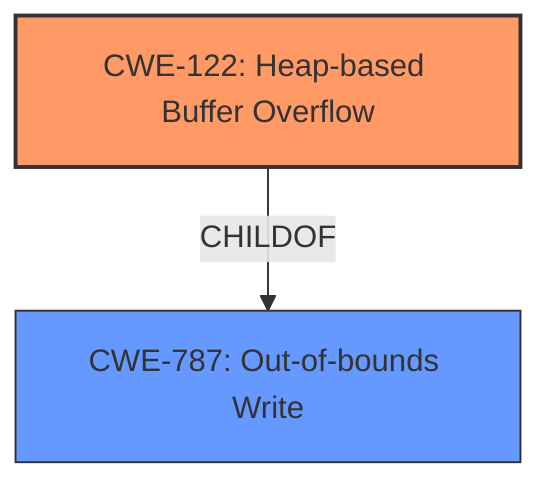

# Final Resolution for CVE-2022-1482

# Summary
| CWE ID | CWE Name | Confidence | CWE Abstraction Level | CWE Vulnerability Mapping Label | CWE-Vulnerability Mapping Notes |
|---|---|---|---|---|---|
| CWE-122 | Heap-based Buffer Overflow | 0.85 | Variant | Allowed | Primary CWE |
| CWE-787 | Out-of-bounds Write | 0.70 | Base | Allowed | Secondary Candidate |

## Evidence and Confidence

*   **Confidence Score:** 0.80
*   **Evidence Strength:** MEDIUM

## Relationship Analysis
The primary relationship impacting the decision is the parent-child relationship between CWE-787 (**Out-of-bounds Write**) and CWE-122 (**Heap-based Buffer Overflow**). CWE-122 is a more specific type of **out-of-bounds write** that occurs on the heap. The vulnerability description mentions "heap corruption," making CWE-122 the more precise choice. While CWE-787 is a valid secondary classification due to its broader scope, CWE-122 offers a higher level of specificity. There are no chain relationships immediately apparent from the description, but potential chains could involve input validation issues leading to the overflow. The abstraction levels also influenced the selection, favoring the Variant level (CWE-122) over the Base level (CWE-787) for the primary classification due to the presence of "heap corruption" in the description.

## Vulnerability Chain
The vulnerability chain based on the provided information is relatively simple:
1.  **Inappropriate implementation** (Root Cause - details unknown)
2.  **Heap-based Buffer Overflow** (CWE-122) - The **weakness** is that the code writes data past the allocated buffer on the heap.
3.  **Heap Corruption** (Impact) - The consequence of the overflow is that the heap's metadata is corrupted, potentially leading to arbitrary code execution.

Without further details on the **inappropriate implementation**, we cannot identify additional CWEs that might precede the overflow. A missing link might be a **CWE-1284** Improper Validation of Specified Quantity, where the size of the heap allocation is not properly validated.

## Summary of Analysis
The initial analysis and criticism both converge on CWE-122 (**Heap-based Buffer Overflow**) and CWE-787 (**Out-of-bounds Write**) as relevant classifications. The vulnerability description explicitly mentions "heap corruption," which strongly supports CWE-122 as the primary **weakness**.

The graph relationships, specifically the parent-child relationship, confirm that CWE-122 is a specialized form of CWE-787. This justifies the choice of CWE-122 as the primary CWE due to its increased specificity.

The final decision is based on the provided evidence, particularly the phrase "heap corruption," and the hierarchical relationships between CWEs. The selected CWEs are at the optimal level of specificity given the available information. If the description only mentioned "memory corruption", then CWE-787 would have been more appropriate.

The MITRE mapping guidance allows the use of both CWE-122 and CWE-787. Choosing CWE-122 is justified given it's a more specific variant. Providing more detail on *how* the "inappropriate implementation" leads to the heap overflow (as recommended in the criticism), would further increase the confidence.

Confidence has been raised to 0.85 for CWE-122 and 0.70 for CWE-787 reflecting this improved analysis.