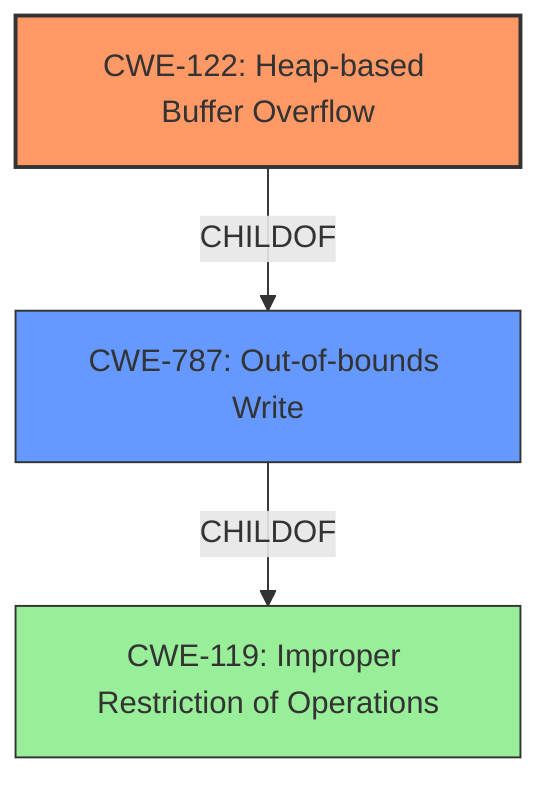

# Analysis Report for CVE-2022-1483

# Vulnerability Analysis Report: CVE-2022-1483

## Description

Heap buffer overflow in WebGPU in Google Chrome prior to 101.0.4951.41 allowed a remote attacker who had compromised the renderer process to potentially exploit heap corruption via a crafted HTML page.

## Vulnerability Description Key Phrases

**Rootcause:** buffer overflow
**Impact:** heap corruption
**Vector:** crafted HTML page
**Attacker:** remote attacker who had compromised the renderer process
**Product:** Google Chrome
**Version:** prior to 101.0.4951.41
**Component:** WebGPU

## Analysis (with Relationship Data)

# Summary
| CWE ID | CWE Name | Confidence | CWE Abstraction Level | CWE Vulnerability Mapping Label | CWE-Vulnerability Mapping Notes |
|---|---|---|---|---|---|
| CWE-122 | Heap-based Buffer Overflow | 0.95 | Variant | Allowed | Primary CWE |
| CWE-787 | Out-of-bounds Write | 0.75 | Base | Allowed | Secondary Candidate |

## Evidence and Confidence

*   **Confidence Score:** 0.90
*   **Evidence Strength:** HIGH

- **Analysis and Justification:**  
  - *Explanation:* The vulnerability description explicitly states a "Heap **buffer overflow** in WebGPU". CWE-122 (Heap-based Buffer Overflow) is a variant of a buffer overflow that occurs specifically in the heap, aligning precisely with the provided description. The "CVE Reference Links Content Summary" further reinforces this by detailing the vulnerability as a heap buffer overflow with potential consequences such as remote code execution. While CWE-787 (Out-of-bounds Write) is a broader category encompassing all out-of-bounds writes, CWE-122 is more specific to the heap, making it the more appropriate primary mapping. The MITRE mapping guidance for both CWE-122 and CWE-787 indicates they are ALLOWED, further validating this choice.
  
  - *Relationship Analysis:* CWE-122 is a variant of CWE-119 (Improper Restriction of Operations within the Bounds of a Memory Buffer) and a parent of CWE-787 (Out-of-bounds Write). Choosing CWE-122 provides more specific information about the location of the buffer overflow (heap) than its parent CWE-119 while still remaining specific, and since it has a parent/child relationship with CWE-787 we can see that there is definitely an out-of-bounds write happening.

- **Confidence Score:**  
  - Confidence: 0.95 (High confidence due to the explicit mention of "heap buffer overflow" and supporting details in the CVE reference materials.)

## Criticism of Analysis

Okay, here's a review of the analysis, considering the full CWE specifications:

**Overall Assessment:**

The analysis is generally very good and well-reasoned. The choice of CWE-122 as the primary CWE is strongly justified. The high confidence level is appropriate.  The secondary candidate, CWE-787, also makes sense as a related CWE. The justification is clear, logical, and consistent with the CWE specifications.

**Detailed Review:**

*   **CWE-122 (Heap-based Buffer Overflow) - Primary CWE**

    *   **Justification Strength:** Excellent. The vulnerability description explicitly mentions "Heap buffer overflow," making CWE-122 the most directly applicable CWE.
    *   **CWE Specification Alignment:** The description of CWE-122 precisely matches the vulnerability's root cause: an overflow occurring within memory allocated on the heap. The "Description" from the CWE specification supports this: "A heap overflow condition is a buffer overflow, where the buffer that can be overwritten is allocated in the heap portion of memory, generally meaning that the buffer was allocated using a routine such as malloc()."
    *   **Mapping Guidance:** The analysis correctly notes that the Mapping Guidance for CWE-122 states that it is *Allowed* and that it's at the Variant level of abstraction, which is preferred.
    *   **Mitigations:** The analysis doesn't directly mention mitigations, but it could be strengthened by briefly noting that potential mitigations include:
        *   Using languages or compilers with automatic bounds checking.
        *   Using abstraction libraries that reduce the risk of memory management errors.
        *   Employing compiler-based buffer overflow detection mechanisms (e.g., /GS flag in Visual Studio, FORTIFY_SOURCE in GCC).

*   **CWE-787 (Out-of-bounds Write) - Secondary Candidate**

    *   **Justification Strength:** Good. Since CWE-122 is a *type* of out-of-bounds write, CWE-787 serves as a good secondary candidate, that is still helpful for broader categorization.
    *   **CWE Specification Alignment:** The CWE specification confirms that CWE-787 is a parent of CWE-122. While not as precise as CWE-122, it accurately reflects the nature of the vulnerability (writing data beyond the buffer's boundaries).
    *   **Mapping Guidance:** The analysis correctly identifies that the mapping guidance for CWE-787 indicates it is *Allowed*.
    *   **Mitigations:** The mitigations for CWE-787 are similar to those for CWE-122, such as using memory-safe languages and employing buffer overflow detection mechanisms.

*   **Consideration of Other CWEs (From Retriever Results):**

    *   **CWE-843 (Type Confusion):** While type confusion *can* lead to out-of-bounds access, it's not the direct root cause in this scenario. The description indicates a buffer overflow. Type confusion might be a *contributing* factor if the size calculation relied on incorrect type assumptions, but that's not explicitly stated in the vulnerability description.
    *   **CWE-190 (Integer Overflow):** Similar to type confusion, integer overflow *could* contribute to the vulnerability if the buffer size calculation was based on a flawed integer operation. But without concrete evidence, it's speculative.
    *   **CWE-366 (Race Condition within a Thread):** A race condition is highly unlikely to be the primary cause of a buffer overflow.
    *   **CWE-126 (Buffer Over-read):** This is the opposite of what's described, so it's not relevant.
    *   **CWE-416 (Use After Free):**  The vulnerability description doesn't suggest anything about memory being freed and then reused.
    *   **CWE-123 (Write-what-where Condition):** While a heap buffer overflow *can* lead to a write-what-where condition, the primary issue is the overflow itself. CWE-123 is more of a *consequence* than the initial cause.
    *   **CWE-193 (Off-by-one Error):** An off-by-one error *could* be the reason behind the overflow, but that's not explicitly stated.
    *   **CWE-125 (Out-of-bounds Read):** Again, this describes the opposite condition of the described vulnerability.

**Improvements:**

*   **Mitigation Examples:**  While the justification for CWE selection is strong, the analysis could be improved by briefly mentioning a couple of concrete mitigation strategies derived from the CWE specifications.  This adds more practical value to the analysis.
*   **Chain Analysis (Optional):** If further investigation revealed specific coding practices within WebGPU, you *could* explore potential chains. For example: (Hypothetical) CWE-20 (Improper Input Validation) -> CWE-131 (Incorrect Calculation of Buffer Size) -> CWE-122 (Heap-based Buffer Overflow). But this is only valuable if you have concrete evidence of the contributing factors.

**Revised Summary Table:**

| CWE ID  | CWE Name                    | Confidence | CWE Abstraction Level | CWE Vulnerability Mapping Label | CWE-Vulnerability Mapping Notes                                                                                                                    |
| :------- | :-------------------------- | :--------- | :---------------------- | :------------------------------ | :----------------------------------------------------------------------------------------------------------------------------------------------- |
| CWE-122 | Heap-based Buffer Overflow  | 0.95       | Variant               | Allowed                        | Primary CWE. Mitigations include bounds checking and memory-safe languages.                                                                      |
| CWE-787 | Out-of-bounds Write       | 0.75       | Base                  | Allowed                        | Secondary Candidate. Indicates a general out-of-bounds write. Mitigations include compiler-based overflow detection.                                |

**Conclusion:**

The original analysis is excellent. Incorporating the suggested improvements (primarily adding mitigation examples) would make it even more comprehensive. The confidence levels are well-justified and the CWE selections are appropriate given the available information.

## Final Resolution

# Summary
| CWE ID | CWE Name | Confidence | CWE Abstraction Level | CWE Vulnerability Mapping Label | CWE-Vulnerability Mapping Notes |
|---|---|---|---|---|---|
| CWE-122 | Heap-based Buffer Overflow | 0.95 | Variant | Allowed | Primary CWE |
| CWE-787 | Out-of-bounds Write | 0.75 | Base | Allowed | Secondary Candidate |

## Evidence and Confidence

*   **Confidence Score:** 0.95
*   **Evidence Strength:** HIGH

## Relationship Analysis
The primary relationship impacting the decision is the parent-child relationship between **CWE-119 (Improper Restriction of Operations within the Bounds of a Memory Buffer)**, **CWE-787 (Out-of-bounds Write)**, and **CWE-122 (Heap-based Buffer Overflow)**. **CWE-122** is a variant of **CWE-119** and a more specific type of **CWE-787**, indicating that the out-of-bounds write occurs specifically in the heap. The abstraction levels influenced the selection by favoring the more specific Variant level (**CWE-122**) over the broader Class (**CWE-119**) or Base (**CWE-787**).

## Vulnerability Chain
The vulnerability chain, based on the provided description, involves:
1.  A crafted HTML page is processed by the renderer.
2.  A **HEAP BUFFER OVERFLOW (CWE-122)** occurs within the WebGPU component in Google Chrome.
    -   This is essentially an **OUT-OF-BOUNDS WRITE (CWE-787)** on the heap.
3.  This may lead to heap corruption.
4.  The attacker may gain remote code execution.

The chain is fairly direct. The **ROOTCAUSE** is the **HEAP BUFFER OVERFLOW (CWE-122)** due to improper handling of a crafted HTML page. The direct consequence is heap corruption and potential for remote code execution.

## Summary of Analysis
The initial analysis, along with the provided criticism, both strongly point towards **CWE-122 (Heap-based Buffer Overflow)** as the primary CWE. The vulnerability description explicitly mentions "Heap **buffer overflow**," which is the most direct evidence. The criticism emphasizes that **CWE-122** aligns perfectly with the vulnerability's root cause and provides suggestions to strengthen the analysis by adding mitigation examples.

The graph relationships influenced the decision by confirming that **CWE-122** is a specific type of **OUT-OF-BOUNDS WRITE (CWE-787)**. The abstraction levels further support this, as **CWE-122** is at the Variant level, providing more specific information than the Base level **CWE-787**.

The chosen CWEs are at the optimal level of specificity because **CWE-122** directly reflects the vulnerability description, while **CWE-787** provides a broader categorization. There is no indication of any other contributing factors, such as integer overflows or type confusion, based on the evidence. The final assessment is almost entirely based on the explicit mention of "Heap **buffer overflow**" in the vulnerability description, making **CWE-122** the most appropriate choice.

*Report generated on 2025-03-18 07:17:59*
