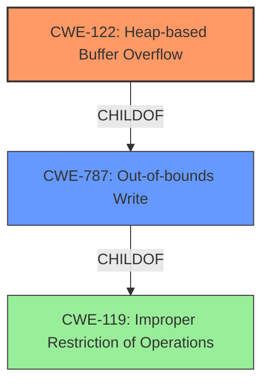

# Final Resolution for CVE-2022-1483

# Summary
| CWE ID | CWE Name | Confidence | CWE Abstraction Level | CWE Vulnerability Mapping Label | CWE-Vulnerability Mapping Notes |
|---|---|---|---|---|---|
| CWE-122 | Heap-based Buffer Overflow | 0.95 | Variant | Allowed | Primary CWE |
| CWE-787 | Out-of-bounds Write | 0.75 | Base | Allowed | Secondary Candidate |

## Evidence and Confidence

*   **Confidence Score:** 0.95
*   **Evidence Strength:** HIGH

## Relationship Analysis
The primary relationship impacting the decision is the parent-child relationship between **CWE-119 (Improper Restriction of Operations within the Bounds of a Memory Buffer)**, **CWE-787 (Out-of-bounds Write)**, and **CWE-122 (Heap-based Buffer Overflow)**. **CWE-122** is a variant of **CWE-119** and a more specific type of **CWE-787**, indicating that the out-of-bounds write occurs specifically in the heap. The abstraction levels influenced the selection by favoring the more specific Variant level (**CWE-122**) over the broader Class (**CWE-119**) or Base (**CWE-787**).

## Vulnerability Chain
The vulnerability chain, based on the provided description, involves:
1.  A crafted HTML page is processed by the renderer.
2.  A **HEAP BUFFER OVERFLOW (CWE-122)** occurs within the WebGPU component in Google Chrome.
    -   This is essentially an **OUT-OF-BOUNDS WRITE (CWE-787)** on the heap.
3.  This may lead to heap corruption.
4.  The attacker may gain remote code execution.

The chain is fairly direct. The **ROOTCAUSE** is the **HEAP BUFFER OVERFLOW (CWE-122)** due to improper handling of a crafted HTML page. The direct consequence is heap corruption and potential for remote code execution.

## Summary of Analysis
The initial analysis, along with the provided criticism, both strongly point towards **CWE-122 (Heap-based Buffer Overflow)** as the primary CWE. The vulnerability description explicitly mentions "Heap **buffer overflow**," which is the most direct evidence. The criticism emphasizes that **CWE-122** aligns perfectly with the vulnerability's root cause and provides suggestions to strengthen the analysis by adding mitigation examples.

The graph relationships influenced the decision by confirming that **CWE-122** is a specific type of **OUT-OF-BOUNDS WRITE (CWE-787)**. The abstraction levels further support this, as **CWE-122** is at the Variant level, providing more specific information than the Base level **CWE-787**.

The chosen CWEs are at the optimal level of specificity because **CWE-122** directly reflects the vulnerability description, while **CWE-787** provides a broader categorization. There is no indication of any other contributing factors, such as integer overflows or type confusion, based on the evidence. The final assessment is almost entirely based on the explicit mention of "Heap **buffer overflow**" in the vulnerability description, making **CWE-122** the most appropriate choice.