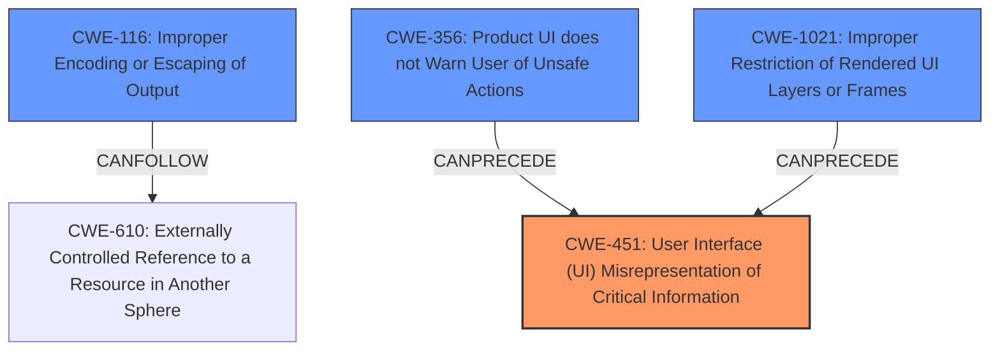

# Final Resolution for CVE-2022-1488

# Summary
| CWE ID | CWE Name | Confidence | CWE Abstraction Level | CWE Vulnerability Mapping Label | CWE-Vulnerability Mapping Notes |
|---|---|---|---|---|---|
| CWE-451 | User Interface (UI) Misrepresentation of Critical Information | 0.5 | Class | Allowed-with-Review | Primary CWE |
| CWE-116 | Improper Encoding or Escaping of Output | 0.4 | Class | Allowed-with-Review | Secondary Candidate |
| CWE-356 | Product UI does not Warn User of Unsafe Actions | 0.4 | Base | Allowed | Secondary Candidate |
| CWE-1021 | Improper Restriction of Rendered UI Layers or Frames | 0.2 | Base | Allowed | Secondary Candidate |

## Evidence and Confidence

*   **Confidence Score:** 0.5
*   **Evidence Strength:** MEDIUM

## Relationship Analysis
The primary relationships that influenced the decision were hierarchical (ParentOf, ChildOf) and chain relationships (CanPrecede, CanFollow). CWE-451 is chosen as a primary Class-level CWE, acknowledging that more specific Base or Variant level CWEs might exist but aren't identifiable with the given information. The selection of CWE-116 acknowledges the potential for improper encoding leading to data leakage. CWE-356 and CWE-1021 are retained with lower confidence to reflect UI-related contributing factors. The abstraction levels guided the selection, favoring Base-level CWEs when possible but acknowledging the need for Class-level CWEs due to limited information.

## Vulnerability Chain
The vulnerability chain starts with the user being convinced to install a malicious extension, suggesting a misrepresentation of critical information in the UI (**CWE-451**) or a lack of warnings (**CWE-356**). This leads to the installation of the malicious extension. Subsequently, the extension uses improper encoding (**CWE-116**) when communicating with other origins, leading to cross-origin data leakage. The externally controlled reference (**CWE-610**) can be seen as the point where the data crosses domains, but is not selected because there are other better fits.

## Summary of Analysis
The initial analysis correctly pointed out the difficulty in assigning specific CWEs due to the vague vulnerability description. The criticism provided valuable insights and suggested more appropriate candidates. The final assessment incorporates these suggestions, prioritizing **CWE-451 (User Interface (UI) Misrepresentation of Critical Information)** as the primary **WEAKNESS** because the vulnerability description specifically mentions that the attacker "convinced" the user, implying a UI issue. The confidence is set to 0.5 because while this is the most likely scenario, it still relies on an interpretation of the vague description.

The selection of **CWE-116 (Improper Encoding or Escaping of Output)** is based on the possibility that the extension API isn't properly encoding data, allowing the malicious extension to inject code or commands. This is a plausible scenario given the cross-origin data leakage, and the Retriever results support it.

**CWE-356 (Product UI does not Warn User of Unsafe Actions)** is retained with a confidence of 0.4, as it's also possible that the UI didn't adequately warn the user about the risks of installing the extension.

**CWE-1021 (Improper Restriction of Rendered UI Layers or Frames)** is kept with a low confidence of 0.2. While clickjacking is a UI-based attack, the primary issue is data leakage, not necessarily tricking the user into performing unintended actions through UI manipulation.

The relationship analysis highlights how these CWEs could be chained together, with the UI issues (CWE-451, CWE-356, CWE-1021) leading to the installation of the malicious extension, which then exploits the encoding issue (CWE-116) to leak data.

The selected CWEs are at the optimal level of specificity given the available evidence. While more specific Base or Variant level CWEs might exist, the current information doesn't allow for their identification.