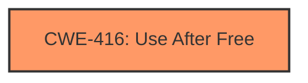

# Analysis Report for CVE-2022-1490

# Vulnerability Analysis Report: CVE-2022-1490

## Description

Use after free in Browser Switcher in Google Chrome prior to 101.0.4951.41 allowed a remote attacker who convinced a user to engage in specific user interaction to potentially exploit heap corruption via a crafted HTML page.

## Vulnerability Description Key Phrases

**Rootcause:** use after free
**Weakness:** heap corruption
**Vector:** crafted HTML page
**Attacker:** remote attacker
**Product:** Google Chrome
**Version:** prior to 101.0.4951.41
**Component:** Browser Switcher

## Analysis (with Relationship Data)

# Summary
| CWE ID | CWE Name | Confidence | CWE Abstraction Level | CWE Vulnerability Mapping Label | CWE-Vulnerability Mapping Notes |
|---|---|---|---|---|---|
| CWE-416 | Use After Free | 1.0 | Variant | Allowed | Primary CWE |

## Evidence and Confidence

*   **Confidence Score:** 1.0
*   **Evidence Strength:** HIGH

- **Analysis and Justification:**  
  - *Explanation:* The vulnerability description explicitly states "**use after free** in Browser Switcher" and the CVE Reference Links Content Summary confirms the "**Root cause of vulnerability** is **use-after-free**". The description of CWE-416 (Use After Free) precisely matches this: "The product reuses or references memory after it has been freed." The vulnerability also results in "**heap corruption**", which is a typical consequence of use-after-free. The Retriever Results also list CWE-416 as the top match with a high combined score. The "Usage: Allowed" mapping guidance reinforces this choice.

  - *Relationship Analysis:* CWE-416 is a Variant level CWE. There are no direct relationships that influence the mapping in this case.

- **Confidence Score:**  
  - Confidence: 1.0 (The vulnerability description directly mentions "use after free", and the CVE summary confirms it as the root cause.)

## Criticism of Analysis

## Critique of the Analysis

The analysis is very strong and confidently identifies the primary CWE as CWE-416 (Use After Free). The confidence score of 1.0 is justified given the explicit mention of "use after free" in both the vulnerability description and the CVE summary. The explanation is well-articulated and covers the key aspects of the vulnerability.

Here's a breakdown of the strengths and potential improvements:

**Strengths:**

*   **Accurate Identification:** The primary CWE mapping to CWE-416 is correct and well-supported by the evidence. The explanation clearly links the vulnerability description to the CWE definition.
*   **High Confidence Justification:** The analysis provides a clear and convincing rationale for the high confidence score. It references both the vulnerability description and the CVE summary.
*   **Abstraction Level Consideration:** The analysis acknowledges that CWE-416 is a Variant level CWE and that this is the preferred level of abstraction.
*   **Relationship Analysis:** The analysis correctly states that there are no direct relationships influencing the mapping in this case.
*   **Retriever Results Validation:** The analysis incorporates and validates the Retriever results, confirming that CWE-416 was the top match.
*   **Example Usage:** The analysis uses observed example CVEs to reinforce understanding of CWE-416.

**Potential Improvements and Considerations:**

1.  **Addressing "Heap Corruption" Secondary Weakness:** While CWE-416 is the primary root cause, the vulnerability description also mentions "heap corruption." It would be beneficial to acknowledge this more explicitly and discuss *why* it's not being mapped as a separate or related CWE.  A brief statement like, "Heap corruption is a common *consequence* of a use-after-free, rather than a distinct root cause in this instance," would be helpful. If the heap corruption was caused independently or had an independent trigger, then it may warrant another mapping, potentially to CWE-787 (Out-of-bounds Write) or CWE-122 (Heap-based Buffer Overflow) depending on how the heap was corrupted. Given the description, it seems highly likely that heap corruption is resultant.

2.  **Discussing Alternative CWEs Considered (and rejected):** The Retriever Results provide a list of other possible CWEs.  While the top choice is clearly correct, a brief explanation of *why* the other top contenders (CWE-366, CWE-843, CWE-415) were not selected would strengthen the analysis. For example:
    *   **CWE-366 (Race Condition within a Thread):** "While race conditions can sometimes *lead* to use-after-free vulnerabilities, the primary cause in this case is the memory management error itself, not a concurrency issue."
    *   **CWE-843 (Type Confusion):** "Type confusion is not explicitly mentioned in the vulnerability description. While a UAF can *result* in type confusion if the freed memory is reallocated with a different type, the root cause is still the UAF."
    *   **CWE-415 (Double Free):** "A double free would cause heap corruption, but is a different mechanism than the use of already freed memory."
    *   **CWE-122 (Heap-based Buffer Overflow):** "While heap corruption is mentioned, a heap-based buffer overflow is not the primary cause, as the initial vulnerability stemmed from a use-after-free, which then lead to heap corruption"

3.  **Mitigation Strategies:** The analysis could be slightly enhanced by briefly mentioning relevant mitigation strategies from the CWE-416 specification *in the context of the Browser Switcher component*.
    *   "Potential mitigations for CWE-416 include using languages with automatic memory management or, in the context of Browser Switcher (which may not be feasible), ensuring that pointers are set to NULL after being freed."  This shows an understanding that mitigations need to be practical and relevant to the affected component.

4.  **Considering Chains:**  While the analysis correctly identifies CWE-416 as the primary weakness, it would be helpful to briefly consider potential chaining scenarios, *even if they are not directly evident in the description*. For example, "It's possible that this UAF is triggered by a race condition (CWE-362) or improper error handling (CWE-754) that leads to premature freeing of the memory. However, without more information, we cannot confirm these as contributing factors." Addressing potential chains demonstrates a deeper understanding of the vulnerability and its potential context.

5.  **UI Misrepresentation (CWE-451):** It may be worthwhile mentioning that while a crafted HTML page is the attack vector, there's no explicit indication that the UI *itself* is misrepresenting information to the user that *directly* leads to the vulnerability.  The user is simply being convinced to interact in a specific way. If the UI displayed a misleading warning that the user ignored, *then* CWE-451 might be relevant.

**Revised Summary Table (Incorporating Suggestions):**

| CWE ID | CWE Name | Confidence | CWE Abstraction Level | CWE Vulnerability Mapping Label | CWE-Vulnerability Mapping Notes |
|---|---|---|---|---|---|
| CWE-416 | Use After Free | 1.0 | Variant | Allowed | Primary CWE. Heap corruption is a common consequence of the UAF, not an independent root cause. |

**In summary,** the analysis is excellent. The suggestions above are mostly minor enhancements that would further demonstrate a comprehensive understanding of the vulnerability and its context within the CWE framework. The mapping to CWE-416 is accurate and well-justified.

## Final Resolution

# Summary
| CWE ID | CWE Name | Confidence | CWE Abstraction Level | CWE Vulnerability Mapping Label | CWE-Vulnerability Mapping Notes |
|---|---|---|---|---|---|
| CWE-416 | Use After Free | 1.0 | Variant | Allowed | Primary CWE. Heap corruption is a common consequence of the **UAF**, not an independent **root cause**. |

## Evidence and Confidence

*   **Confidence Score:** 1.0
*   **Evidence Strength:** HIGH

## Relationship Analysis
The primary relationship considered was the lack of explicit relationships for CWE-416, emphasizing its direct applicability based on the vulnerability description. The analysis considered and rejected potential parent CWEs (CWE-672) because the provided information clearly indicated a **use-after-free** condition rather than a more general memory management issue. The absence of strong chain relationships suggests that the provided description focuses primarily on the **root cause** itself rather than a complex sequence of weaknesses.

## Vulnerability Chain
The vulnerability chain starts with a **use-after-free** condition (CWE-416). The sequence begins when memory is freed but a pointer still references it. A remote attacker convinces a user to engage in specific user interaction, which triggers the **use-after-free**, leading to **heap corruption**. The final impact is the potential to exploit the heap due to the corrupted state. There are no missing links in the chain based on the description.

## Summary of Analysis
The initial analysis correctly identifies CWE-416 (Use After Free) as the primary **weakness**. The criticism provides helpful suggestions for improvement, such as explicitly addressing the "heap corruption" aspect and discussing why other potential CWEs were not selected.

- **Content Matching:** The vulnerability description states "use after free" and the CVE Reference Links Content Summary confirms the "**root cause** of vulnerability is **use-after-free**." This directly aligns with the description of CWE-416.
- **Relationship Analysis:** There are no direct relationships influencing the mapping in this case, as the description clearly points to a **use-after-free**.
- **Mapping Guidance Analysis:** CWE-416 is a Variant level CWE, and the mapping guidance allows its use.
- **Mitigation Analysis:** Mitigations for CWE-416 include languages with automatic memory management or ensuring pointers are set to NULL after being freed.
- **Evidence-Based Decision Making:** The decision is based on the explicit mention of "**use-after-free**" in the vulnerability description and CVE summary, leading to a high confidence score.

The graph relationships influenced the selection by highlighting the absence of complex chains, thus reinforcing the direct mapping to CWE-416. The selected CWE is at the optimal level of specificity because it precisely describes the **root cause** as a **use-after-free** condition.

*Report generated on 2025-03-18 07:21:31*
