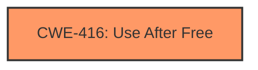

# Final Resolution for CVE-2022-1490

# Summary
| CWE ID | CWE Name | Confidence | CWE Abstraction Level | CWE Vulnerability Mapping Label | CWE-Vulnerability Mapping Notes |
|---|---|---|---|---|---|
| CWE-416 | Use After Free | 1.0 | Variant | Allowed | Primary CWE. Heap corruption is a common consequence of the **UAF**, not an independent **root cause**. |

## Evidence and Confidence

*   **Confidence Score:** 1.0
*   **Evidence Strength:** HIGH

## Relationship Analysis
The primary relationship considered was the lack of explicit relationships for CWE-416, emphasizing its direct applicability based on the vulnerability description. The analysis considered and rejected potential parent CWEs (CWE-672) because the provided information clearly indicated a **use-after-free** condition rather than a more general memory management issue. The absence of strong chain relationships suggests that the provided description focuses primarily on the **root cause** itself rather than a complex sequence of weaknesses.

## Vulnerability Chain
The vulnerability chain starts with a **use-after-free** condition (CWE-416). The sequence begins when memory is freed but a pointer still references it. A remote attacker convinces a user to engage in specific user interaction, which triggers the **use-after-free**, leading to **heap corruption**. The final impact is the potential to exploit the heap due to the corrupted state. There are no missing links in the chain based on the description.

## Summary of Analysis
The initial analysis correctly identifies CWE-416 (Use After Free) as the primary **weakness**. The criticism provides helpful suggestions for improvement, such as explicitly addressing the "heap corruption" aspect and discussing why other potential CWEs were not selected.

- **Content Matching:** The vulnerability description states "use after free" and the CVE Reference Links Content Summary confirms the "**root cause** of vulnerability is **use-after-free**." This directly aligns with the description of CWE-416.
- **Relationship Analysis:** There are no direct relationships influencing the mapping in this case, as the description clearly points to a **use-after-free**.
- **Mapping Guidance Analysis:** CWE-416 is a Variant level CWE, and the mapping guidance allows its use.
- **Mitigation Analysis:** Mitigations for CWE-416 include languages with automatic memory management or ensuring pointers are set to NULL after being freed.
- **Evidence-Based Decision Making:** The decision is based on the explicit mention of "**use-after-free**" in the vulnerability description and CVE summary, leading to a high confidence score.

The graph relationships influenced the selection by highlighting the absence of complex chains, thus reinforcing the direct mapping to CWE-416. The selected CWE is at the optimal level of specificity because it precisely describes the **root cause** as a **use-after-free** condition.