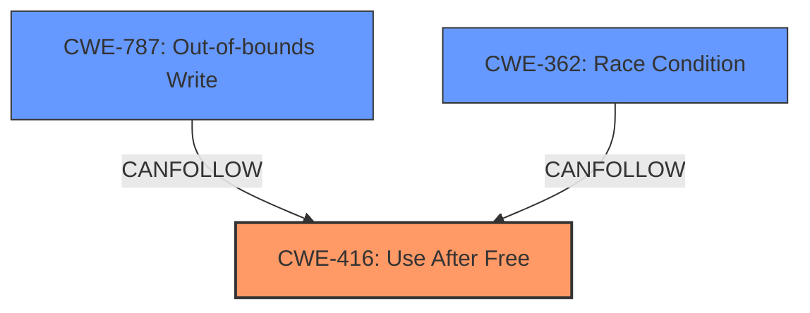

# Final Resolution for CVE-2022-1491

# Summary
| CWE ID | CWE Name | Confidence | CWE Abstraction Level | CWE Vulnerability Mapping Label | CWE-Vulnerability Mapping Notes |
|---|---|---|---|---|---|
| CWE-416 | Use After Free | 1.0 | Variant | Allowed | Primary CWE. Leads to **heap corruption**. Potential for out-of-bounds write if freed memory is reallocated. |

## Evidence and Confidence

*   **Confidence Score:** 1.0
*   **Evidence Strength:** HIGH

## Relationship Analysis
The primary relationship that impacted the decision was the understanding that **CWE-416 (Use After Free)** can lead to **heap corruption**, as described in the vulnerability. While other CWEs like CWE-787 (Out-of-bounds Write) could potentially arise as a *consequence* of the **use-after-free**, CWE-416 remains the most accurate *rootcause*. The relationships `CanFollow -> CWE-754`, `CANFOLLOW -> CWE-364`, `CANFOLLOW -> CWE-362`, `CANFOLLOW -> CWE-1265` and `CANPRECEDE -> CWE-123`, `CANPRECEDE -> CWE-120` show the potential for a more complex chain of events, but the available evidence focuses on the **use-after-free** condition. The fact that CWE-416 is a variant makes it specific enough for this vulnerability.

## Vulnerability Chain
The vulnerability chain starts with the **use-after-free** condition (**CWE-416**). This occurs when memory is accessed after it has been freed, leading to **heap corruption**. If the freed memory is reallocated, a subsequent write operation could lead to an out-of-bounds write (**CWE-787**), potentially allowing an attacker to execute arbitrary code.

## Summary of Analysis
The initial analysis correctly identified **CWE-416 (Use After Free)** as the primary **weakness** for CVE-2022-1491. The vulnerability description clearly states "Use after free in Bookmarks in Google Chrome prior to 101.0.4951.41 allowed a remote attacker to potentially exploit heap corruption via specific and direct user interaction."

The criticism highlights the need to explicitly connect the **use-after-free (CWE-416)** to the resulting "**heap corruption**". It is also important to clarify why **CWE-787 (Out-of-bounds Write)** is not the primary **CWE**, even though it could be a consequence of the UAF. The analysis has been updated to address these points, stating that the UAF *leads to* **heap corruption**, and that **CWE-787** is a potential *consequence*, but not the *rootcause* in this instance.

The graph relationships show that **CWE-416** can be followed by other **weaknesses**, such as **CWE-787** or **CWE-362 (Race Condition)**. The fact that the retriever results showed **CWE-362** as a high combined score indicates that a race condition might contribute to the UAF, though based on the information available, there is no direct indication of a race condition in this vulnerability.

The final selection of **CWE-416** is at the optimal level of specificity, as it directly matches the **root cause** described in the vulnerability.