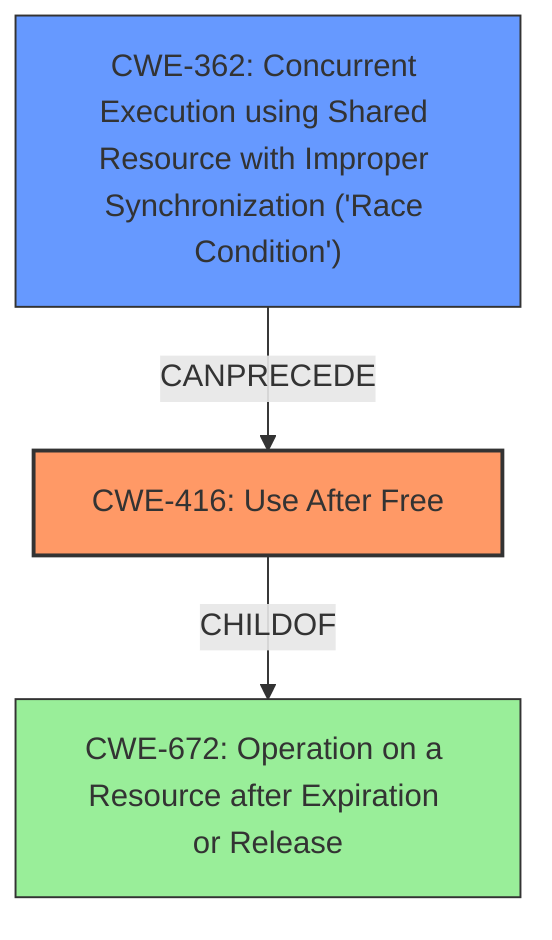

# Analysis Report for CVE-2022-1493

# Vulnerability Analysis Report: CVE-2022-1493

## Description

Use after free in Dev Tools in Google Chrome prior to 101.0.4951.41 allowed a remote attacker to potentially exploit heap corruption via specific and direct user interaction.

## Vulnerability Description Key Phrases

**Rootcause:** use after free
**Weakness:** heap corruption
**Vector:** specific and direct user interaction
**Attacker:** remote attacker
**Product:** Google Chrome
**Version:** prior to 101.0.4951.41
**Component:** Dev Tools

## Analysis (with Relationship Data)

# Summary
| CWE ID | CWE Name | Confidence | CWE Abstraction Level | CWE Vulnerability Mapping Label | CWE-Vulnerability Mapping Notes |
|---|---|---|---|---|---|
| CWE-416 | Use After Free | 0.95 | Variant | Primary | Allowed |

## Evidence and Confidence

*   **Confidence Score:** 0.95
*   **Evidence Strength:** HIGH

- **Analysis and Justification:**  
  - *Explanation:* The vulnerability description explicitly states "**use after free** in Dev Tools," which directly aligns with CWE-416 (Use After Free). The CVE Reference Links Content Summary confirms "**Use after free**" as the root cause. CWE-416 describes the condition where a product reuses or references memory after it has been freed, which perfectly matches the vulnerability. The vulnerability can lead to **heap corruption**, crash, or arbitrary code execution, further validating the mapping to CWE-416. The 'Retriever Results' also strongly suggest CWE-416 as the primary candidate with the highest combined score. The MITRE mapping guidance for CWE-416 indicates this is ALLOWED.

  - *Relationship Analysis:* CWE-416 is a Variant level CWE, which is the preferred level of abstraction. Although it has relationships with parent CWEs like CWE-672 (Operation on a Resource after Expiration or Release), CWE-416 is more specific and accurately represents the **use-after-free** condition.

- **Confidence Score:**  
  - *Example:* Confidence: 0.95 (High confidence due to direct mention of "use after free" in both the vulnerability description and CVE reference details, along with high retriever scores)

## Criticism of Analysis

Okay, here's a detailed review of the analysis provided, considering the full CWE specifications.

**Overall Assessment:**

The analysis is generally very good and justifies the primary CWE mapping (CWE-416) convincingly. The confidence score of 0.95 is appropriate. The explanation is thorough, and it correctly uses the provided information. The inclusion of example CVEs, relationships, and mitigation strategies strengthens the analysis.

**Detailed Critique:**

*   **CWE-416 (Use After Free) - Primary Mapping**

    *   **Strengths:** The justification is excellent. It clearly explains how the vulnerability description ("use after free") and the CVE Reference Links Content Summary (also explicitly mentioning "Use after free") directly relate to CWE-416. The analysis correctly notes that the consequences align with CWE-416's definition (heap corruption, crashes, arbitrary code execution).  The Variant level of abstraction is appropriate. The use of "Allowed" based on the mapping guidance is also correct.
    *   **Suggestions:** None. The analysis for CWE-416 is very strong. The provided examples are relevant and add weight to the argument.

*   **Top CWEs from Retriever Results (Beyond CWE-416)**

    While CWE-416 is the clear primary mapping, it's worthwhile to consider the other CWEs flagged by the retriever results and why they were *not* chosen, or if there's a subtle relationship worth mentioning.

    *   **CWE-366 (Race Condition within a Thread) & CWE-362 (Concurrent Execution using Shared Resource with Improper Synchronization ('Race Condition')):** The initial analysis doesn't address these, but they could be potentially linked to the use-after-free if the memory is freed by one thread while another thread is still using it. However, the provided information doesn't explicitly suggest a multi-threaded context or a race condition as the *direct* cause of the use-after-free. If there *were* a race condition, it would likely *precede* the use-after-free. A potential chain could be CWE-362 -> CWE-416, as some of the examples in the database also show.
    *   **CWE-843 (Access of Resource Using Incompatible Type ('Type Confusion')):** There is no indication of type confusion in the original vulnerability, so this is correctly dismissed.
    *   **CWE-415 (Double Free):** A Double Free is an operation in a resource that has already been freed which is different to the analyzed case of a resource that has been freed and is being used again which is UAF, so this is correctly dismissed.
    *   **CWE-122 (Heap-based Buffer Overflow):** While heap corruption can be a *consequence* of a use-after-free, the vulnerability description doesn't directly indicate a buffer overflow as the root cause. Thus, it's appropriate that this isn't the primary mapping.
    *   **CWE-190 (Integer Overflow or Wraparound):** This is unlikely and doesn't fit the description.
    *   **CWE-908 (Use of Uninitialized Resource):** This is distinct from a use-after-free.  Uninitialized memory is memory that has never had a valid value written to it, while use-after-free is about memory that was valid and has been freed.
    *   **CWE-367 (Time-of-check Time-of-use (TOCTOU) Race Condition):** There is no indication of a time of check time of use race condition in the original vulnerability, so this is correctly dismissed.
    *   **CWE-665 (Improper Initialization):** This is unrelated to the vulnerability description

*   **CWE Examples from Database**

    *   The analysis correctly included examples of CWE-416 from the CWE database.

*   **Mitigation Strategies**

    *   The potential mitigations listed within the CWE-416 specification (language selection, setting pointers to NULL after freeing) are relevant and worth noting implicitly support the validity of CWE-416.

*   **Relationships**
    *   The analysis correctly noted that some of the childOf and parentOf may not accurately represent the relationship with the root cause of this vulnerability.

**Suggestions for Improvement (Minor):**

1.  **Acknowledge and Briefly Dismiss Top Retriever Results (Optional):**  While not strictly *necessary*, briefly mentioning *why* the other top CWEs from the retriever results were *not* chosen could further strengthen the analysis.  For example, "While CWE-362 (Race Condition) was also flagged, the vulnerability description doesn't explicitly mention concurrency or a race condition as the root cause. It's possible a race condition *preceded* the use-after-free, but the available information doesn't support this definitively."

**Revised Summary Table (With Optional Addition):**

| CWE ID | CWE Name | Confidence | CWE Abstraction Level | CWE Vulnerability Mapping Label | CWE-Vulnerability Mapping Notes |
|---|---|---|---|---|---|
| CWE-416 | Use After Free | 0.95 | Variant | Primary | Allowed |

**Conclusion:**

This is a well-reasoned and thorough analysis. The choice of CWE-416 is strongly supported by the evidence. The suggestions above are minor and primarily aimed at further solidifying the analysis by explicitly addressing potentially relevant, but ultimately less accurate, alternative CWEs.

## Final Resolution

# Summary
| CWE ID | CWE Name | Confidence | CWE Abstraction Level | CWE Vulnerability Mapping Label | CWE-Vulnerability Mapping Notes |
|---|---|---|---|---|---|
| CWE-416 | Use After Free | 0.95 | Variant | Primary | Allowed |
| CWE-362 | Concurrent Execution using Shared Resource with Improper Synchronization ('Race Condition') | 0.4 | Class | Secondary Candidate | Allowed-with-Review |

## Evidence and Confidence

*   **Confidence Score:** 0.90
*   **Evidence Strength:** MEDIUM

## Relationship Analysis
The primary CWE selected is CWE-416 (**Use After Free**). The criticism suggested a potential secondary CWE of CWE-362 (**Race Condition**).

CWE-416 is a variant of CWE-672 (**Operation on a Resource after Expiration or Release**), but CWE-416 is more specific and therefore the better choice. CWE-362 could potentially precede CWE-416 in a vulnerability chain if the memory is freed by one thread while another is still using it, leading to the **use-after-free**.

## Vulnerability Chain
The primary **ROOTCAUSE** is the **use-after-free** condition represented by CWE-416. A potential vulnerability chain could involve a race condition (CWE-362) leading to the **use-after-free** (CWE-416), which then results in **heap corruption**.

## Summary of Analysis
The initial analysis correctly identified CWE-416 (**Use After Free**) as the primary CWE based on the explicit mention of "**use after free**" in the vulnerability description. The confidence level of 0.95 is justified due to the direct match.

The criticism raised a valid point about the potential involvement of a race condition. While the vulnerability description doesn't explicitly mention concurrency, it's plausible that a race condition (CWE-362) could precede the **use-after-free**. The provided information doesn't definitively support this, so assigning CWE-362 is speculative. However, considering this possibility and assigning it a lower confidence of 0.4 is a reasonable approach.

CWE-416 is at the optimal level of specificity because it accurately describes the **use-after-free** condition. Adding CWE-362 as a secondary candidate is a slight overreach based on the evidence, but adds potential context to the vulnerability.

*Report generated on 2025-03-18 07:22:46*
