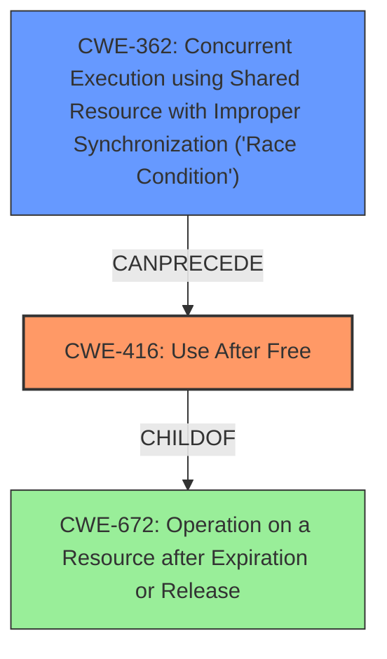

# Final Resolution for CVE-2022-1493

# Summary
| CWE ID | CWE Name | Confidence | CWE Abstraction Level | CWE Vulnerability Mapping Label | CWE-Vulnerability Mapping Notes |
|---|---|---|---|---|---|
| CWE-416 | Use After Free | 0.95 | Variant | Primary | Allowed |
| CWE-362 | Concurrent Execution using Shared Resource with Improper Synchronization ('Race Condition') | 0.4 | Class | Secondary Candidate | Allowed-with-Review |

## Evidence and Confidence

*   **Confidence Score:** 0.90
*   **Evidence Strength:** MEDIUM

## Relationship Analysis
The primary CWE selected is CWE-416 (**Use After Free**). The criticism suggested a potential secondary CWE of CWE-362 (**Race Condition**).

CWE-416 is a variant of CWE-672 (**Operation on a Resource after Expiration or Release**), but CWE-416 is more specific and therefore the better choice. CWE-362 could potentially precede CWE-416 in a vulnerability chain if the memory is freed by one thread while another is still using it, leading to the **use-after-free**.

## Vulnerability Chain
The primary **ROOTCAUSE** is the **use-after-free** condition represented by CWE-416. A potential vulnerability chain could involve a race condition (CWE-362) leading to the **use-after-free** (CWE-416), which then results in **heap corruption**.

## Summary of Analysis
The initial analysis correctly identified CWE-416 (**Use After Free**) as the primary CWE based on the explicit mention of "**use after free**" in the vulnerability description. The confidence level of 0.95 is justified due to the direct match.

The criticism raised a valid point about the potential involvement of a race condition. While the vulnerability description doesn't explicitly mention concurrency, it's plausible that a race condition (CWE-362) could precede the **use-after-free**. The provided information doesn't definitively support this, so assigning CWE-362 is speculative. However, considering this possibility and assigning it a lower confidence of 0.4 is a reasonable approach.

CWE-416 is at the optimal level of specificity because it accurately describes the **use-after-free** condition. Adding CWE-362 as a secondary candidate is a slight overreach based on the evidence, but adds potential context to the vulnerability.