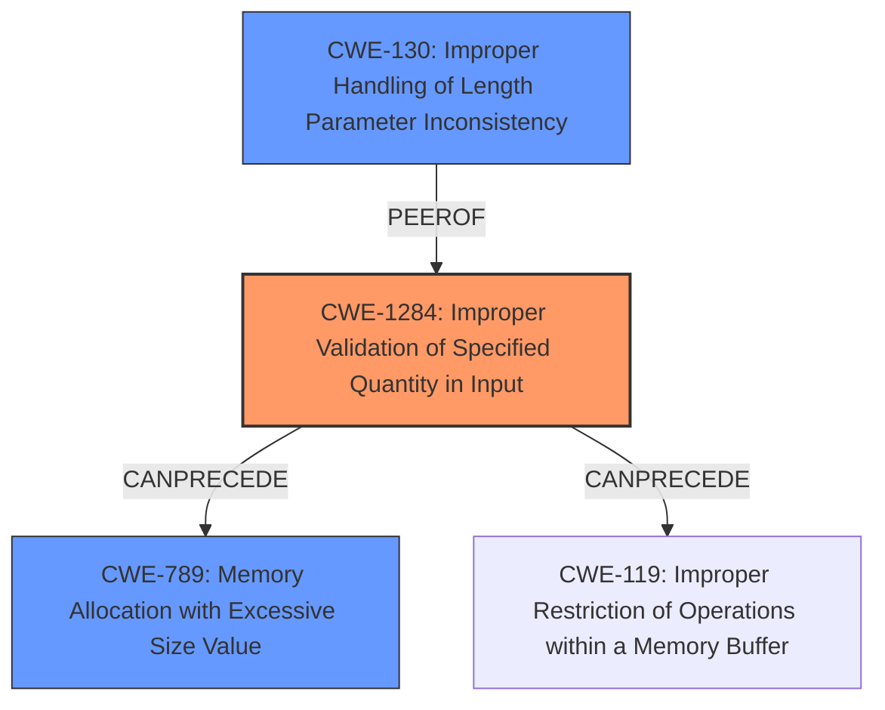

# Final Resolution for CVE-2022-1543

# Summary
| CWE ID | CWE Name | Confidence | CWE Abstraction Level | CWE Vulnerability Mapping Label | CWE-Vulnerability Mapping Notes |
|---|---|---|---|---|---|
| CWE-1284 | Improper Validation of Specified Quantity in Input | 0.95 | Base | Allowed | The product receives input that is expected to specify a quantity (such as size or length), but it does not validate or incorrectly validates that the quantity has the required properties. |
| CWE-130 | Improper Handling of Length Parameter Inconsistency | 0.7 | Base | Allowed | The product parses a formatted message or structure, but it does not handle or incorrectly handles a length field that is inconsistent with the actual length of the associated data. |
| CWE-789 | Memory Allocation with Excessive Size Value | 0.6 | Variant | Allowed | The product allocates memory based on an untrusted, large size value, but it does not ensure that the size is within expected limits, allowing arbitrary amounts of memory to be allocated. |

  - The Primary CWE should be first and noted as the Primary CWEs
  - The secondary candidate CWEs should be next and noted as secondary candidates.
  - The confidence is a confidence score 0 to 1 to rate your confidence in your assessment for that CWE.
  - The CWE Abstraction Level as one of these values: Base, Variant, Pillar, Class, Compound
  - The Mapping Notes Usage as one of these values: Allowed, Allowed-with-Review, Prohibited, Discouraged

## Evidence and Confidence

*   **Confidence Score:** 0.9
*   **Evidence Strength:** HIGH

## Relationship Analysis
The primary relationship that influenced the decision was the chain from **CWE-1284 (Improper Validation of Specified Quantity in Input)** to potential consequences like **CWE-789 (Memory Allocation with Excessive Size Value)**. While **CWE-130 (Improper Handling of Length Parameter Inconsistency)** was initially considered, the criticism highlighted that the root cause is the lack of proper validation of the input length, making **CWE-1284** a more accurate representation. **CWE-789** remains a possible consequence, but its occurrence depends on the system's memory allocation behavior.

## Vulnerability Chain
The vulnerability chain starts with the lack of input validation (**CWE-1284**) of the profile name's length. This can lead to an excessively large size value being used in memory allocation (**CWE-789**), potentially resulting in a denial of service or memory corruption. Alternatively, if the overly long name causes a buffer overflow when being written to memory, **CWE-119** could be a consequence.

## Summary of Analysis
The final decision is primarily based on the vulnerability description and the provided fix, which involves limiting the length of the profile name using `StringUtils.abbreviate`. This strongly suggests that the root cause is the lack of proper validation of the input length, aligning perfectly with **CWE-1284 (Improper Validation of Specified Quantity in Input)**. The criticism correctly pointed out that the original analysis focused too much on handling the inconsistency rather than the initial validation failure.

The evidence from the vulnerability description, "When the text size is large enough the service results in a momentary outage in a production environment. That can lead to memory corruption on the server," supports this analysis. The fact that `StringUtils.abbreviate` was used as a fix further reinforces the importance of input validation.

The relationship analysis highlights that **CWE-1284** can lead to **CWE-789** if the excessively large size value is used for memory allocation. However, the primary issue is the lack of validation, making **CWE-1284** the most appropriate root cause.

The selected CWEs are at the optimal level of specificity. **CWE-1284** is a Base level CWE, which is preferred for mapping to the root causes of vulnerabilities. It provides a clear and accurate representation of the **weakness**, while also allowing for the possibility of secondary consequences like **CWE-789**.