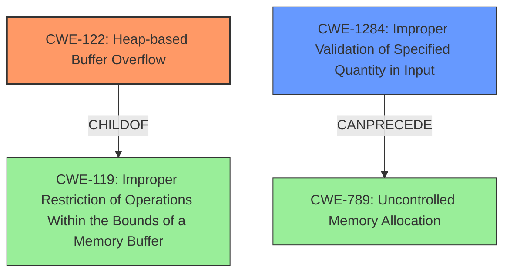

# Final Resolution for CVE-2022-1621

# Summary
| CWE ID | CWE Name | Confidence | CWE Abstraction Level | CWE Vulnerability Mapping Label | CWE-Vulnerability Mapping Notes |
|---|---|---|---|---|---|
| **CWE-122** | **Heap-based Buffer Overflow** | 0.95 | Variant | Allowed | Primary **CWE** |
| **CWE-1284** | **Improper Validation of Specified Quantity in Input** | 0.70 | Base | Allowed | Secondary Candidate |

## Evidence and Confidence

*   **Confidence Score:** 0.95
*   **Evidence Strength:** HIGH

## Relationship Analysis
The primary relationship is that **CWE-122 (Heap-based Buffer Overflow)** is a variant of **CWE-119 (Improper Restriction of Operations Within the Bounds of a Memory Buffer)**. This hierarchical relationship justifies selecting the more specific **CWE-122** over its parent. **CWE-1284 (Improper Validation of Specified Quantity in Input)** can precede **CWE-789 (Uncontrolled Memory Allocation)**, indicating a potential vulnerability chain where invalid input leads to excessive memory allocation. The abstraction levels influenced the selection by prioritizing the more specific Variant (**CWE-122**) and Base (**CWE-1284**) level **CWEs** over the Class level **CWE-119**.

## Vulnerability Chain
The vulnerability chain starts with **CWE-1284 (Improper Validation of Specified Quantity in Input)**, where the input string used in spell checking is not properly validated for UTF-8 validity. This leads to **CWE-122 (Heap-based Buffer Overflow)** during the `vim_strncpy find_word` function call, as the `store_word` and `spell_add_word` functions write the unvalidated input to a heap-allocated buffer. The overflow can result in crashing the software, bypassing protection mechanisms, and potentially allowing remote code execution. A potential consequence could be **CWE-825 (Expired Pointer Dereference)** or **CWE-824 (Access of Uninitialized Pointer)** if heap metadata is corrupted.

## Summary of Analysis
The initial analysis and criticism were both very good, and the final conclusion remains the same. The vulnerability is primarily a **heap buffer overflow** (CWE-122) caused by improper input validation (CWE-1284). This assessment is strongly based on the provided evidence, which explicitly states "Heap buffer overflow in `vim_strncpy find_word`" and describes the fix as "using `utf_valid_string` to ensure a valid UTF-8 string is used."

The graph relationships influenced the decision by prioritizing the most specific **CWE** available. **CWE-122**, a variant of **CWE-119**, provides a more precise classification of the heap overflow. The identification of **CWE-1284** and its potential to precede **CWE-789** highlights the importance of input validation in preventing memory corruption vulnerabilities.

The selected **CWEs** are at the optimal level of specificity because they accurately reflect the root cause (improper input validation) and the direct consequence (heap buffer overflow). While other **CWEs** like **CWE-119** are related, they are less specific and do not fully capture the nature of the vulnerability. Including mitigations such as "accept known good" input validation strategies further supports the selection of **CWE-1284**.