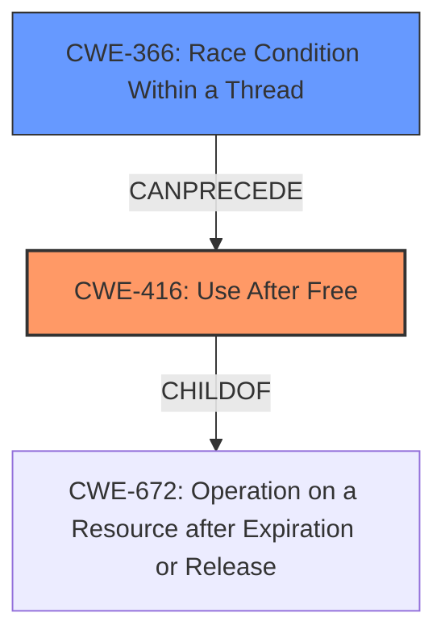

# Final Resolution for CVE-2022-1636

# Summary
| CWE ID | CWE Name | Confidence | CWE Abstraction Level | CWE Vulnerability Mapping Label | CWE-Vulnerability Mapping Notes |
|---|---|---|---|---|---|
| **CWE-416** | **Use After Free** | 1.0 | Variant |  Primary | Allowed |
| CWE-366 | Race Condition within a Thread | 0.3 | Base |  Secondary Candidate | Allowed |

## Evidence and Confidence

*   **Confidence Score:** 0.9
*   **Evidence Strength:** MEDIUM

## Relationship Analysis
The primary relationship influencing the decision is the parent-child relationship between CWE-672 (Operation on Resource after Expiration or Release) and **CWE-416** (**Use After Free**), with **CWE-416** being a variant of CWE-672, making it a more specific and appropriate choice. The analysis also considered that race conditions (CWE-366) can precede **use-after-free** vulnerabilities but are not explicitly stated in the vulnerability description, so it is included as a secondary candidate with low confidence.

## Vulnerability Chain
The vulnerability chain starts with memory being freed. Subsequently, the freed memory is accessed, leading to a **use-after-free** condition (**CWE-416**). This can result in heap corruption, as noted in the vulnerability description. A potential, but not confirmed, race condition (CWE-366) could be a contributing factor that triggers the **use-after-free** condition.

## Summary of Analysis
The initial analysis and the criticism both agree on the primary classification of **CWE-416** (**Use After Free**). The vulnerability description explicitly mentions "**use after free**," providing a strong basis for this classification. The criticism correctly points out that while other CWEs like CWE-843 (Access of Resource Using Incompatible Type) and CWE-366 (Race Condition within a Thread) could potentially be related, they are not the direct cause described in the vulnerability. The decision to include CWE-366 as a secondary candidate with low confidence (0.3) stems from the understanding that race conditions can lead to **use-after-free**, but there isn't enough explicit evidence in the description to warrant a higher confidence level. The selection of **CWE-416** is at the optimal level of specificity, as it is a variant-level CWE that directly addresses the described vulnerability. Evidence: "Use after free in Performance APIs in Google Chrome prior to 101.0.4951.64 allowed a remote attacker to potentially exploit heap corruption via a crafted HTML page."