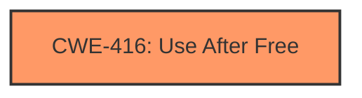

# Final Resolution for CVE-2022-1640

# Summary
| CWE ID  | CWE Name         | Confidence | CWE Abstraction Level | CWE Vulnerability Mapping Label | CWE-Vulnerability Mapping Notes |
| ------- | ---------------- | ---------- | ----------------------- | ------------------------------- | -------------------------------- |
| CWE-416 | Use After Free   | 1.0        | Variant                 | Allowed                       | Primary CWE                     |

## Evidence and Confidence

*   **Confidence Score:** 1.0
*   **Evidence Strength:** HIGH

## Relationship Analysis
The primary relationship considered was the direct match between the vulnerability description, which explicitly states "use after free," and the description of **CWE-416 (Use After Free)**. While other CWEs have "CanFollow" relationships with **CWE-416 (Use After Free)**, such as **CWE-362 (Concurrent Execution using Shared Resource with Improper Synchronization ('Race Condition'))**, there is no explicit evidence in the vulnerability description to support including those. The variant level of **CWE-416 (Use After Free)** is appropriately specific for this case.

## Vulnerability Chain
The vulnerability chain consists of a **ROOTCAUSE** of **CWE-416 (Use After Free)** which leads to the impact of heap corruption and potential remote code execution.
- The sequence starts with memory being freed.
- Subsequently, the freed memory is reused or referenced, which is the core of the **CWE-416 (Use After Free)** weakness.
- This leads to heap corruption as the freed memory might have been reallocated for another purpose.
- The heap corruption can then be exploited by an attacker to achieve remote code execution.

## Summary of Analysis
The initial analysis correctly identifies **CWE-416 (Use After Free)** as the primary **WEAKNESS**. The criticism correctly points out that additional CWEs suggested by retriever results are not sufficiently supported by the provided evidence. The analysis is based on the provided evidence, which explicitly mentions "use after free," and aligns perfectly with the definition of **CWE-416 (Use After Free)**. The decision to focus solely on **CWE-416 (Use After Free)** is based on the principle of only including CWEs where there is explicit or very strong implicit evidence. The relationships such as "CanFollow" from **CWE-416 (Use After Free)** to other CWEs are not included as there is no evidence for them. The **WEAKNESS** is at the optimal level of specificity.