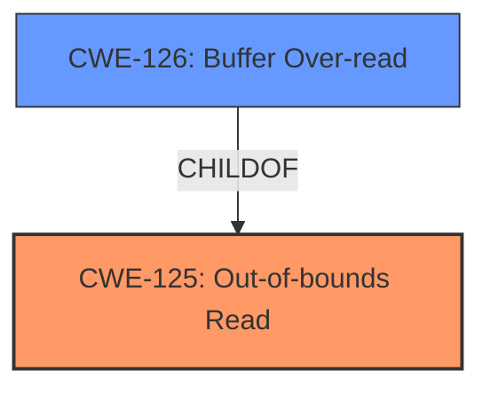

# Final Resolution for CVE-2022-1714

# Summary
| CWE ID  | CWE Name                        | Confidence | CWE Abstraction Level | CWE Vulnerability Mapping Label | CWE-Vulnerability Mapping Notes |
| :------- | :------------------------------ | :--------- | :-------------------- | :------------------------------ | :------------------------------ |
| CWE-125 | Out-of-bounds Read | 1.00      | Base                  | Allowed                         | Primary CWE, Root cause of the vulnerability  |
| CWE-126 | Buffer Over-read | 0.75      | Variant                  | Allowed                         | Secondary Candidate |

## Evidence and Confidence

*   **Confidence Score:** 0.95
*   **Evidence Strength:** HIGH

## Relationship Analysis
The primary relationship that impacted the decision was the parent-child relationship between CWE-125 (**Out-of-bounds Read**) and CWE-126 (**Buffer Over-read**). CWE-126 is a variant of CWE-125, making it a closely related alternative. The final decision leaned towards CWE-125 as the primary because the vulnerability description explicitly mentions reading "past the end of the intended buffer," which directly aligns with CWE-125's base-level description. However, CWE-126 was still considered as a secondary candidate due to its specific focus on buffer over-reads.

## Vulnerability Chain
The vulnerability chain starts with the **ROOTCAUSE** being the lack of proper bounds checking when reading data. This leads to **CWE-125 (Out-of-bounds Read)**, where the program reads data past the end of the intended buffer. The consequence of this read could be sensitive information disclosure or a program crash due to accessing invalid memory locations. The description "A 4-byte out-of-bounds read in the MSP430 disassembler" and "the code attempts to read 2 bytes for a jump address when the buffer has less than 4 bytes" from the CVE reference links are explicit evidence of this chain.

## Summary of Analysis
The initial analysis and criticism both converge on CWE-125 (**Out-of-bounds Read**) as the most appropriate primary CWE. The vulnerability description explicitly states "**Out-of-bounds Read**" as the **rootcause**. The description also mentions that the program "reads data past the end of the intended buffer," which aligns directly with the definition of CWE-125.

The graph relationships influenced the decision by highlighting the close relationship between CWE-125 and CWE-126. While CWE-126 is more specific, the general nature of the vulnerability description makes CWE-125 a slightly better fit as the primary. The explicit mention of reading past the end of the buffer in the vulnerability report is strong evidence for CWE-125.

The chosen CWEs are at the optimal level of specificity. CWE-125 is a base-level CWE, providing a general description of the vulnerability. While CWE-126 is a variant, the evidence doesn't strongly favor the more specific classification.