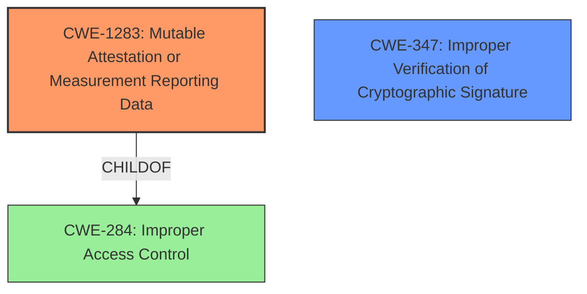

# Analysis Report for CVE-2022-1740

# Vulnerability Analysis Report: CVE-2022-1740

## Description

The tested version of Dominion Voting Systems ImageCast Xs on-screen application hash display feature, audit log export, and application export functionality rely on self-attestation mechanisms. An attacker could leverage this vulnerability to disguise malicious applications on a device.

## Vulnerability Description Key Phrases

**Rootcause:** self-attestation mechanisms
**Impact:** disguise malicious applications
**Attacker:** attacker
**Product:** Dominion Voting Systems ImageCast Xs
**Version:** tested version
**Component:** ['on-screen application hash display feature', 'audit log export', 'application export functionality']

## Analysis (with Relationship Data)

# Summary
| CWE ID | CWE Name | Confidence | CWE Abstraction Level | CWE Vulnerability Mapping Label | CWE-Vulnerability Mapping Notes |
|---|---|---|---|---|---|
| CWE-1283 | Mutable Attestation or Measurement Reporting Data | 1.0 | Base | Allowed | Primary CWE: The device's self-attestation mechanisms are modifiable by an attacker. |

## Evidence and Confidence

*   **Confidence Score:** 1.0
*   **Evidence Strength:** HIGH

- **Analysis and Justification:**
  - *Explanation:* The vulnerability description states that the Dominion Voting Systems ImageCast Xs relies on **self-attestation mechanisms**, which can be leveraged by an attacker to disguise malicious applications. The CVE reference summary explicitly identifies the vulnerability as "Mutable Attestation or Measurement Reporting Data (CWE-1283)" and elaborates on how an attacker can tamper with the self-generated reports. This aligns perfectly with CWE-1283, which describes a scenario where "The register contents used for attestation or measurement reporting data to verify boot flow are modifiable by an adversary." The vulnerability allows an attacker to modify the displayed application hash and exported audit logs, making malicious software appear legitimate. This direct match between the vulnerability description, the CVE summary, and the CWE description supports the selection of CWE-1283.
  
  - *Relationship Analysis:* There are no direct relationships for CWE-1283 listed in the provided information. However, it is a child of CWE-284 (Improper Access Control), which implies a potential broader context of access control issues.

- **Confidence Score:**
  - Confidence: 1.0 (Strong evidence from vulnerability description and CVE reference summary.)

## Criticism of Analysis

Okay, let's review the analysis and critique the CWE mapping, justification, and related aspects using the full CWE specifications provided.

**Overall Assessment:**

The primary CWE mapping to CWE-1283 (Mutable Attestation or Measurement Reporting Data) is **accurate and well-justified.** The confidence score of 1.0 is appropriate. The analysis effectively connects the vulnerability description and CVE summary to the core concept of CWE-1283: an attacker can modify the self-generated integrity reports of the system.

**Detailed Review:**

1.  **CWE-1283: Mutable Attestation or Measurement Reporting Data**

    *   **Correctness:**  The mapping is correct.  The description of CWE-1283 explicitly mentions the modifiability of measurement data used to verify boot flow, which is analogous to the modifiable application hashes, audit logs, and application exports in the Dominion Voting Systems ImageCast Xs.  The analysis correctly highlights this parallel.
    *   **Justification Strength:** The justification is strong.  It accurately links the vulnerability description, CVE summary, and the CWE definition.  It also points out how the attack allows malicious software to appear legitimate.
    *   **Abstraction Level:** CWE-1283 is a Base-level CWE, which is the preferred level for this type of analysis.
    *   **Mitigations:** The potential mitigation listed in the CWE specification for CWE-1283, "Measurement data should be stored in registers that are read-only or otherwise have access controls that prevent modification by an untrusted agent," is highly relevant. In this case, it is not register contents on a System-on-Chip, but the concept of using an immutable data store that is protected from modification by an adversary is the underlying principle that applies. Instead of relying on self-attestation, the system should involve a trusted third party or a hardware-backed root of trust for verifying the integrity of the application and logs.
    *   **Relationship Analysis:** The analysis mentions that CWE-1283 is a child of CWE-284 (Improper Access Control). This is correct according to the CWE specification. This suggests a broader context of access control issues, which is reasonable. Although CWE-284 is discouraged, it is helpful to acknowledge the high-level relationship.

2.  **Retriever Results Analysis**

    The retriever results suggest other CWEs that could be potentially applicable. Let's examine some of the top results:

    *   **CWE-347: Improper Verification of Cryptographic Signature:** This CWE is interesting. While the vulnerability doesn't explicitly mention signature verification, the fact that an attacker can modify the hash values *implies* that any signature that might be present isn't being properly verified against the *actual* content. If the system *were* properly verifying a signature of the application or logs, then the attacker's modification would be detected. So, while CWE-1283 is the *direct* cause, CWE-347 could be considered a contributing factor. It represents the *lack* of a robust signature verification mechanism that could have prevented the issue. However, if no signature is used at all, CWE-347 is irrelevant.

    *   **CWE-1392: Use of Default Credentials:** This CWE is less relevant. The vulnerability doesn't mention anything about default credentials being used to access or modify the system. Unless there's additional information not provided in the original description, this is a false positive.

    *   **CWE-926: Improper Export of Android Application Components:** This CWE is irrelevant as the analyzed product is not an Android application.

    *   **CWE-532: Insertion of Sensitive Information into Log File:** While audit logs are involved, the core issue is not the *content* of the logs, but the fact that they can be *modified*.  Unless the logs themselves contain sensitive information that should not be logged, this CWE is not the primary concern.

    *   **CWE-912: Hidden Functionality:** This is unlikely, as no hidden functionality or backdoor is mentioned in the description.

    *   **CWE-269 & CWE-287: Improper Privilege Management & Improper Authentication:** These are too high level and don't accurately represent the core problem of modifiable attestation data.

3. **Missing Authorization/Access Control Considerations**

    It's worth considering if there are more specific access control issues beyond the high-level CWE-284. Are there specific registers or memory locations that *should* be protected by access control mechanisms (CWE-862, CWE-863), but are not? If the attacker needs to exploit a missing authorization check to modify the hashes, then adding CWE-862 as a secondary CWE could be helpful.

**Recommendations:**

1.  **Maintain the primary mapping to CWE-1283 with high confidence.**  The justification is solid.
2.  **Consider adding CWE-347 (Improper Verification of Cryptographic Signature) as a secondary CWE *if and only if* the system is supposed to be verifying signatures but isn't doing it correctly.**  This adds depth to the analysis, but it's contingent on a specific condition.  If signatures are never used, exclude this CWE. Provide a note if this is the case.
3.  **Explicitly state why other top retriever results (CWE-1392, CWE-926, CWE-532, CWE-912, CWE-269, CWE-287) are not applicable in the analysis documentation** to avoid confusion. This will strengthen the overall quality of the analysis.
4.  **Expand the Mitigation section to focus on the need for hardware-backed root of trust or trusted third-party attestation instead of self-attestation.** Mention the need for immutable data stores for the logs.
5. **Investigate whether specific access control CWEs apply (CWE-862, CWE-863) if the attacker exploits a missing authorization check to modify the measurement data**

By incorporating these recommendations, the analysis will be even more comprehensive and accurate.

## Final Resolution

# Summary
| CWE ID | CWE Name | Confidence | CWE Abstraction Level | CWE Vulnerability Mapping Label | CWE-Vulnerability Mapping Notes |
|---|---|---|---|---|---|
| CWE-1283 | Mutable Attestation or Measurement Reporting Data | 1.0 | Base | Allowed | Primary CWE: The device's self-attestation mechanisms are modifiable by an attacker. |
| CWE-347 | Improper Verification of Cryptographic Signature | 0.5 | Base | Allowed | Secondary CWE: The system may not be properly verifying signatures, which could have prevented the vulnerability. Only applicable if signatures are expected. |

## Evidence and Confidence

*   **Confidence Score:** 0.9
*   **Evidence Strength:** MEDIUM

## Relationship Analysis
The primary CWE, CWE-1283 (**Mutable Attestation or Measurement Reporting Data**), is a base-level CWE, which is ideal for root cause analysis. It has a parent relationship to CWE-284 (**Improper Access Control**), indicating a broader context of access control issues. The secondary CWE, CWE-347 (**Improper Verification of Cryptographic Signature**), represents a missing security control that could have prevented the vulnerability. There are no direct relationships between CWE-1283 and CWE-347, but CWE-347 highlights the absence of a proper signature verification mechanism.

## Vulnerability Chain
The vulnerability chain starts with the **ROOTCAUSE**: a lack of proper protection for attestation data. This leads to the **WEAKNESS**: CWE-1283 (**Mutable Attestation or Measurement Reporting Data**), where an attacker can modify the reported hash values. This modification allows the attacker to disguise malicious applications. If a signature were expected, then the **WEAKNESS** CWE-347 (**Improper Verification of Cryptographic Signature**) contributes to the vulnerability by not detecting the modified data. The final impact is that the system trusts modified and potentially malicious applications.

## Summary of Analysis
The initial analysis correctly identified CWE-1283 (**Mutable Attestation or Measurement Reporting Data**) as the primary **WEAKNESS**. The criticism suggested adding CWE-347 (**Improper Verification of Cryptographic Signature**) as a secondary CWE, which is reasonable if the system is supposed to use signatures. The analysis has been updated to reflect this conditional inclusion of CWE-347. The selection of CWE-1283 is justified by the vulnerability description, which explicitly states that the self-attestation mechanisms are modifiable.

The decision to include CWE-347 is based on the *potential* lack of signature verification. If signatures are not used at all, then CWE-347 is not applicable. The confidence score for CWE-347 is lower (0.5) to reflect this uncertainty.

The selected CWEs are at the optimal level of specificity. CWE-1283 is a base-level CWE, which is preferred for root cause analysis. Alternative CWEs suggested by the retriever, such as CWE-1392 (**Use of Default Credentials**) and CWE-532 (**Insertion of Sensitive Information into Log File**), are not applicable based on the available evidence. CWE-1283 directly addresses the **ROOTCAUSE**: the ability to modify attestation data.

*Report generated on 2025-03-17 03:51:17*
