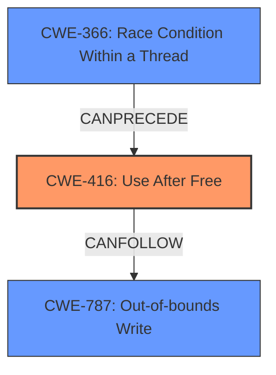

# Analysis Report for CVE-2022-1854

# Vulnerability Analysis Report: CVE-2022-1854

## Description

Use after free in ANGLE in Google Chrome prior to 102.0.5005.61 allowed a remote attacker to potentially exploit heap corruption via a crafted HTML page.

## Vulnerability Description Key Phrases

**Weakness:** use after free
**Impact:** heap corruption
**Vector:** crafted HTML page
**Attacker:** remote attacker
**Product:** Google Chrome
**Version:** prior to 102.0.5005.61
**Component:** ANGLE

## Analysis (with Relationship Data)

# Summary
| CWE ID | CWE Name | Confidence | CWE Abstraction Level | CWE Vulnerability Mapping Label | CWE-Vulnerability Mapping Notes |
|---|---|---|---|---|---|
| CWE-416 | Use After Free | 1.0 | Variant | Allowed | This is the primary CWE based on the vulnerability description and retriever results. |

## Evidence and Confidence

*   **Confidence Score:** 1.0
*   **Evidence Strength:** HIGH

- **Analysis and Justification:**  
  - *Explanation:* The vulnerability description explicitly states a **"use after free"** in ANGLE in Google Chrome. The **root cause of the vulnerability** is a **use-after-free**. The CVE Reference Links Content Summary confirms this, stating: "The vulnerability is a use-after-free, meaning that a program attempts to access memory after it has been freed, which can lead to crashes or arbitrary code execution." The retriever results also strongly suggest CWE-416 as the primary candidate with a score of 0.7020. CWE-416's description, "The product reuses or references memory after it has been freed," directly matches the vulnerability. The usage is ALLOWED.
  
  - *Relationship Analysis:* While other CWEs are suggested, such as CWE-787 (Out-of-bounds Write), CWE-366 (Race Condition within a Thread), CWE-415 (Double Free), and CWE-843 (Access of Resource Using Incompatible Type), the description focuses specifically on a use-after-free condition, making CWE-416 the most accurate and specific representation of the **weakness**. CWE-416 is a variant, making it a good fit.

- **Confidence Score:**  
  - Confidence: 1.0 (Explicit mention of "use after free" in vulnerability description and supporting CVE details.)

## Criticism of Analysis

## Critique of the Analysis

Overall, the analysis is excellent and well-justified. The choice of CWE-416 as the primary weakness is correct. The provided evidence is strong and well-articulated.

Here's a more detailed breakdown:

**Strengths:**

*   **Clear and Concise Summary:** The summary table effectively presents the core finding and its confidence level.
*   **Strong Evidence and Justification:** The justification for selecting CWE-416 is thorough and convincing. It directly links the vulnerability description and CVE details to the definition of CWE-416.  The relationship analysis does a good job of explaining why other CWEs, even those with high retriever scores, are less appropriate.
*   **High Confidence:** The confidence score of 1.0 is well-deserved due to the explicit mention of "use after free" in multiple sources.
*   **Relevant Examples:** The inclusion of known examples for CWE-416 from the CWE database provides context and validates the mapping.
*   **Comprehensive CWE Specifications:** Providing the complete CWE specifications for all considered CWEs is very helpful for understanding the rationale behind the choices.
*   **Correct Abstraction Level:** The analysis correctly identifies CWE-416 as a Variant, aligning with best practices for CWE mapping.

**Areas for Potential Improvement (Minor):**

*   **Elaboration on Relationships with other CWEs:** While the "Relationship Analysis" is good, it could be slightly expanded to explicitly address why other CWEs were *not* chosen, even though they were present in the retriever results. For example, mentioning that while CWE-787 *could* be a consequence of a UAF leading to memory corruption, it doesn't describe the *root cause*.
*   **Deeper Consideration of Chain Scenarios:** The observed examples for CWE-416 list several chain scenarios. The analysis *could* briefly mention a possible, albeit less likely, chain that *leads* to CWE-416 as further justification for this being the weakness. For example, as noted in some of the examples for CWE-416, race conditions or improper resource locking can lead to Use-After-Free vulnerabilities, e.g. `CWE-366 -> CWE-416` or `CWE-413 -> CWE-416`

**Specific Comments on the Retriever Results:**

The retriever results are useful but need to be interpreted with caution. Note the following:

*   **CWE-366 (Race Condition within a Thread):** A race condition *could* be a *cause* of a Use-After-Free if a resource is freed by one thread while another thread is still using it. However, the vulnerability description doesn't mention concurrency, making CWE-416 the more direct and accurate mapping in this case.
*   **CWE-415 (Double Free):** A Double-Free is a distinct memory corruption issue, different from Use-After-Free, although both relate to memory management.
*   **CWE-843 (Access of Resource Using Incompatible Type ('Type Confusion')):**  While type confusion *could* lead to memory corruption, the description doesn't indicate a type confusion issue as the *primary* vulnerability.
*   **CWE-787 (Out-of-bounds Write):** This is a *potential impact* of a Use-After-Free, *not* the root cause. Using freed memory can lead to arbitrary writes, but the initial problem is the UAF condition itself. A UAF could lead to a write-what-where condition, but that again, is a secondary consequence.
*   **CWE-122 (Heap-based Buffer Overflow):** Similarly, this is a potential *consequence* of memory corruption caused by UAF, not the primary issue.

**In summary,** the analysis is excellent. It correctly identifies CWE-416 as the primary weakness with strong justification. The suggested improvements are minor and aimed at providing an even more comprehensive rationale for the chosen CWE. The analysis demonstrates a good understanding of CWE concepts and best practices for vulnerability mapping.

## Final Resolution

# Summary
| CWE ID | CWE Name | Confidence | CWE Abstraction Level | CWE Vulnerability Mapping Label | CWE-Vulnerability Mapping Notes |
|---|---|---|---|---|---|
| CWE-416 | Use After Free | 1.0 | Variant | Allowed | Primary CWE |
| CWE-366 | Race Condition Within a Thread | 0.4 | Base | Allowed | Secondary Candidate |
| CWE-787 | Out-of-bounds Write | 0.3 | Base | Allowed | Secondary Candidate |

## Evidence and Confidence

*   **Confidence Score:** 0.9
*   **Evidence Strength:** HIGH

## Relationship Analysis
The primary CWE is CWE-416 (**Use After Free**). This is a Variant level CWE, providing a good level of specificity. CWE-416 can be reached via a race condition (CWE-366) or lead to an out-of-bounds write (CWE-787) as a consequence. Therefore, while the primary **weakness** is CWE-416, we consider CWE-366 and CWE-787 as secondary candidates to represent possible causes and consequences.

## Vulnerability Chain
The vulnerability chain starts with a potential **race condition** (**CWE-366**) where memory is freed by one thread while another thread is still accessing it. This leads to a **use-after-free** condition (**CWE-416**), where the program attempts to access memory that has already been freed. The impact of this can be heap corruption, potentially leading to an **out-of-bounds write** (**CWE-787**) and ultimately arbitrary code execution. The vulnerability description specifically mentions the **use-after-free**, making CWE-416 the primary **weakness**.

## Summary of Analysis
The initial analysis and criticism both converge on CWE-416 (**Use After Free**) as the primary **weakness**. The vulnerability description explicitly states a **use-after-free**, providing strong evidence for this classification. The retriever results also support this, with CWE-416 having a high score.

The relationship analysis highlights potential causes and consequences of the **use-after-free**. A race condition (**CWE-366**) could lead to the **use-after-free**, and the **use-after-free** could lead to an out-of-bounds write (**CWE-787**).

The final decision is to classify the vulnerability primarily as CWE-416 with secondary considerations for CWE-366 and CWE-787. This reflects the specific vulnerability described and considers potential contributing factors and consequences. The selected CWEs are at the optimal level of specificity, with CWE-416 being a Variant and CWE-366 and CWE-787 being Base level CWEs. The decision is based on the provided evidence, relationship analysis, and mapping guidance.

The evidence from the vulnerability description is: "Use after free in ANGLE in Google Chrome prior to 102.0.5005.61 allowed a remote attacker to potentially exploit heap corruption via a crafted HTML page."

This statement explicitly mentions "Use after free", directly supporting the classification of CWE-416.

*Report generated on 2025-03-18 07:59:13*
