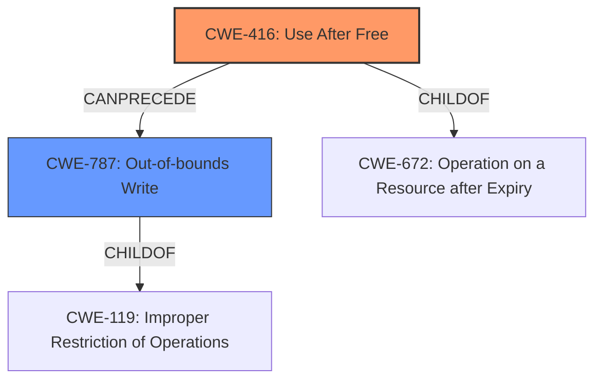

# Analysis Report for CVE-2022-1855

# Vulnerability Analysis Report: CVE-2022-1855

## Description

Use after free in Messaging in Google Chrome prior to 102.0.5005.61 allowed a remote attacker to potentially exploit heap corruption via a crafted HTML page.

## Vulnerability Description Key Phrases

**Weakness:** use after free
**Impact:** heap corruption
**Vector:** crafted HTML page
**Attacker:** remote attacker
**Product:** Google Chrome
**Version:** prior to 102.0.5005.61
**Component:** Messaging

## Analysis (with Relationship Data)

# Summary
| CWE ID | CWE Name | Confidence | CWE Abstraction Level | CWE Vulnerability Mapping Label | CWE-Vulnerability Mapping Notes |
|---|---|---|---|---|---|
| CWE-416 | Use After Free | 1.0 | Variant | Primary | Allowed |

## Evidence and Confidence

*   **Confidence Score:** 1.0
*   **Evidence Strength:** HIGH

- **Analysis and Justification:**
  - *Explanation:* The vulnerability description clearly states a "**use after free**" condition in Google Chrome's Messaging component. This directly aligns with CWE-416, which describes the scenario where a product reuses memory after it has been freed. The CVE Reference Links Content Summary also confirms the **root cause** as "**use-after-free**," further solidifying this mapping. The impact, leading to potential heap corruption, is a typical consequence of use-after-free vulnerabilities. CWE-416 is a Variant, which is the preferred level of abstraction. MITRE mapping guidance designates its usage as ALLOWED.
  
  - *Relationship Analysis:* While other CWEs like CWE-415 (Double Free) and CWE-366 (Race Condition within a Thread) were considered based on retriever results, the explicit mention of "use after free" makes CWE-416 the most accurate. There are no direct relationships mentioned for CWE-416.

- **Confidence Score:**
  - Confidence: 1.0 (Direct evidence of a use-after-free vulnerability)

## Criticism of Analysis

Okay, here's a review of the analysis, considering the full CWE specifications provided.

**Overall Assessment:**

The analysis is generally sound and the primary CWE mapping to CWE-416 (Use After Free) is accurate and well-justified.  The confidence score of 1.0 is appropriate. The explanations are clear and use relevant terminology. The analysis considered and ruled out other potential CWEs effectively.

**Detailed Review:**

*   **Summary Table:** The summary table accurately reflects the analysis, providing a concise overview.
*   **Confidence Score:** The confidence score of 1.0 is appropriate given the clear and direct evidence of a use-after-free vulnerability.
*   **Evidence and Confidence:**
    *   **Analysis and Justification:** The explanation is well-written and clearly links the vulnerability description and CVE details to the definition of CWE-416. The justification for choosing CWE-416 over other potential candidates is logical. The comment that the Variant level of abstraction is the preferred level is correct. The explanation is excellent and follows the CWE mapping guidance.
    *   **Relationship Analysis:** The section correctly identifies and dismisses other potential CWEs like CWE-415 and CWE-366. The inclusion of relationship analysis is crucial and demonstrates a thorough understanding of the CWEs.

**Suggestions and Observations:**

1.  **Consider Chaining:** Although CWE-416 is the primary weakness, it is *often* the result of other underlying issues. Some of the retriever results hint at these possibilities (specifically, CWE-362/366 - Race Condition). The CVE description mentions a "crafted HTML page" as the vector. It's worth briefly exploring *how* this crafted page leads to the UAF.  Does it trigger a race condition in the Messaging component? Does it corrupt memory leading to the use of a freed pointer?  While *not* necessary for the primary mapping, a sentence or two speculating on possible *causes* of the UAF (based on the available info) would be a bonus. This would also help to justify the dismissal of CWE-362/366. For instance, you could say "While a race condition *could* be a precursor, there's no explicit evidence in the description to suggest a concurrency issue is involved in *triggering* the use-after-free." If a race condition is explicitly mentioned in the analysis or CVE descriptions, then a chain would be in order: CWE-362 -> CWE-416.
    *   The CWE specifications for CWE-416 also states "CanFollow -> CWE-362" This is further evidence to consider the possibility of a CWE chain.
    *   The Known Examples for CWE-366 includes "CVE-2022-2621: Chain: two threads in a web browser use the same resource (CWE-366), but one of those threads can destroy the resource before the other has completed (CWE-416)." This highlights the possibility of the two being linked.
2.  **Potential Mitigations (for completeness):** Although not strictly required, it's good practice to briefly mention potential mitigations for CWE-416. This demonstrates a holistic understanding of the vulnerability. Example: "Mitigations for CWE-416 include using memory-safe languages or employing techniques like setting pointers to NULL after freeing them." You can extract these from the "Potential Mitigations" section of the CWE-416 specification.
3.  **CWE-787:** While CWE-416 is the direct cause, the impact is heap corruption, which could be seen as an instance of CWE-787. But since CWE-416 is a more specific and accurate description, it's correct to choose it as the primary.
4.  **Retriever Results Consideration:** The retriever results list a few other CWEs with decent scores, notably CWE-415 (Double Free), CWE-843 (Type Confusion), and CWE-366 (Race Condition).  The analysis appropriately focuses on CWE-416 due to the explicit mention in the vulnerability description.  The relationship analysis explains why these others were rejected. The retriever results are useful for *suggesting* possible CWEs, but should not override direct evidence.
5.  **CWE-672:** Be mindful that CWE-416 is a child of CWE-672. While CWE-672 is a Class, it is worth considering as a related CWE.

**Revised Summary Table (with chaining consideration - *if justified by deeper investigation*):**

| CWE ID         | CWE Name                                                                 | Confidence | CWE Abstraction Level | CWE Vulnerability Mapping Label | CWE-Vulnerability Mapping Notes                                                                                                                                                                                                                                |
| -------------- | ------------------------------------------------------------------------ | ---------- | --------------------- | ------------------------------- | -------------------------------------------------------------------------------------------------------------------------------------------------------------------------------------------------------------------------------------------------------------- |
| **CWE-416**     | Use After Free                                                             | 1.0        | Variant               | Primary                         | Allowed                                                                                                                                                                                                                                                   |
| *CWE-362*      | *Concurrent Execution using Shared Resource with Improper Synchronization ('Race Condition')* | *0.6*       | *Class*             | *Precursor (Conditional)*                      | *Allowed-with-Review - Only include if further investigation reveals a race condition is involved in triggering the UAF.  Low confidence without direct evidence in the descriptions.* |

**In summary,** the original analysis is excellent. The suggestions above are minor refinements to make it even more comprehensive, especially considering potential chaining. The key is to ensure that any added CWEs are well-supported by the available evidence and not just speculative.

## Final Resolution

# Summary
| CWE ID | CWE Name | Confidence | CWE Abstraction Level | CWE Vulnerability Mapping Label | CWE-Vulnerability Mapping Notes |
|---|---|---|---|---|---|
| CWE-416 | Use After Free | 1.0 | Variant | Primary | Allowed |
| CWE-787 | Out-of-bounds Write | 0.4 | Base | Secondary | Allowed |

## Evidence and Confidence

*   **Confidence Score:** 0.9
*   **Evidence Strength:** MEDIUM

## Relationship Analysis
The primary CWE is CWE-416 (Use After Free), which is a Variant-level CWE. The criticism suggested considering potential chaining, specifically with CWE-362 (Race Condition) or CWE-366 (Race Condition within a Thread). However, there is no explicit evidence in the vulnerability description to suggest a concurrency issue. The description mentions heap corruption, which can be the result of a UAF, and is also described by CWE-787 (Out-of-bounds Write).

## Vulnerability Chain
The vulnerability chain starts with the **ROOTCAUSE** being a "**use-after-free**" condition (CWE-416). This leads to the consequence of potential heap corruption. The heap corruption is a result of writing to memory that has already been freed (CWE-787). The vulnerability is triggered by a crafted HTML page.

## Summary of Analysis
The initial analysis correctly identified CWE-416 (Use After Free) as the primary **WEAKNESS**, based on the vulnerability description that explicitly states a "use after free" condition. The criticism suggested considering chaining with race condition related CWEs, but this is not supported by the available evidence. The mention of "heap corruption" in the vulnerability description suggests that the UAF leads to an out-of-bounds write, which can be represented by CWE-787.

The decision to include CWE-787 as a secondary CWE is based on the fact that heap corruption is a common consequence of UAF vulnerabilities. Although the vulnerability description does not explicitly state an out-of-bounds write, the mention of heap corruption implies that the freed memory is being overwritten.

The selected CWEs are at the optimal level of specificity. CWE-416 is a Variant, which is the preferred level of abstraction. CWE-787 is a Base CWE.

*Report generated on 2025-03-18 07:59:50*
