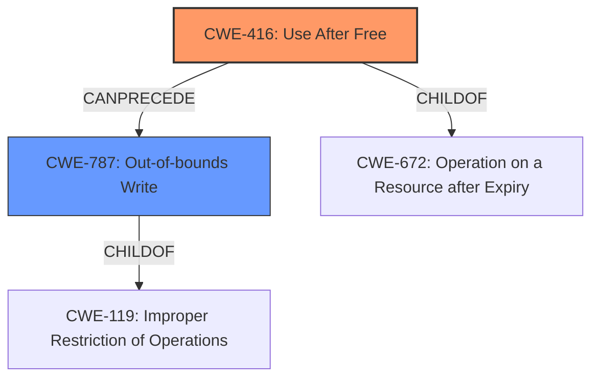

# Final Resolution for CVE-2022-1855

# Summary
| CWE ID | CWE Name | Confidence | CWE Abstraction Level | CWE Vulnerability Mapping Label | CWE-Vulnerability Mapping Notes |
|---|---|---|---|---|---|
| CWE-416 | Use After Free | 1.0 | Variant | Primary | Allowed |
| CWE-787 | Out-of-bounds Write | 0.4 | Base | Secondary | Allowed |

## Evidence and Confidence

*   **Confidence Score:** 0.9
*   **Evidence Strength:** MEDIUM

## Relationship Analysis
The primary CWE is CWE-416 (Use After Free), which is a Variant-level CWE. The criticism suggested considering potential chaining, specifically with CWE-362 (Race Condition) or CWE-366 (Race Condition within a Thread). However, there is no explicit evidence in the vulnerability description to suggest a concurrency issue. The description mentions heap corruption, which can be the result of a UAF, and is also described by CWE-787 (Out-of-bounds Write).

## Vulnerability Chain
The vulnerability chain starts with the **ROOTCAUSE** being a "**use-after-free**" condition (CWE-416). This leads to the consequence of potential heap corruption. The heap corruption is a result of writing to memory that has already been freed (CWE-787). The vulnerability is triggered by a crafted HTML page.

## Summary of Analysis
The initial analysis correctly identified CWE-416 (Use After Free) as the primary **WEAKNESS**, based on the vulnerability description that explicitly states a "use after free" condition. The criticism suggested considering chaining with race condition related CWEs, but this is not supported by the available evidence. The mention of "heap corruption" in the vulnerability description suggests that the UAF leads to an out-of-bounds write, which can be represented by CWE-787.

The decision to include CWE-787 as a secondary CWE is based on the fact that heap corruption is a common consequence of UAF vulnerabilities. Although the vulnerability description does not explicitly state an out-of-bounds write, the mention of heap corruption implies that the freed memory is being overwritten.

The selected CWEs are at the optimal level of specificity. CWE-416 is a Variant, which is the preferred level of abstraction. CWE-787 is a Base CWE.