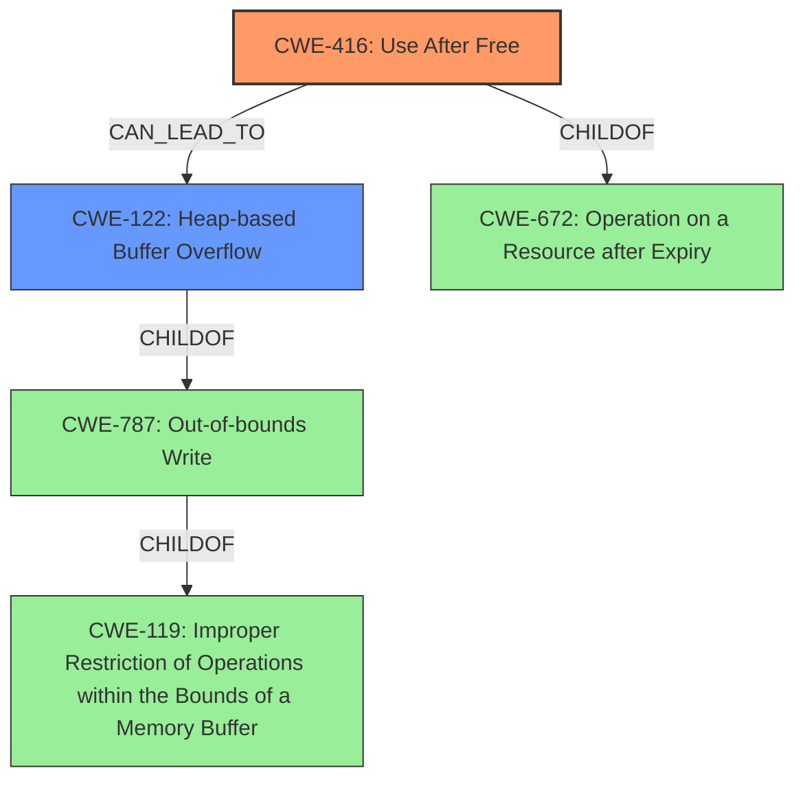

# Analysis Report for CVE-2022-1856

# Vulnerability Analysis Report: CVE-2022-1856

## Description

Use after free in User Education in Google Chrome prior to 102.0.5005.61 allowed an attacker who convinced a user to install a malicious extension to potentially exploit heap corruption via a crafted Chrome Extension or specific user interaction.

## Vulnerability Description Key Phrases

**Rootcause:** use after free
**Weakness:** heap corruption
**Vector:** crafted Chrome Extension or specific user interaction
**Attacker:** attacker
**Product:** Google Chrome
**Version:** prior to 102.0.5005.61
**Component:** User Education

## Analysis (with Relationship Data)

# Summary
| CWE ID | CWE Name | Confidence | CWE Abstraction Level | CWE Vulnerability Mapping Label | CWE-Vulnerability Mapping Notes |
|---|---|---|---|---|---|
| CWE-416 | Use After Free | 0.95 | Variant | Allowed | This is the primary CWE because the vulnerability description explicitly states "use after free". |
| CWE-122 | Heap-based Buffer Overflow | 0.5 | Variant | Allowed | This is a secondary candidate because **heap corruption** is mentioned, and heap overflows can lead to corruption. |

## Evidence and Confidence

*   **Confidence Score:** 0.9
*   **Evidence Strength:** HIGH

- **Analysis and Justification:**  
  - *Explanation:* The vulnerability description clearly states "**use after free** in User Education... allowed an attacker... to potentially exploit **heap corruption**". The CVE Reference Links Content Summary confirms the "**root cause of vulnerability**" is "**Use after free**". CWE-416 (Use After Free) directly addresses this **root cause**, where memory is reused or referenced after being freed, leading to undefined behavior and potential exploitation. The 'Retriever Results' also supports CWE-416 as the top candidate with a high score. The description also mentions "**heap corruption**", which may be related to buffer overflows. CWE-122 (Heap-based Buffer Overflow) is included as a secondary candidate. MITRE mapping guidance for CWE-416 indicates this is ALLOWED for use-after-free vulnerabilities.

  - *Relationship Analysis:* CWE-416 is a variant-level CWE, which is preferred because it's more specific. It is related to CWE-672 (Operation on a Resource after Expiry), which provides a broader context of resource lifecycle issues. CWE-122 is a variant of CWE-119 (Improper Restriction of Operations within the Bounds of a Memory Buffer), and can be caused by integer overflows (CWE-190) or type confusion (CWE-843).

- **Confidence Score:**  
  - Confidence: 0.95 (High confidence due to explicit mention of "use after free" in the vulnerability description and confirmed by CVE reference.)

---

## Criticism of Analysis

Okay, here's a detailed review of the analysis, incorporating the full CWE specifications.

**Overall Assessment:**

The analysis is generally sound and well-justified. The primary mapping to CWE-416 (Use After Free) is highly appropriate and the confidence level is justified. The inclusion of CWE-122 (Heap-based Buffer Overflow) as a secondary concern is also reasonable, given the mention of "heap corruption" in the vulnerability description. The analysis clearly articulates the reasoning behind each choice and acknowledges the relationship between the two CWEs.

**Specific Comments:**

**1. CWE-416: Use After Free**

*   **Assessment:** Excellent choice.  The vulnerability description explicitly states "use after free," making this the most direct and accurate mapping.
*   **Confidence:** The high confidence score (0.95) is appropriate.
*   **Abstraction Level:** The Variant level is ideal.
*   **CWE Specification Considerations:**
    *   **Mapping Guidance:**  The analysis correctly notes that CWE-416 is "Allowed" for use-after-free vulnerabilities, as per the CWE's mapping guidance.
    *   **Potential Mitigations:** The analysis could be improved by briefly mentioning some potential mitigations, even though they are general:
        *   *Language Selection (using a memory-safe language)*
        *   *Setting pointers to NULL after freeing them (although this is often insufficient in complex scenarios).*
    *   **Relationships:** The analysis already mentions the relationship to CWE-672 (Operation on a Resource after Expiry).
*   **Suggested Improvements:**  None, except for adding a brief mention of mitigations.

**2. CWE-122: Heap-based Buffer Overflow**

*   **Assessment:**  A reasonable secondary consideration. The mention of "heap corruption" suggests that a heap overflow is possible. However, it is crucial to recognize this is *less certain* than the UAF.
*   **Confidence:** The confidence score (0.5) is appropriately lower than that of CWE-416, reflecting the uncertainty.
*   **Abstraction Level:** Variant.
*   **CWE Specification Considerations:**
    *   **Mapping Guidance:** Correctly identifies it as Allowed.
    *   **Potential Mitigations:** Should mention potential mitigations:
        *   *Language Selection (using languages with automatic bounds checking)*
        *   *Using safer libraries or frameworks*
        *   *Compiler-based buffer overflow detection mechanisms (e.g., /GS flag, FORTIFY_SOURCE)*
    *   **Relationships:** The analysis could mention that CWE-122 is a child of CWE-787 (Out-of-bounds Write) and CWE-788 (Access of Memory Location After End of Buffer).
*   **Suggested Improvements:**  Add the mitigation bullet points, and state explicitly that this is a *possible* root cause, *dependent on* the specifics of how the UAF manifests.  Reinforce the connection to heap corruption *if* the UAF leads to an exploitable overflow.

**General Observations and Suggestions:**

1.  **Emphasis on "Heap Corruption":** The analysis rightly focuses on the "heap corruption" aspect. However, it's worth stating that UAF vulnerabilities *often* lead to heap corruption as a consequence. An attacker reallocates the freed memory and then the original dangling pointer is used to write to what is now an unexpected location on the heap. This corruption doesn't necessarily *have* to be a buffer overflow. It could be overwriting other metadata or data structures on the heap, which might have other consequences than a "traditional" buffer overflow.
2.  **Alternative CWEs Considered:** The "Retriever Results" list several other CWEs that the automated tools considered. While the analysis doesn't need to exhaustively address *every* possibility, briefly explaining why some of the higher-ranked alternatives were *not* chosen could strengthen the reasoning. For example:
    *   **CWE-366 (Race Condition within a Thread):** While concurrency could *potentially* be involved, the primary issue is memory management. A race condition isn't explicitly mentioned or implied.
    *   **CWE-843 (Access of Resource Using Incompatible Type ('Type Confusion')):** Type confusion could conceivably *contribute* to the vulnerability, but it's not the primary cause. The root cause is the use of memory after it has been freed, leading to the *potential* for type confusion.
    *   **CWE-415 (Double Free):** While double-free can *lead* to heap corruption and sometimes resemble UAF, the primary report suggests *use* after free, not a double free.
3.  **Chains:** The analysis could explicitly mention the *potential* for chaining. A UAF is often the *result* of some other coding error (e.g., incorrect error handling, logic flaw).
4.  **Mitigation Specificity:** Remember, the mitigations listed in the CWEs are very general. For a more in-depth analysis, consider what specific coding practices or vulnerability mitigations *could* have prevented this specific UAF. For example: Was the object's lifetime not properly managed? Was there a failure to set a pointer to NULL after freeing? Was there a lack of ownership tracking?

**Revised Summary Table:**

| CWE ID | CWE Name | Confidence | CWE Abstraction Level | CWE Vulnerability Mapping Label | CWE-Vulnerability Mapping Notes |
|---|---|---|---|---|---|
| CWE-416 | Use After Free | 0.95 | Variant | Allowed | This is the primary CWE because the vulnerability description explicitly states "use after free". Mitigations include using memory-safe languages and setting pointers to NULL after freeing. |
| CWE-122 | Heap-based Buffer Overflow | 0.5 | Variant | Allowed | This is a secondary candidate because **heap corruption** is mentioned, and a UAF can lead to corruption, potentially in the form of a heap overflow. Mitigations include using languages with bounds checking and employing compiler-based overflow detection.  This is *dependent on* the specific manifestation of the UAF. |

By incorporating these suggestions, the analysis will be even more robust and demonstrate a deeper understanding of the CWE specifications and their application to this vulnerability.

## Final Resolution

# Summary
| CWE ID | CWE Name | Confidence | CWE Abstraction Level | CWE Vulnerability Mapping Label | CWE-Vulnerability Mapping Notes |
|---|---|---|---|---|---|
| CWE-416 | Use After Free | 0.95 | Variant | Allowed | This is the primary CWE because the vulnerability description explicitly states "use after free". Mitigations include using memory-safe languages and setting pointers to NULL after freeing. |
| CWE-122 | Heap-based Buffer Overflow | 0.5 | Variant | Allowed | This is a secondary candidate because **heap corruption** is mentioned, and a UAF can lead to corruption, potentially in the form of a heap overflow. Mitigations include using languages with bounds checking and employing compiler-based overflow detection. This is *dependent on* the specific manifestation of the UAF. |

## Evidence and Confidence

*   **Confidence Score:** 0.93
*   **Evidence Strength:** HIGH

## Relationship Analysis
The primary relationship is that CWE-416 (Use After Free) can potentially lead to CWE-122 (Heap-based Buffer Overflow) if the freed memory is reallocated and subsequently overflowed. CWE-416 is a variant of CWE-672 (Operation on a Resource after Expiry). CWE-122 is a variant of CWE-119 (Improper Restriction of Operations within the Bounds of a Memory Buffer) and a child of CWE-787 (Out-of-bounds Write).

## Vulnerability Chain
The vulnerability chain starts with a coding error that leads to memory being freed prematurely or incorrectly. This results in CWE-416 (**Use After Free**), where the application attempts to access or modify the freed memory. If an attacker can reallocate this memory and then trigger a write operation using the dangling pointer, it can lead to **heap corruption**, which may manifest as CWE-122 (**Heap-based Buffer Overflow**) or other heap-related issues. The ultimate impact is arbitrary code execution due to **heap corruption**.

## Summary of Analysis
The initial analysis and criticism are both well-reasoned. The primary CWE, CWE-416 (**Use After Free**), is strongly supported by the vulnerability description, which explicitly mentions "use after free." The secondary CWE, CWE-122 (**Heap-based Buffer Overflow**), is plausible given the mention of "heap corruption," but it is less certain and depends on the specific details of how the use-after-free is exploited.

The graph relationships influenced the selection by illustrating how CWE-416 can potentially lead to CWE-122, and placing the vulnerability in the broader context of resource management issues (CWE-672) and memory safety (CWE-119, CWE-787).

The selected CWEs are at the optimal level of specificity. CWE-416 is a variant-level CWE that directly addresses the use-after-free condition. CWE-122 is also a variant-level CWE that describes a specific type of heap corruption that may result from the use-after-free.

The final decision is based on the provided evidence, specifically the vulnerability description's mention of "use after free" and "heap corruption". The confidence score reflects the strength of this evidence.

*Report generated on 2025-03-18 08:00:42*
