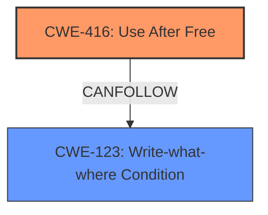

# Analysis Report for CVE-2022-1859

# Vulnerability Analysis Report: CVE-2022-1859

## Description

Use after free in Performance Manager in Google Chrome prior to 102.0.5005.61 allowed a remote attacker who convinced a user to engage in specific user interaction to potentially exploit heap corruption via a crafted HTML page.

## Vulnerability Description Key Phrases

**Rootcause:** use after free
**Weakness:** heap corruption
**Vector:** crafted HTML page
**Attacker:** remote attacker
**Product:** Google Chrome
**Version:** prior to 102.0.5005.61
**Component:** Performance Manager

## Analysis (with Relationship Data)

# Summary
| CWE ID | CWE Name | Confidence | CWE Abstraction Level | CWE Vulnerability Mapping Label | CWE-Vulnerability Mapping Notes |
|---|---|---|---|---|---|
| CWE-416 | Use After Free | 0.95 | Variant | Allowed | Primary CWE |

## Evidence and Confidence

*   **Confidence Score:** 0.95
*   **Evidence Strength:** HIGH

- **Analysis and Justification:**  
  - *Explanation:* The vulnerability description clearly states a **use after free** condition in the Performance Manager of Google Chrome. The "Vulnerability Description Key Phrases" section also highlights the **use after free** as the **rootcause** and **heap corruption** as the **weakness**. The CVE reference confirms the presence of a **use-after-free** vulnerability. CWE-416 (Use After Free) directly addresses this condition where memory is reused or referenced after it has been freed, potentially leading to **heap corruption**. The retriever results also list CWE-416 as the top candidate with a high combined score. The MITRE mapping guidance indicates that the usage for CWE-416 is ALLOWED, making it an appropriate choice.

  - *Relationship Analysis:* While other CWEs like CWE-122 (Heap-based Buffer Overflow) and CWE-787 (Out-of-bounds Write) are related to memory corruption, the explicit mention of "use after free" strongly points to CWE-416 as the primary weakness. CWE-416 is a variant of a broader class of memory management issues.

- **Confidence Score:**
  - Confidence: 0.95 (Strong evidence from vulnerability description, key phrases, CVE reference, and retriever results)

---

## Criticism of Analysis

## Critique of the Analysis

The analysis is generally good and arrives at the correct CWE (CWE-416). The confidence score is justified given the clear description and supporting information. However, there's room for improvement in acknowledging related CWEs and more explicitly detailing the chain of events leading to the vulnerability.

Here's a breakdown:

**Strengths:**

*   **Correct CWE Identification:** The primary CWE identification as CWE-416 (Use After Free) is accurate and well-supported by the vulnerability description, key phrases, CVE reference, and retriever results.
*   **High Confidence Score:** A confidence score of 0.95 is suitable, reflecting the strong evidence.
*   **Detailed Justification:** The justification clearly explains *why* CWE-416 is the appropriate choice, referencing the vulnerability details, key phrases, and retriever results.
*   **Relationship Analysis:** The analysis acknowledges other related CWEs like CWE-122 (Heap-based Buffer Overflow) and CWE-787 (Out-of-bounds Write) and explains why CWE-416 is the more precise primary weakness.
*   **Clear Presentation:** The summary table and structured explanation make the analysis easy to follow.

**Areas for Improvement:**

1.  **CWE Chaining/Composition:** While the analysis mentions *heap corruption* as a weakness, it should explicitly explore how the UAF leads to potential heap corruption and the potential for other consequences. A "chain" of CWEs might be appropriate. For example, a possible chain could be:
    *   CWE-416 (Use After Free) -> CWE-78 (Improper Neutralization of Special Elements used in an OS Command) via memory corruption if the attacker gains control of the freed memory and can influence program control flow.  Or,
    *   CWE-416 (Use After Free) -> CWE-190 (Integer Overflow or Wraparound) -> CWE-122 (Heap-based Buffer Overflow) if the UAF results in an integer overflow leading to a buffer overflow, as shown in one of the examples. The point is to show how UAF allows the attacker to corrupt memory leading to further exploitable states.

2.  **Deeper Dive into Potential Mitigations:** Although the analysis correctly identifies CWE-416 as the primary weakness, a deeper discussion of the potential mitigations would be beneficial. Given that the context is Google Chrome, a more detailed explanation of how to prevent UAF within the Performance Manager would be appropriate. The analysis could mention specific mitigation techniques such as:
    *   Using smart pointers or reference counting to automatically manage memory and prevent dangling pointers.
    *   Employing garbage collection to automatically reclaim unused memory.
    *   Implementing robust memory safety checks and sanitizers during development and testing to detect UAF errors early.
    *   Adopting secure coding practices to minimize the risk of memory management errors.
    *   Sandboxing techniques to restrict the impact of any potential UAF vulnerabilities.

3.  **Consideration of Concurrent Execution:** Given that browsers are inherently concurrent, a brief consideration of potential race conditions leading to the UAF might be worthwhile. This could involve mentioning CWE-362 (Concurrent Execution using Shared Resource with Improper Synchronization) or CWE-366 (Race Condition Within a Thread) as a contributing factor if applicable. While not the *primary* CWE, it could be a contributing factor that enables or exacerbates the UAF.  The CVE-2022-2621 is provided as a CWE-366's example of chaining into CWE-416.

4.  **Specificity of Attack Vector:** The analysis mentions "crafted HTML page" as the attack vector, but it could elaborate on how the HTML page triggers the UAF in Performance Manager. Does it trigger a specific sequence of events? Does it exploit a particular API or function call?

**Revised Analysis Snippets:**

*   **CWE Chain Example:**  
    "The vulnerability description clearly states a **use after free** condition in the Performance Manager of Google Chrome, which can lead to **heap corruption**. This occurs when memory is accessed after being freed, potentially allowing an attacker to overwrite the freed memory with malicious data, leading to a write-what-where condition (CWE-123) or control-flow hijacking. Thus a possible chain is CWE-416 -> CWE-123"

*   **Enhanced Mitigation Discussion:**
    "Mitigation strategies for CWE-416 include employing automatic memory management techniques (e.g., garbage collection, smart pointers), using memory safety checks and sanitizers during development and testing, and adopting secure coding practices to minimize memory management errors. Specific to the Performance Manager in Chrome, stricter ownership and lifetime management of objects within the Performance Manager is needed. Use AddressSanitizer (ASan) to detect use-after-free errors during testing."

*   **Acknowledging Concurrency:**
    "While use-after-free is the primary weakness, concurrent access to the same memory region without proper synchronization could exacerbate the issue. Therefore, CWE-362 (Concurrent Execution using Shared Resource with Improper Synchronization) may be a contributing factor, potentially creating a race condition that allows the UAF to be triggered more easily."

**In Summary:**

The analysis provides a solid foundation for understanding the vulnerability. By incorporating the suggested improvements, particularly a deeper exploration of the potential chain of exploitation and a more detailed discussion of the mitigation strategies and concurrency, the analysis can become more comprehensive and valuable.

## Final Resolution

# Summary
| CWE ID | CWE Name | Confidence | CWE Abstraction Level | CWE Vulnerability Mapping Label | CWE-Vulnerability Mapping Notes |
|---|---|---|---|---|---|
| CWE-416 | **Use After Free** | 0.95 | Variant | Allowed | Primary CWE |
| CWE-123 | **Write-what-where Condition** | 0.6 | Base | Allowed | Secondary Candidate |

## Evidence and Confidence

*   **Confidence Score:** 0.90
*   **Evidence Strength:** MEDIUM

## Relationship Analysis
The primary relationship influencing the decision is the CANFOLLOW relationship from **CWE-416 (Use After Free)** to **CWE-123 (Write-what-where Condition)**. The **use after free** condition allows an attacker to potentially overwrite freed memory with malicious data, leading to arbitrary write capabilities. While **CWE-416** is a Variant, it is a specific type of memory corruption. **CWE-123** is a Base CWE and represents the general outcome of memory corruption. The abstraction levels guided the selection to include both the specific flaw (CWE-416) and its likely immediate consequence (CWE-123).

## Vulnerability Chain
The vulnerability chain begins with the **CWE-416 (Use After Free)** condition within the Performance Manager of Google Chrome. A remote attacker convinces a user to interact with a crafted HTML page that triggers the **use-after-free**. This allows the attacker to potentially overwrite the freed memory with arbitrary data, achieving a **CWE-123 (Write-what-where Condition)**. The sequence is:

1.  **CWE-416 (Use After Free):** Memory is accessed after being freed.
2.  **CWE-123 (Write-what-where Condition):** The attacker overwrites freed memory, potentially controlling program execution.

## Summary of Analysis
The initial analysis correctly identified **CWE-416 (Use After Free)** as the primary weakness. The criticism highlighted the need to explore the chain of events and potential consequences of the **use-after-free**. Specifically, the **use-after-free** condition allows an attacker to potentially overwrite the freed memory, which is a **CWE-123 (Write-what-where Condition)**.

The relationship analysis shows that **CWE-416** can lead to **CWE-123**, meaning the **use-after-free** can allow an attacker to write arbitrary data to arbitrary locations in memory. This makes **CWE-123** a relevant secondary CWE.

The evidence for **CWE-416** is strong, as the vulnerability description explicitly mentions it. The evidence for **CWE-123** is based on the understanding of how a **use-after-free** can be exploited. The confidence score is slightly reduced to 0.90 to reflect the fact that the addition of **CWE-123** relies on inference.

The selected CWEs are at the optimal level of specificity, with **CWE-416** being a Variant that accurately describes the memory management issue, and **CWE-123** being a Base CWE that describes the immediate consequence of the flaw.

*Report generated on 2025-03-18 08:01:23*
