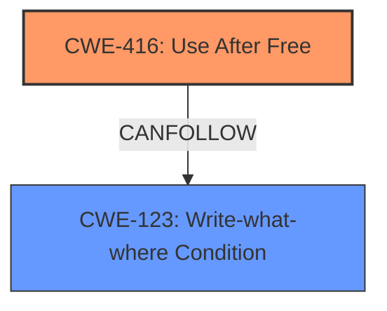

# Final Resolution for CVE-2022-1859

# Summary
| CWE ID | CWE Name | Confidence | CWE Abstraction Level | CWE Vulnerability Mapping Label | CWE-Vulnerability Mapping Notes |
|---|---|---|---|---|---|
| CWE-416 | **Use After Free** | 0.95 | Variant | Allowed | Primary CWE |
| CWE-123 | **Write-what-where Condition** | 0.6 | Base | Allowed | Secondary Candidate |

## Evidence and Confidence

*   **Confidence Score:** 0.90
*   **Evidence Strength:** MEDIUM

## Relationship Analysis
The primary relationship influencing the decision is the CANFOLLOW relationship from **CWE-416 (Use After Free)** to **CWE-123 (Write-what-where Condition)**. The **use after free** condition allows an attacker to potentially overwrite freed memory with malicious data, leading to arbitrary write capabilities. While **CWE-416** is a Variant, it is a specific type of memory corruption. **CWE-123** is a Base CWE and represents the general outcome of memory corruption. The abstraction levels guided the selection to include both the specific flaw (CWE-416) and its likely immediate consequence (CWE-123).

## Vulnerability Chain
The vulnerability chain begins with the **CWE-416 (Use After Free)** condition within the Performance Manager of Google Chrome. A remote attacker convinces a user to interact with a crafted HTML page that triggers the **use-after-free**. This allows the attacker to potentially overwrite the freed memory with arbitrary data, achieving a **CWE-123 (Write-what-where Condition)**. The sequence is:

1.  **CWE-416 (Use After Free):** Memory is accessed after being freed.
2.  **CWE-123 (Write-what-where Condition):** The attacker overwrites freed memory, potentially controlling program execution.

## Summary of Analysis
The initial analysis correctly identified **CWE-416 (Use After Free)** as the primary weakness. The criticism highlighted the need to explore the chain of events and potential consequences of the **use-after-free**. Specifically, the **use-after-free** condition allows an attacker to potentially overwrite the freed memory, which is a **CWE-123 (Write-what-where Condition)**.

The relationship analysis shows that **CWE-416** can lead to **CWE-123**, meaning the **use-after-free** can allow an attacker to write arbitrary data to arbitrary locations in memory. This makes **CWE-123** a relevant secondary CWE.

The evidence for **CWE-416** is strong, as the vulnerability description explicitly mentions it. The evidence for **CWE-123** is based on the understanding of how a **use-after-free** can be exploited. The confidence score is slightly reduced to 0.90 to reflect the fact that the addition of **CWE-123** relies on inference.

The selected CWEs are at the optimal level of specificity, with **CWE-416** being a Variant that accurately describes the memory management issue, and **CWE-123** being a Base CWE that describes the immediate consequence of the flaw.