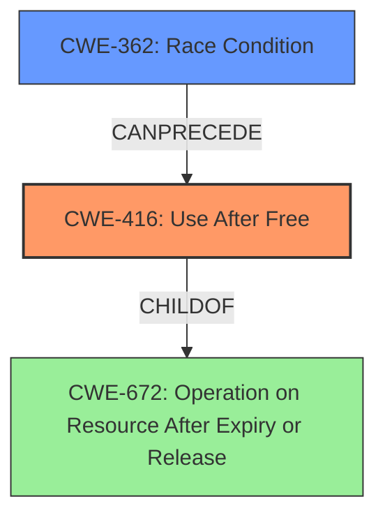

# Final Resolution for CVE-2022-1860

# Summary

| CWE ID | CWE Name | Confidence | CWE Abstraction Level | CWE Vulnerability Mapping Label | CWE-Vulnerability Mapping Notes |
|---|---|---|---|---|---|
| CWE-416 | Use After Free | 1.0 | Variant | Allowed | Primary CWE. Memory is reused after being freed, leading to heap corruption. |
| CWE-362 | Concurrent Execution using Shared Resource with Improper Synchronization ('Race Condition') | 0.3 | Class | Allowed-with-Review | Possible contributing factor. Specific user interactions might create a race condition facilitating the exploitation of the UAF. Not the primary weakness, but may be a contributing factor in the exploitability. |

## Evidence and Confidence

*   **Confidence Score:** 0.95
*   **Evidence Strength:** HIGH

## Relationship Analysis
The primary relationship that impacted my decision was the potential for CWE-362 (Race Condition) to contribute to the exploitability of CWE-416 (Use After Free). While CWE-416 remains the core issue, the vulnerability description mentions "specific user interactions," which suggests the possibility of concurrent threads accessing the freed memory, thus increasing the likelihood of successful exploitation. CWE-416 is a variant of CWE-672 (Operation on a Resource after Expiration or Release).

## Vulnerability Chain
The chain of events starts with the **ROOTCAUSE**, CWE-416 (**Use After Free**), where memory is freed but later accessed again. The "specific user interactions" hint at a possible CWE-362 (**Race Condition**), where multiple threads might be attempting to access the same memory region concurrently. The **WEAKNESS** allows an attacker to corrupt the heap, leading to potential remote code execution.

## Summary of Analysis
The initial analysis correctly identified CWE-416 (**Use After Free**) as the primary **WEAKNESS**, based on the vulnerability description stating "**Use after free**" and the CVE reference confirming this root cause.

The criticism raised a valid point about the potential contribution of CWE-362 (**Race Condition**) due to "specific user interactions." Even if not the primary cause, concurrency could make the UAF easier to exploit.

My assessment is strongly based on the provided evidence, especially the vulnerability description and CVE reference. The relationship analysis influenced my decision to include CWE-362 as a secondary contributing factor. I'm selecting CWE-416 as the primary CWE because it directly reflects the vulnerability's root cause, while CWE-362 is a potential contributing factor based on the description of specific user interactions. CWE-416 is at the optimal level of specificity (Variant), directly describing the use-after-free condition.