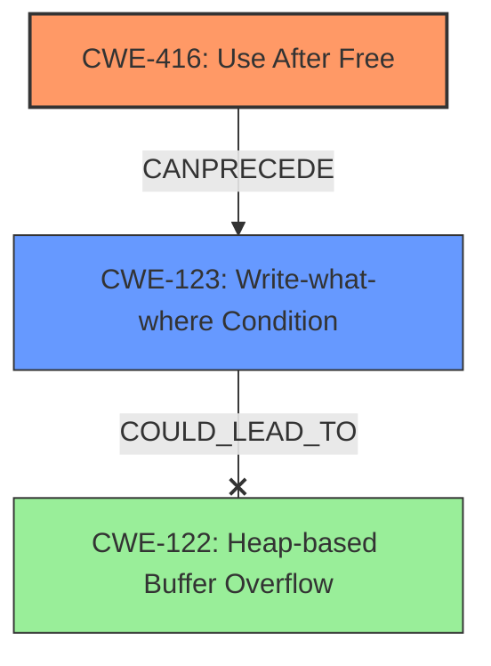

# Final Resolution for CVE-2022-1863

# Summary
| CWE ID  | CWE Name                     | Confidence | CWE Abstraction Level | CWE Vulnerability Mapping Label | CWE-Vulnerability Mapping Notes |
| :-------- | :--------------------------- | :--------- | :-------------------- | :------------------------------ | :------------------------------ |
| CWE-416 | Use After Free             | 0.95       | Variant               | Allowed                         | Primary CWE                     |
| CWE-123 | Write-What-Where Condition | 0.50       | Base                  | Allowed                         | Secondary Candidate             |

## Evidence and Confidence

*   **Confidence Score:** 0.90
*   **Evidence Strength:** MEDIUM

## Relationship Analysis
The primary relationship impacting the decision is that **CWE-416 (Use After Free)** can **CANPRECEDE** **CWE-123 (Write-What-Where Condition)**. While **CWE-122 (Heap-based Buffer Overflow)** was considered, there isn't explicit evidence of a buffer overflow. The description mentions "heap corruption," which could be caused by a **CWE-123 (Write-What-Where Condition)** following a **CWE-416 (Use After Free)**. Therefore, it's more accurate to consider the potential for arbitrary memory writes as a consequence of the UAF.

## Vulnerability Chain
The vulnerability chain starts with **CWE-416 (Use After Free)**, where memory is accessed after it has been freed. This **root cause** can lead to **CWE-123 (Write-What-Where Condition)** if the freed memory is reallocated and then written to with arbitrary values. The final impact is **heap corruption**, which can have various consequences depending on what data structures are corrupted. The absence of explicit mention of a buffer overflow action makes **CWE-122 (Heap-based Buffer Overflow)** a less likely consequence, although still possible, and therefore not an ideal secondary CWE.

## Summary of Analysis
The initial analysis correctly identifies **CWE-416 (Use After Free)** as the primary **root cause** due to the explicit mention in the vulnerability description: "Use after free in Tab Groups... allowed an attacker... to potentially exploit heap corruption." The criticism suggested refining the secondary CWE. The original choice, **CWE-122 (Heap-based Buffer Overflow)**, was deemed plausible but not explicitly supported by the description. The description only mentioned "**heap corruption**".

Following the criticism's suggestion and considering relationship analysis, **CWE-123 (Write-What-Where Condition)** is a more appropriate secondary CWE. The relationship **CANPRECEDE** from **CWE-416 (Use After Free)** to **CWE-123 (Write-What-Where Condition)** supports this decision. A use-after-free can enable an attacker to write arbitrary values to arbitrary memory locations, leading to **heap corruption**.

The confidence score for **CWE-123 (Write-What-Where Condition)** is set to 0.50, reflecting the fact that it is a potential consequence of the primary weakness but not directly stated in the description. This represents a reasonable level of doubt as suggested in the criticism.