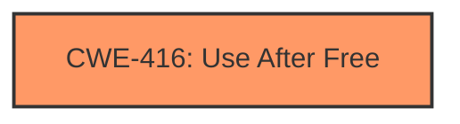

# Final Resolution for CVE-2022-1865

# Summary
| CWE ID | CWE Name | Confidence | CWE Abstraction Level | CWE Vulnerability Mapping Label | CWE-Vulnerability Mapping Notes |
|---|---|---|---|---|---|
| CWE-416 | Use After Free | 1.0 | Variant | Allowed | Primary CWE |

## Evidence and Confidence

*   **Confidence Score:** 1.0
*   **Evidence Strength:** HIGH

## Relationship Analysis
The primary relationship considered was the absence of relationships that would suggest a different CWE. Although **CWE-416 (Use After Free)** can lead to other issues like **CWE-787 (Out-of-bounds Write)**, the vulnerability description focuses on the **use-after-free** condition as the **ROOTCAUSE**. The Variant level of **CWE-416 (Use After Free)** is appropriate as it's a specific type of memory corruption.

## Vulnerability Chain
The vulnerability chain starts with a **use-after-free** condition, which allows an attacker to potentially exploit heap corruption. The sequence is:

1.  **ROOTCAUSE**: **CWE-416 (Use After Free)** - Memory is freed, but a pointer to that memory is still used.
2.  Consequence: Heap corruption due to the **WEAKNESS** of using dangling pointers.
3.  Impact: Potential for arbitrary code execution or other malicious activity.

## Summary of Analysis
The initial analysis and criticism both agree that **CWE-416 (Use After Free)** is the correct classification. The vulnerability description clearly states "use after free," and the analysis correctly identifies this as the **ROOTCAUSE**. No other CWEs are strongly indicated by the description.

The assessment is strongly based on the provided evidence, specifically the vulnerability description "Use after free in Bookmarks in Google Chrome prior to 102.0.5005.61 allowed an attacker who convinced a user to install a malicious extension to potentially exploit heap corruption via a crafted Chrome Extension and specific user interaction."

The selected CWE is at the optimal level of specificity because **CWE-416 (Use After Free)** directly describes the vulnerability, and there is no evidence to suggest a more specific variant is needed or that a broader base class would be more appropriate.