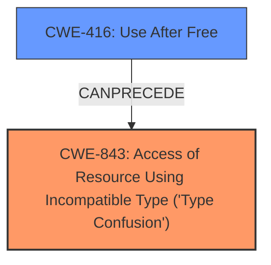

# Final Resolution for CVE-2022-1869

# Summary
| CWE ID | CWE Name | Confidence | CWE Abstraction Level | CWE Vulnerability Mapping Label | CWE-Vulnerability Mapping Notes |
|---|---|---|---|---|---|
| CWE-843 | Access of Resource Using Incompatible Type ('Type Confusion') | 0.95 | Base | Allowed | Primary CWE |
| CWE-416 | Use After Free | 0.6 | Variant | Allowed | Secondary Candidate |

## Evidence and Confidence

*   **Confidence Score:** 0.9
*   **Evidence Strength:** HIGH

## Relationship Analysis
The primary relationship considered was the potential for **CWE-843 (Access of Resource Using Incompatible Type ('Type Confusion'))** to lead to **CWE-416 (Use After Free)**. While **CWE-843** doesn't have direct relationships listed in the provided information, its nature suggests it can **CANPRECEDE** memory corruption issues like **CWE-416**. **CWE-843** is a Base level CWE, offering a good level of specificity for the root cause. **CWE-416** is a Variant, making it a more specific consequence. Both are subtypes of memory corruption.



## Vulnerability Chain
The vulnerability chain starts with **CWE-843 (Access of Resource Using Incompatible Type ('Type Confusion'))**, which corrupts the heap. This corruption can then lead to **CWE-416 (Use After Free)** if the corrupted memory is freed and then accessed again. The **ROOTCAUSE** is the type confusion, and the potential impact is a use-after-free vulnerability.

## Summary of Analysis
The initial analysis and criticism both align on the primary classification of **CWE-843 (Access of Resource Using Incompatible Type ('Type Confusion'))**. The vulnerability description explicitly mentions "Type Confusion in V8", providing strong evidence for this classification. The CVE Reference Links Content Summary further supports this.

The inclusion of **CWE-416 (Use After Free)** as a secondary candidate is also reasonable, as type confusion can lead to heap corruption, potentially resulting in a use-after-free. However, the primary focus remains on the type confusion itself. As the critic noted, without deeper code inspection, it is hard to assert with certainty that **CWE-416** happened, even if its possibility exists.

The graph relationships influenced the decision by highlighting the potential chain of events, with type confusion leading to memory corruption. Both **CWE-843** and **CWE-416** are at appropriate levels of abstraction (Base and Variant, respectively). The mitigations for **CWE-843** would focus on preventing type confusion in the V8 engine, while mitigations for **CWE-416** would focus on memory management practices to prevent use-after-free vulnerabilities.
I am basing my assessment on the provided evidence and the additional information from the detailed CWE specifications, as well as the critic's notes.
The decision to prioritize **CWE-843** is justified by the explicit mention of "Type Confusion" in the vulnerability description.
```
Vulnerability Description
Type Confusion in V8 in Google Chrome prior to 102.0.5005.61 allowed a remote attacker to potentially exploit heap corruption via a crafted HTML page.
```
This direct evidence supports the classification.
The selected CWEs are at the optimal level of specificity, with **CWE-843** representing the **ROOTCAUSE** and **CWE-416** representing a potential consequence.