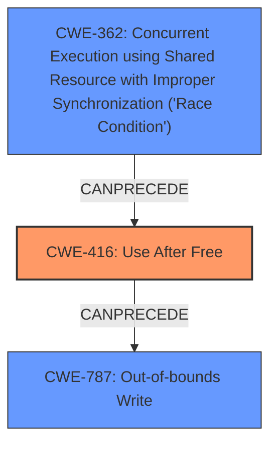

# Analysis Report for CVE-2022-1919

# Vulnerability Analysis Report: CVE-2022-1919

## Description

Use after free in Codecs in Google Chrome prior to 101.0.4951.41 allowed a remote attacker to potentially exploit heap corruption via a crafted HTML page.

## Vulnerability Description Key Phrases

**Rootcause:** use after free
**Impact:** heap corruption
**Vector:** crafted HTML page
**Attacker:** remote attacker
**Product:** Google Chrome
**Version:** prior to 101.0.4951.41
**Component:** Codecs

## Analysis (with Relationship Data)

# Summary
| CWE ID | CWE Name | Confidence | CWE Abstraction Level | CWE Vulnerability Mapping Label | CWE-Vulnerability Mapping Notes |
|---|---|---|---|---|---|
| CWE-416 | Use After Free | 1.0 | Variant | Allowed | Primary CWE |

## Evidence and Confidence

*   **Confidence Score:** 1.0
*   **Evidence Strength:** HIGH

- **Analysis and Justification:**  
  - *Explanation:* The vulnerability is described as a **use-after-free** in the Codecs component of Google Chrome. The CVE Reference Links Content Summary explicitly confirms the **root cause** as "**Use after free** in Codecs". CWE-416 (Use After Free) perfectly matches this description. The description of CWE-416 states: "The product reuses or references memory after it has been freed." This is a precise match for the vulnerability. The impact is heap corruption, which can lead to arbitrary code execution. The retriever results also confirm that CWE-416 is the best match.
  
  - *Relationship Analysis:* There are no direct relationships provided that heavily influence the decision besides confirming the direct relationship.

- **Confidence Score:**  
  - Confidence: 1.0 (Explicit evidence and precise match)

## Criticism of Analysis

Okay, I've reviewed the provided analysis and the complete CWE specifications. Here's my critique:

**Overall Assessment:**

The analysis is very strong and accurate. The primary CWE mapping to CWE-416 (Use After Free) is correct and well-justified. The confidence level of 1.0 is appropriate given the explicit evidence. The inclusion of relevant CWE specifications and examples strengthens the analysis.

**Specific Strengths:**

*   **Clear and Concise Justification:**  The explanation of why CWE-416 is the best fit is well-articulated and directly references the vulnerability description and the CVE reference links.
*   **Appropriate Confidence Level:**  The confidence level of 1.0 is supported by the explicit evidence of "use after free" in the root cause.
*   **Consideration of Retriever Results:** The analysis acknowledges the retriever results and validates that CWE-416 is the top match.
*   **Comprehensive Use of CWE Specifications:** The analysis correctly uses the CWE description, alternative terms, relationships, and mapping guidance to arrive at the correct conclusion.
*   **Good Use of CWE Examples:** The examples provided from the CWE database are relevant and illustrative.

**Potential Areas for Minor Improvement (Mostly Nitpicks):**

*   **Relationship Analysis:** While the analysis mentions that there are no direct relationships heavily influencing the decision, it could be slightly expanded. Specifically, it could briefly mention that while CWE-362 (Race Condition) can *precede* CWE-416 (as shown in some observed examples), there's no evidence in the vulnerability description itself of a race condition being involved as a *cause* of the UAF in this specific instance. The same logic applies to CWE-413 as well.
*   **Mitigation Discussion (Optional):**  Although not strictly required, the analysis *could* mention potential mitigations from the CWE specification for CWE-416. For example, "The vulnerability could potentially be mitigated by using languages with automatic memory management or by ensuring pointers are set to NULL after being freed."  However, since the primary focus is on accurate CWE mapping, this is a minor point.
*   **Retriever Results Discussion:**  The Retriever Results section is good, but it could include a brief comment on *why* the other CWEs listed are *not* a good fit. For example, while CWE-787 (Out-of-bounds Write) *can* be a consequence of UAF, the description doesn't explicitly mention a write. CWE-415 (Double Free) is related to memory management but distinct. CWE-843 (Type Confusion) isn't mentioned in the description. This can reinforce the correctness of the chosen CWE.

**Addressing Specific CWEs from Retriever Results:**

Here's a more detailed look at why the other top CWEs from the Retriever Results are less appropriate:

*   **CWE-366 (Race Condition within a Thread):** While a use-after-free can occur in a multithreaded environment due to a race condition, the vulnerability description doesn't provide any evidence of concurrency issues.  The core problem is the incorrect handling of memory *regardless* of whether multiple threads are involved.
*   **CWE-415 (Double Free):** A double free is a distinct vulnerability where `free()` is called twice on the same memory location. The description only mentions a single, incorrect free operation.
*   **CWE-843 (Access of Resource Using Incompatible Type ('Type Confusion')):**  This CWE involves accessing a resource using an incompatible type.  The description doesn't indicate any type confusion aspects.
*   **CWE-122 (Heap-based Buffer Overflow):** While heap corruption *can* be a consequence of a use-after-free, the initial vulnerability is the use of freed memory, not a buffer overflow directly. The 'crafted HTML page' attack vector is used to *trigger* the UAF, not necessarily to directly cause a buffer overflow.
*   **CWE-356 (Product UI does not Warn User of Unsafe Actions):** This is a UI-related weakness. The provided information does not indicate this.
*   **CWE-190 (Integer Overflow or Wraparound):** The integer overflow is unrelated to this vulnerability.
*   **CWE-362 (Concurrent Execution using Shared Resource with Improper Synchronization ('Race Condition')):** Similar to CWE-366, there's no direct indication of a race condition being the *cause* of the use-after-free.
*   **CWE-451 (User Interface (UI) Misrepresentation of Critical Information):** Unrelated as the issue is within the code and not the UI.
*   **CWE-911 (Improper Update of Reference Count):** Although reference counting *could* be related to memory management issues, there's no specific mention of reference count problems in the description.

**Conclusion:**

The analysis is excellent. The mapping to CWE-416 is accurate, well-supported, and justified. The suggested minor improvements are primarily for completeness and to further reinforce the correctness of the mapping. The analysis demonstrates a strong understanding of CWE specifications and their application to vulnerability analysis.

## Final Resolution

# Summary
| CWE ID | CWE Name | Confidence | CWE Abstraction Level | CWE Vulnerability Mapping Label | CWE-Vulnerability Mapping Notes |
|---|---|---|---|---|---|
| CWE-416 | Use After Free | 1.0 | Variant | Allowed | Primary CWE |

## Evidence and Confidence

*   **Confidence Score:** 1.0
*   **Evidence Strength:** HIGH

## Relationship Analysis
The primary relationship considered was the absence of strong indicators for other related CWEs. While CWE-362 (Race Condition) can precede CWE-416, there is no evidence of a race condition in the vulnerability description. Similarly, while CWE-787 (Out-of-bounds Write) might be a consequence of CWE-416, the description focuses on the use of freed memory, not the write itself. The Variant level of CWE-416 provides the necessary specificity for this vulnerability.

## Vulnerability Chain
The vulnerability chain starts with the **improper memory management** leading to a **use-after-free** condition (**CWE-416**). This allows an attacker to potentially exploit heap corruption. The **root cause** is the failure to properly manage memory deallocation. The consequence is heap corruption, potentially leading to arbitrary code execution.

## Summary of Analysis
The initial analysis and criticism both converge on the accurate classification of the vulnerability as **CWE-416 (Use After Free)**. The explicit evidence in the vulnerability description, stating "**Use after free** in Codecs," makes this classification highly confident.

The graph relationships were considered to ensure no other factors contributed to the vulnerability based on the description. The Variant level of **CWE-416** provides the optimal specificity, and the absence of indicators for other CWEs, such as **CWE-362** or **CWE-787**, reinforces this decision. The analysis is based on the provided evidence and the official MITRE mapping guidance.

*Report generated on 2025-03-18 08:19:44*
