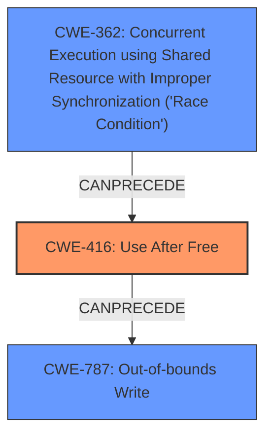

# Final Resolution for CVE-2022-1919

# Summary
| CWE ID | CWE Name | Confidence | CWE Abstraction Level | CWE Vulnerability Mapping Label | CWE-Vulnerability Mapping Notes |
|---|---|---|---|---|---|
| CWE-416 | Use After Free | 1.0 | Variant | Allowed | Primary CWE |

## Evidence and Confidence

*   **Confidence Score:** 1.0
*   **Evidence Strength:** HIGH

## Relationship Analysis
The primary relationship considered was the absence of strong indicators for other related CWEs. While CWE-362 (Race Condition) can precede CWE-416, there is no evidence of a race condition in the vulnerability description. Similarly, while CWE-787 (Out-of-bounds Write) might be a consequence of CWE-416, the description focuses on the use of freed memory, not the write itself. The Variant level of CWE-416 provides the necessary specificity for this vulnerability.

## Vulnerability Chain
The vulnerability chain starts with the **improper memory management** leading to a **use-after-free** condition (**CWE-416**). This allows an attacker to potentially exploit heap corruption. The **root cause** is the failure to properly manage memory deallocation. The consequence is heap corruption, potentially leading to arbitrary code execution.

## Summary of Analysis
The initial analysis and criticism both converge on the accurate classification of the vulnerability as **CWE-416 (Use After Free)**. The explicit evidence in the vulnerability description, stating "**Use after free** in Codecs," makes this classification highly confident.

The graph relationships were considered to ensure no other factors contributed to the vulnerability based on the description. The Variant level of **CWE-416** provides the optimal specificity, and the absence of indicators for other CWEs, such as **CWE-362** or **CWE-787**, reinforces this decision. The analysis is based on the provided evidence and the official MITRE mapping guidance.