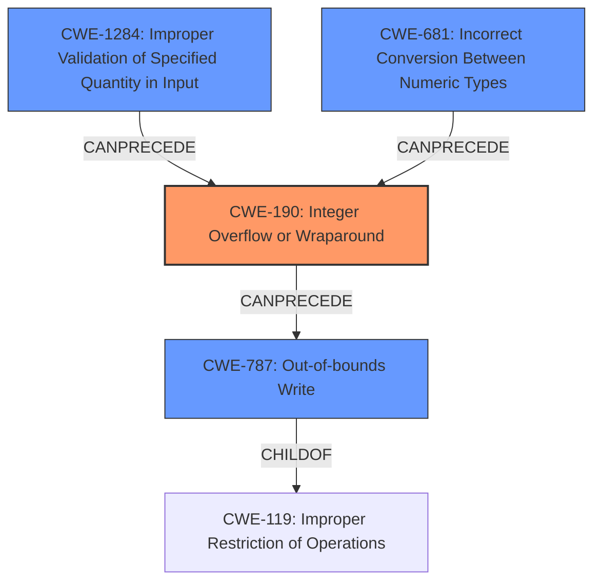

# Analysis Report for CVE-2022-1923

# Vulnerability Analysis Report: CVE-2022-1923

## Description

DOS / potential heap overwrite in mkv demuxing using bzip decompression. Integer overflow in matroskademux element in bzip decompression function which causes a segfault, or could cause a heap overwrite, depending on libc and OS. Depending on the libc used, and the underlying OS capabilities, it could be just a segfault or a heap overwrite. If the libc uses mmap for large chunks, and the OS supports mmap, then it is just a segfault (because the realloc before the integer overflow will use mremap to reduce the size of the chunk, and it will start to write to unmapped memory). However, if using a libc implementation that does not use mmap, or if the OS does not support mmap while using libc, then this could result in a heap overwrite.

## Vulnerability Description Key Phrases

**Rootcause:** integer overflow in matroskademux element in bzip decompression function
**Impact:** ['segfault', 'heap overwrite']
**Vector:** mkv demuxing using bzip decompression

## Analysis (with Relationship Data)

# Summary
| CWE ID | CWE Name | Confidence | CWE Abstraction Level | CWE Vulnerability Mapping Label | CWE-Vulnerability Mapping Notes |
|---|---|---|---|---|---|
| CWE-190 | Integer Overflow or Wraparound | 0.9 | Base | Allowed | Primary CWE |
| CWE-122 | Heap-based Buffer Overflow | 0.7 | Variant | Allowed | Secondary Candidate |

## Evidence and Confidence

*   **Confidence Score:** 0.8
*   **Evidence Strength:** HIGH

- **Analysis and Justification:**
  - *Explanation:* The vulnerability description explicitly mentions an "**integer overflow in matroskademux element in bzip decompression function**". This aligns directly with CWE-190 (Integer Overflow or Wraparound), where a calculation produces an integer overflow or wraparound. The CVE Reference Links Content Summary reinforces this by stating the vulnerability is caused by an integer overflow when handling zlib-compressed data. The **integer overflow** can then lead to a heap overwrite. CWE-190 is a Base level CWE, which is appropriate for mapping to the root cause. The MITRE mapping guidance lists CWE-190 Usage as Allowed.

  - *Relationship Analysis:* While the description also mentions a heap overwrite, the root cause is the integer overflow. The retriever results also list CWE-190 as the highest ranked. CWE-122 (Heap-based Buffer Overflow) is considered a secondary candidate because the **heap overwrite** is a potential consequence of the **integer overflow**, depending on libc and OS configurations. CWE-122 is a Variant of CWE-119 (Improper Restriction of Operations within the Bounds of a Memory Buffer).

- **Confidence Score:**
  - Confidence: 0.9 (High confidence due to direct evidence of integer overflow and the retriever results)
---

## Criticism of Analysis

Okay, let's break down the analysis and critique the CWE mappings based on the provided CWE specifications.

**Summary of the Analysis's CWE Mappings:**

*   **Primary CWE:** CWE-190 (Integer Overflow or Wraparound) - Confidence: 0.9
*   **Secondary Candidate:** CWE-122 (Heap-based Buffer Overflow) - Confidence: 0.7

**Critique:**

Overall, the analysis is well-reasoned and the primary CWE mapping to CWE-190 is correct and justified. The inclusion of CWE-122 as a secondary candidate is also appropriate, but the confidence level could be slightly adjusted based on the variability of the heap overflow manifestation.

Here's a more detailed point-by-point review:

**1. CWE-190 (Integer Overflow or Wraparound): Primary Mapping**

*   **Justification:** The analysis accurately identifies the core issue:  an integer overflow occurring during the decompression process within the matroskademux element. The vulnerability description and the CVE Reference Links Content Summary both explicitly point to this integer overflow.
*   **CWE Specification Alignment:**
    *   **Abstraction:** The analysis correctly identifies CWE-190 as a Base-level CWE.
    *   **Mapping Guidance:** The analysis correctly notes that CWE-190's Usage is "Allowed." The rationale provided by CWE for allowed usage - "This CWE entry is at the Base level of abstraction, which is a preferred level of abstraction for mapping to the root causes of vulnerabilities" -  supports the chosen mapping.
    *   **Relationships:** The specification notes "Integer overflows can be primary to buffer overflows when they cause less memory to be allocated than expected."  This is exactly what is happening here.
    *   **Observed Examples:** CVE-2021-43537 from the specification is especially relevant here, as it shows a chain involving CWE-681 -> CWE-190 -> CWE-122, similar to the vulnerability being analyzed.
*   **Confidence Level:** The analysis assigns a confidence level of 0.9, which is well-justified given the explicit mention of integer overflow in the vulnerability description.
*   **Minor Improvements:** None

**2. CWE-122 (Heap-based Buffer Overflow): Secondary Mapping**

*   **Justification:** The analysis correctly identifies that a heap overflow is a *potential* consequence of the integer overflow. It accurately notes that whether or not this occurs depends on the specific libc implementation and OS capabilities.
*   **CWE Specification Alignment:**
    *   **Abstraction:** The analysis correctly identifies that CWE-122 is a Variant-level CWE.
    *   **Mapping Guidance:** The analysis follows the mapping guidance as well: This CWE entry is at the Variant level of abstraction, which is a preferred level of abstraction for mapping to the root causes of vulnerabilities.
    *   **Relationships:** The specification lists CWE-122 as a ChildOf CWE-788 and CWE-787. CWE-787 Out-of-bounds Write is most specific here.
    *   **Observed Examples:** The CVE-2021-43537 example in the specification is again relevant, demonstrating the chain from integer overflow to heap-based buffer overflow.
*   **Confidence Level:** The analysis assigns a confidence level of 0.7. This is reasonable, although perhaps slightly high. While the potential for a heap overflow is present, it is not *guaranteed*.
*   **Potential Improvements:**
    *   The confidence level could be slightly reduced to 0.6 or 0.65 to reflect the conditional nature of the heap overflow.
    *   A stronger connection to CWE-787 (Out-of-bounds Write) could be made in the "Relationship Analysis".
    *   Consider mention of CWE-770 (Allocation of Memory Without Limits) as a potential related weakness. It is not a direct mapping, but the description fits "The product allocates memory, but it does not ensure that the amount of memory to be allocated is limited, allowing an attacker to specify an extremely large amount of memory to be allocated." The integer overflow can lead to an attacker controlling the size and potentially causing excessive memory allocation before the overflow occurs (e.g., allocating a huge chunk, then overflowing, leading to memory exhaustion). This is a lower probability, but it can be a theoretical consequence, if exploitation is timed precisely.

**3. Missed Opportunities and Potential Additional Considerations:**

*   **CWE-1284 (Improper Validation of Specified Quantity in Input):** This CWE could be considered as a related issue. If the code does not properly validate the size of the compressed data *before* decompression, an attacker could supply a compressed block that *always* triggers the overflow, even with relatively small decompressed sizes. The description for CWE-1284 fits well: "The product receives input that is expected to specify a quantity (such as size or length), but it does not validate or incorrectly validates that the quantity has the required properties." The "quantity" in this case would be the size or length of the decompressed data. This is *less* direct than CWE-190 but could be a contributing factor.
*  **CWE-681 (Incorrect Conversion between Numeric Types):** As observed in the example for both CWE-190 and CWE-122, the vulnerability could be made worse (or possibly only exploitable) if there is an incorrect conversion between numeric types, from a larger type to a smaller type.

**Revised Summary (incorporating suggestions):**

| CWE ID  | CWE Name                           | Confidence | CWE Abstraction Level | CWE Vulnerability Mapping Label | CWE-Vulnerability Mapping Notes                                                                                                                                                                                                                                                                                                                              |
| :------ | :--------------------------------- | :--------- | :-------------------- | :---------------------------- | :------------------------------------------------------------------------------------------------------------------------------------------------------------------------------------------------------------------------------------------------------------------------------------------------------------------------------------------------------------------ |
| CWE-190 | Integer Overflow or Wraparound        | 0.9        | Base                | Allowed                     | Primary CWE                                                                                                                                                                                                                                                                                                                                                               |
| CWE-122 | Heap-based Buffer Overflow         | 0.65       | Variant               | Allowed                     | Secondary Candidate.  Likelihood depends on libc implementation and OS capabilities. Directly related to CWE-787.                                                                                                                                                                                                                                                        |
| CWE-1284 | Improper Validation of Specified Quantity in Input | 0.4 | Base | Allowed | Contributing Factor.  If the size of the compressed data is not validated before decompression, an attacker can supply compressed data to trigger the overflow with a relatively small *decompressed* size.                                                                                                     |
| CWE-681 | Incorrect Conversion Between Numeric Types | 0.3 | Base | Allowed | Potentially a Contributing Factor. If there is a conversion from a larger numeric type to a smaller type before the integer overflow occurs, it can potentially make the issue more exploitable.

**Mitigation Considerations:**

The provided CWE specifications also offer valuable mitigation strategies. For example:

*   **CWE-190 Mitigations:** Language selection (using languages with automatic bounds checking), using safe integer handling libraries, and rigorous input validation are all relevant.
*   **CWE-122 Mitigations:** Using languages with automatic memory management, using abstraction libraries, and enabling compiler-based buffer overflow detection mechanisms are important defenses.
*   **CWE-1284 Mitigations:** Input validation is key to preventing malicious quantities.

**In conclusion, the initial analysis is strong.  The suggested improvements, primarily focusing on refining the confidence level and adding additional considerations, would further enhance the accuracy and completeness of the CWE mappings.**

## Final Resolution

# Summary
| CWE ID   | CWE Name                                                        | Confidence | CWE Abstraction Level | CWE Vulnerability Mapping Label | CWE-Vulnerability Mapping Notes                                                                                                                                                           |
| :------- | :-------------------------------------------------------------- | :--------- | :-------------------- | :---------------------------- | :---------------------------------------------------------------------------------------------------------------------------------------------------------------------------------------- |
| CWE-190  | Integer Overflow or Wraparound                                  | 0.9        | Base                | Allowed                     | Primary CWE                                                                                                                                                                                 |
| CWE-787  | Out-of-bounds Write                                             | 0.7        | Base                | Allowed                     | Secondary Candidate. Consequence of integer overflow leading to potential heap overwrite. More specific than CWE-122.                                                                    |
| CWE-1284 | Improper Validation of Specified Quantity in Input              | 0.4        | Base                | Allowed                     | Contributing Factor. If the size of the compressed data is not validated before decompression, an attacker can supply compressed data to trigger the overflow with a relatively small decompressed size. |
| CWE-681  | Incorrect Conversion Between Numeric Types                        | 0.3        | Base                | Allowed                     | Potentially a Contributing Factor. If there is a conversion from a larger numeric type to a smaller type before the integer overflow occurs, it can potentially make the issue more exploitable.           |

## Evidence and Confidence

*   **Confidence Score:** 0.8
*   **Evidence Strength:** HIGH

## Relationship Analysis
The primary weakness is an **integer overflow (CWE-190)**, which can **precede (CANPRECEDE)** an **out-of-bounds write (CWE-787)** leading to a heap overwrite. **CWE-1284** can contribute by allowing a malicious size to be passed, exacerbating the **CWE-190**. **CWE-681** can also contribute if an incorrect conversion between numeric types occurs before the **integer overflow**, making the overflow more easily triggerable or exploitable. **CWE-787** is a child of **CWE-119 (Improper Restriction of Operations within the Bounds of a Memory Buffer)**, making **CWE-787** a more specific and preferred classification than **CWE-122 (Heap-based Buffer Overflow)**.

## Vulnerability Chain
The vulnerability chain starts with either **CWE-1284 (Improper Validation of Specified Quantity in Input)** allowing an attacker to control the input size, or **CWE-681 (Incorrect Conversion Between Numeric Types)** potentially exacerbating the issue, leading to **CWE-190 (Integer Overflow or Wraparound)** during size calculation. This overflow results in a smaller-than-expected buffer being allocated. Subsequently, when data is written to this buffer, it leads to **CWE-787 (Out-of-bounds Write)**, potentially causing a heap overwrite and a denial of service.

## Summary of Analysis
The initial analysis correctly identified **CWE-190 (Integer Overflow or Wraparound)** as the primary **ROOTCAUSE**. The criticism provided valuable suggestions for refining the secondary CWEs and their confidence levels. Based on the vulnerability description's mention of "**integer overflow in matroskademux element in bzip decompression function**", **CWE-190** remains the most accurate primary classification with a high confidence of 0.9.

The initial analysis identified **CWE-122 (Heap-based Buffer Overflow)** as a secondary candidate. However, **CWE-787 (Out-of-bounds Write)** is a more specific and accurate representation of the consequence of the **integer overflow** leading to a **heap overwrite**, and has been selected as the secondary CWE with a confidence of 0.7. The choice of **CWE-787** is also supported by its relationship as a child of **CWE-119**, making it more specific than **CWE-122**.

Additionally, the analysis incorporates **CWE-1284 (Improper Validation of Specified Quantity in Input)** and **CWE-681 (Incorrect Conversion Between Numeric Types)** as contributing factors with lower confidence levels (0.4 and 0.3, respectively). These CWEs can influence the vulnerability chain but are not direct causes or consequences.

The graph relationships influenced the final selection by highlighting the chain of events and the hierarchical relationships between CWEs. The abstraction levels were also considered, ensuring that the selected CWEs are at the appropriate level of granularity (Base and Variant). The final classification reflects the optimal level of specificity based on the available evidence and relationship analysis.

*Report generated on 2025-03-18 08:21:16*
