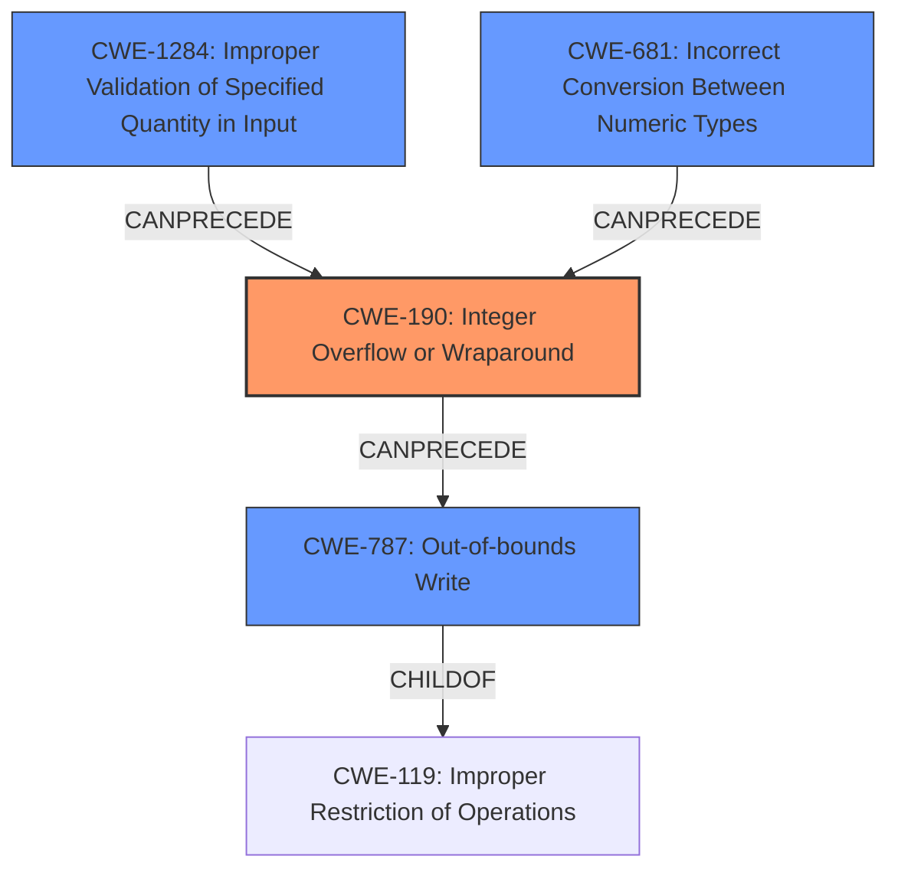

# Final Resolution for CVE-2022-1923

# Summary
| CWE ID   | CWE Name                                                        | Confidence | CWE Abstraction Level | CWE Vulnerability Mapping Label | CWE-Vulnerability Mapping Notes                                                                                                                                                           |
| :------- | :-------------------------------------------------------------- | :--------- | :-------------------- | :---------------------------- | :---------------------------------------------------------------------------------------------------------------------------------------------------------------------------------------- |
| CWE-190  | Integer Overflow or Wraparound                                  | 0.9        | Base                | Allowed                     | Primary CWE                                                                                                                                                                                 |
| CWE-787  | Out-of-bounds Write                                             | 0.7        | Base                | Allowed                     | Secondary Candidate. Consequence of integer overflow leading to potential heap overwrite. More specific than CWE-122.                                                                    |
| CWE-1284 | Improper Validation of Specified Quantity in Input              | 0.4        | Base                | Allowed                     | Contributing Factor. If the size of the compressed data is not validated before decompression, an attacker can supply compressed data to trigger the overflow with a relatively small decompressed size. |
| CWE-681  | Incorrect Conversion Between Numeric Types                        | 0.3        | Base                | Allowed                     | Potentially a Contributing Factor. If there is a conversion from a larger numeric type to a smaller type before the integer overflow occurs, it can potentially make the issue more exploitable.           |

## Evidence and Confidence

*   **Confidence Score:** 0.8
*   **Evidence Strength:** HIGH

## Relationship Analysis
The primary weakness is an **integer overflow (CWE-190)**, which can **precede (CANPRECEDE)** an **out-of-bounds write (CWE-787)** leading to a heap overwrite. **CWE-1284** can contribute by allowing a malicious size to be passed, exacerbating the **CWE-190**. **CWE-681** can also contribute if an incorrect conversion between numeric types occurs before the **integer overflow**, making the overflow more easily triggerable or exploitable. **CWE-787** is a child of **CWE-119 (Improper Restriction of Operations within the Bounds of a Memory Buffer)**, making **CWE-787** a more specific and preferred classification than **CWE-122 (Heap-based Buffer Overflow)**.

## Vulnerability Chain
The vulnerability chain starts with either **CWE-1284 (Improper Validation of Specified Quantity in Input)** allowing an attacker to control the input size, or **CWE-681 (Incorrect Conversion Between Numeric Types)** potentially exacerbating the issue, leading to **CWE-190 (Integer Overflow or Wraparound)** during size calculation. This overflow results in a smaller-than-expected buffer being allocated. Subsequently, when data is written to this buffer, it leads to **CWE-787 (Out-of-bounds Write)**, potentially causing a heap overwrite and a denial of service.

## Summary of Analysis
The initial analysis correctly identified **CWE-190 (Integer Overflow or Wraparound)** as the primary **ROOTCAUSE**. The criticism provided valuable suggestions for refining the secondary CWEs and their confidence levels. Based on the vulnerability description's mention of "**integer overflow in matroskademux element in bzip decompression function**", **CWE-190** remains the most accurate primary classification with a high confidence of 0.9.

The initial analysis identified **CWE-122 (Heap-based Buffer Overflow)** as a secondary candidate. However, **CWE-787 (Out-of-bounds Write)** is a more specific and accurate representation of the consequence of the **integer overflow** leading to a **heap overwrite**, and has been selected as the secondary CWE with a confidence of 0.7. The choice of **CWE-787** is also supported by its relationship as a child of **CWE-119**, making it more specific than **CWE-122**.

Additionally, the analysis incorporates **CWE-1284 (Improper Validation of Specified Quantity in Input)** and **CWE-681 (Incorrect Conversion Between Numeric Types)** as contributing factors with lower confidence levels (0.4 and 0.3, respectively). These CWEs can influence the vulnerability chain but are not direct causes or consequences.

The graph relationships influenced the final selection by highlighting the chain of events and the hierarchical relationships between CWEs. The abstraction levels were also considered, ensuring that the selected CWEs are at the appropriate level of granularity (Base and Variant). The final classification reflects the optimal level of specificity based on the available evidence and relationship analysis.