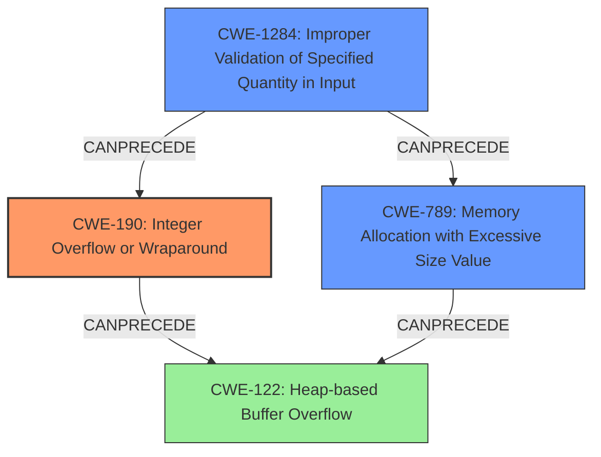

# Analysis Report for CVE-2022-1924

# Vulnerability Analysis Report: CVE-2022-1924

## Description

DOS / potential heap overwrite in mkv demuxing using lzo decompression. Integer overflow in matroskademux element in lzo decompression function which causes a segfault, or could cause a heap overwrite, depending on libc and OS. Depending on the libc used, and the underlying OS capabilities, it could be just a segfault or a heap overwrite. If the libc uses mmap for large chunks, and the OS supports mmap, then it is just a segfault (because the realloc before the integer overflow will use mremap to reduce the size of the chunk, and it will start to write to unmapped memory). However, if using a libc implementation that does not use mmap, or if the OS does not support mmap while using libc, then this could result in a heap overwrite.

## Vulnerability Description Key Phrases

**Rootcause:** integer overflow
**Impact:** segfault or heap overwrite
**Vector:** mkv demuxing using lzo decompression
**Product:** matroskademux element
**Component:** lzo decompression function

## Analysis (with Relationship Data)

# Summary
| CWE ID | CWE Name | Confidence | CWE Abstraction Level | CWE Vulnerability Mapping Label | CWE-Vulnerability Mapping Notes |
|---|---|---|---|---|---|
| CWE-190 | Integer Overflow or Wraparound | 1.0 | Base | Primary | Allowed |
| CWE-122 | Heap-based Buffer Overflow | 0.7 | Variant | Secondary Candidate | Allowed |

## Evidence and Confidence

*   **Confidence Score:** 0.85
*   **Evidence Strength:** HIGH

- **Analysis and Justification:**  
  - *Explanation:* The vulnerability description clearly states an **integer overflow** in the matroskademux element's lzo decompression function. This **integer overflow** leads to either a segfault or a heap overwrite, depending on the libc and OS. The "Vulnerability Description Key Phrases" section explicitly mentions "**rootcause: integer overflow**". The "CVE Reference Links Content Summary" confirms an **integer overflow** when a large decompressed size is encountered. This aligns directly with CWE-190, which describes a scenario where a calculation results in an integer overflow or wraparound. The MITRE mapping guidance for CWE-190 indicates this is ALLOWED.
  
  - *Relationship Analysis:* CWE-190 is a Base level CWE. While it doesn't have direct parent-child relationships in the provided information, it is related to other numeric errors. The integer overflow can lead to other issues, such as a heap overflow (CWE-122).

- **Confidence Score:**  
  - Confidence: 1.0 (Explicit mention of integer overflow as the root cause and supporting evidence from CVE details)

- **Analysis and Justification:**  
  - *Explanation:* The vulnerability description indicates that the **integer overflow** can lead to a heap overwrite. Specifically, if the libc implementation doesn't use mmap or if the OS doesn't support mmap, a heap overwrite can occur. This heap overwrite aligns with CWE-122, Heap-based Buffer Overflow, since the buffer that can be overwritten is allocated in the heap portion of memory. The MITRE mapping guidance for CWE-122 indicates that this is ALLOWED. The "CVE Reference Links Content Summary" also states a "Potential Heap Memory Corruption" is present, which is strongly correlated with CWE-122.
  
  - *Relationship Analysis:* CWE-122 is a variant of a buffer overflow. It arises because of the initial integer overflow (CWE-190) that leads to an incorrect memory allocation, which, in turn, results in a heap-based buffer overflow.

- **Confidence Score:**  
  - Confidence: 0.7 (The heap overflow is conditional based on the libc and OS. So, while likely, it is not guaranteed.)

## Criticism of Analysis

Okay, here's a review of the provided CWE analysis, incorporating the full CWE specifications:

**Overall Assessment:**

The analysis is generally good and identifies the core vulnerability (CWE-190) accurately. The inclusion of CWE-122 as a secondary candidate is also justified, given the potential for a heap overflow based on system configuration.  However, a few minor refinements and additions can improve the analysis further, particularly concerning alternative CWEs and potential mitigation strategies.

**Detailed Review:**

| CWE ID | CWE Name | Confidence | CWE Abstraction Level | CWE Vulnerability Mapping Label | CWE-Vulnerability Mapping Notes | Assessment |
|---|---|---|---|---|---|---|
| CWE-190 | Integer Overflow or Wraparound | 1.0 | Base | Primary | Allowed | **Correct.** The analysis provides strong evidence for this mapping.  The core issue is indeed an integer overflow that leads to subsequent problems. The high confidence level is appropriate. The provided CVE examples that link CWE-681 -> CWE-190 -> CWE-122 further support this assessment. |
| CWE-122 | Heap-based Buffer Overflow | 0.7 | Variant | Secondary Candidate | Allowed | **Correct.** The confidence level of 0.7 is well-justified.  The heap overflow is not guaranteed, but highly probable given the conditions described (libc implementation, OS mmap support).  The description clearly explains how the integer overflow leads to an incorrect buffer size, potentially causing a heap overflow. The listed examples also support the chain CWE-190 -> CWE-122. |

**Suggestions for Improvement:**

1.  **Consider CWE-789 (Memory Allocation with Excessive Size Value):** While the analysis focuses on the *under-allocation* due to integer overflow, consider the scenario *before* the overflow, if the system attempts to allocate a very large amount of memory. An attacker might try to provide an extremely large value (even within 32-bit integer limits) before the overflow occurs, causing excessive memory allocation. This directly relates to denial of service and is a weakness in itself.
    *   *Justification:*  The "CVE Reference Links Content Summary" mentions the large decompressed size.  Even *if* the overflow doesn't occur, attempting to allocate that much memory can be problematic.  The CWE-789 description fits: "The product allocates memory based on an untrusted, large size value, but it does not ensure that the size is within expected limits, allowing arbitrary amounts of memory to be allocated."
    *   *Confidence:* Moderate (0.6). It's a potential contributing factor, especially from a DoS perspective.
    *   *Abstraction Level:* Variant (appropriate)
    *   *Mitigation Consideration:* Focus on validating the *maximum* decompressed size allowed, regardless of whether an overflow occurs.

2.  **Further Explore Input Validation (CWE-20 and its children):** The analysis doesn't explicitly address input validation, although it's implied. Consider highlighting this aspect. The code *should* be validating the compressed data size *before* attempting decompression.
    *   *CWE-1284 (Improper Validation of Specified Quantity in Input):* This is a more specific child of CWE-20 and more closely related to the vulnerability than CWE-20 itself.
    *   *Justification:* The vulnerability wouldn't be exploitable if there were checks to ensure the decompressed size remained within acceptable boundaries *before* allocation.
    *   *Confidence:* High (0.8). Missing/incorrect input validation is a major contributor.
    *  *Mitigation Consideration:* Implement checks *before* decompression to limit the size of the decompressed data, preventing both integer overflows and excessive memory allocation.

3.  **Mitigation Strategies:**
    *   *CWE-190 Mitigations:* The analysis could explicitly mention mitigations from the CWE-190 specification such as:
        *   Using a language or compiler that performs automatic bounds checking (e.g., Rust).
        *   Using safe integer handling libraries (e.g., SafeInt in C++).
        *   Strictly defining protocols and requiring conformance.
    *   *CWE-122 Mitigations:* Mention compiler-based buffer overflow detection mechanisms (e.g., /GS flag in Visual Studio, FORTIFY_SOURCE in GCC). Also, reiterate the importance of using secure memory allocation routines.
    *   *CWE-789 Mitigations:* Add the following mitigation: "Perform adequate input validation against any value that influences the amount of memory that is allocated. Define an appropriate strategy for handling requests that exceed the limit, and consider supporting a configuration option so that the administrator can extend the amount of memory to be used if necessary."
    *   *CWE-1284 Mitigations:* Add the following mitigation: "Assume all input is malicious. Use an "accept known good" input validation strategy, i.e., use a list of acceptable inputs that strictly conform to specifications. Reject any input that does not strictly conform to specifications, or transform it into something that does."

4.  **Chaining and Relationship Clarity:** While the analysis mentions the relationship between CWE-190 and CWE-122, consider making the chain more explicit: `CWE-1284 -> CWE-190 -> CWE-122 OR CWE-789`. `CWE-1284` (Improper Input Validation) can lead to either `CWE-190` (Integer Overflow) *or* `CWE-789` (Memory Allocation with Excessive Size Value), and `CWE-190` leads to `CWE-122` (Heap-based Buffer Overflow).

**Revised Summary Table (with suggested additions):**

| CWE ID | CWE Name | Confidence | CWE Abstraction Level | CWE Vulnerability Mapping Label | CWE-Vulnerability Mapping Notes |
|---|---|---|---|---|---|
| CWE-190 | Integer Overflow or Wraparound | 1.0 | Base | Primary | Allowed |
| CWE-122 | Heap-based Buffer Overflow | 0.7 | Variant | Secondary Candidate | Allowed |
| CWE-789 | Memory Allocation with Excessive Size Value | 0.6 | Variant | Contributing Factor | Allowed |
| CWE-1284 | Improper Validation of Specified Quantity in Input | 0.8 | Base | Contributing Factor | Allowed |

By incorporating these suggestions, the analysis would provide a more comprehensive and nuanced understanding of the vulnerability, its causes, and effective mitigation strategies.

## Final Resolution

# Summary
| CWE ID | CWE Name | Confidence | CWE Abstraction Level | CWE Vulnerability Mapping Label | CWE-Vulnerability Mapping Notes |
|---|---|---|---|---|---|
| CWE-190 | Integer Overflow or Wraparound | 1.0 | Base | Primary | Allowed |
| CWE-1284 | Improper Validation of Specified Quantity in Input | 0.8 | Base | Contributing Factor | Allowed |
| CWE-789 | Memory Allocation with Excessive Size Value | 0.6 | Variant | Contributing Factor | Allowed |
| CWE-122 | Heap-based Buffer Overflow | 0.6 | Variant | Secondary Candidate | Allowed |

## Evidence and Confidence

*   **Confidence Score:** 0.85
*   **Evidence Strength:** HIGH

## Relationship Analysis
The analysis considers the hierarchical and chain relationships between CWEs. **CWE-190 (Integer Overflow or Wraparound)** is the primary **ROOTCAUSE**, leading to potential issues like **CWE-122 (Heap-based Buffer Overflow)**. **CWE-1284 (Improper Validation of Specified Quantity in Input)** is added as it **CANPRECEDE** both **CWE-190** and **CWE-789**. **CWE-789 (Memory Allocation with Excessive Size Value)** is included because even without an overflow, a large allocation can cause problems. The abstraction levels were considered to ensure the selections were at the optimal levels.

## Vulnerability Chain
The vulnerability chain starts with **CWE-1284 (Improper Validation of Specified Quantity in Input)**, leading to either **CWE-190 (Integer Overflow)** or **CWE-789 (Memory Allocation with Excessive Size Value)**. If **CWE-190** occurs, it can then result in **CWE-122 (Heap-based Buffer Overflow)**. The chain highlights the importance of input validation to prevent the subsequent weaknesses.

## Summary of Analysis
The initial analysis identified **CWE-190 (Integer Overflow or Wraparound)** and **CWE-122 (Heap-based Buffer Overflow)**. The criticism suggested adding **CWE-789 (Memory Allocation with Excessive Size Value)** and **CWE-1284 (Improper Validation of Specified Quantity in Input)**.

The decision to include **CWE-1284** is based on the fact that the vulnerability would likely not be exploitable if the input size were properly validated before decompression. This is evidenced by the need to validate the compressed data size before attempting decompression.
The decision to include **CWE-789** is based on the CVE description that mentions large decompressed size. Even if the overflow doesn't occur, attempting to allocate that much memory can be problematic.

The graph relationships influenced the final selection by highlighting the chain of events leading to the vulnerability. **CWE-1284** sets the stage for **CWE-190** or **CWE-789**, and **CWE-190** can then lead to **CWE-122**. These CWEs are at the optimal level of specificity because they accurately represent the **ROOTCAUSE** and contributing factors to the vulnerability.

*Report generated on 2025-03-18 08:21:54*
