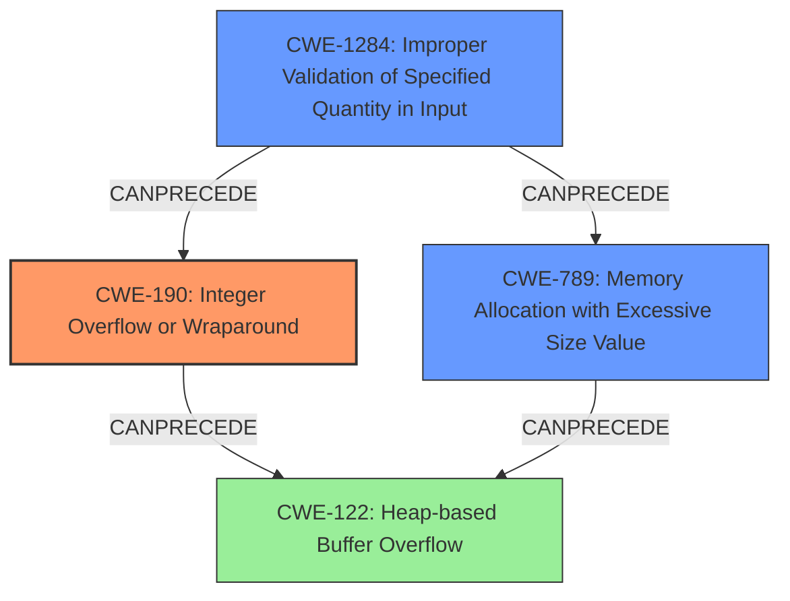

# Final Resolution for CVE-2022-1924

# Summary
| CWE ID | CWE Name | Confidence | CWE Abstraction Level | CWE Vulnerability Mapping Label | CWE-Vulnerability Mapping Notes |
|---|---|---|---|---|---|
| CWE-190 | Integer Overflow or Wraparound | 1.0 | Base | Primary | Allowed |
| CWE-1284 | Improper Validation of Specified Quantity in Input | 0.8 | Base | Contributing Factor | Allowed |
| CWE-789 | Memory Allocation with Excessive Size Value | 0.6 | Variant | Contributing Factor | Allowed |
| CWE-122 | Heap-based Buffer Overflow | 0.6 | Variant | Secondary Candidate | Allowed |

## Evidence and Confidence

*   **Confidence Score:** 0.85
*   **Evidence Strength:** HIGH

## Relationship Analysis
The analysis considers the hierarchical and chain relationships between CWEs. **CWE-190 (Integer Overflow or Wraparound)** is the primary **ROOTCAUSE**, leading to potential issues like **CWE-122 (Heap-based Buffer Overflow)**. **CWE-1284 (Improper Validation of Specified Quantity in Input)** is added as it **CANPRECEDE** both **CWE-190** and **CWE-789**. **CWE-789 (Memory Allocation with Excessive Size Value)** is included because even without an overflow, a large allocation can cause problems. The abstraction levels were considered to ensure the selections were at the optimal levels.

## Vulnerability Chain
The vulnerability chain starts with **CWE-1284 (Improper Validation of Specified Quantity in Input)**, leading to either **CWE-190 (Integer Overflow)** or **CWE-789 (Memory Allocation with Excessive Size Value)**. If **CWE-190** occurs, it can then result in **CWE-122 (Heap-based Buffer Overflow)**. The chain highlights the importance of input validation to prevent the subsequent weaknesses.

## Summary of Analysis
The initial analysis identified **CWE-190 (Integer Overflow or Wraparound)** and **CWE-122 (Heap-based Buffer Overflow)**. The criticism suggested adding **CWE-789 (Memory Allocation with Excessive Size Value)** and **CWE-1284 (Improper Validation of Specified Quantity in Input)**.

The decision to include **CWE-1284** is based on the fact that the vulnerability would likely not be exploitable if the input size were properly validated before decompression. This is evidenced by the need to validate the compressed data size before attempting decompression.
The decision to include **CWE-789** is based on the CVE description that mentions large decompressed size. Even if the overflow doesn't occur, attempting to allocate that much memory can be problematic.

The graph relationships influenced the final selection by highlighting the chain of events leading to the vulnerability. **CWE-1284** sets the stage for **CWE-190** or **CWE-789**, and **CWE-190** can then lead to **CWE-122**. These CWEs are at the optimal level of specificity because they accurately represent the **ROOTCAUSE** and contributing factors to the vulnerability.