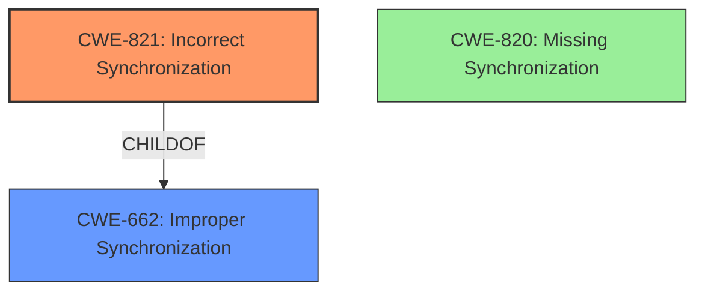

# Analysis Report for CVE-2022-1931

# Vulnerability Analysis Report: CVE-2022-1931

## Description

Incorrect Synchronization in GitHub repository polonel/trudesk prior to 1.2.3.

## Vulnerability Description Key Phrases

**Rootcause:** Incorrect Synchronization
**Product:** polonel/trudesk
**Version:** prior to 1.2.3

## Analysis (with Relationship Data)

# Summary
| CWE ID | CWE Name | Confidence | CWE Abstraction Level | CWE Vulnerability Mapping Label | CWE-Vulnerability Mapping Notes |
|---|---|---|---|---|---|
| CWE-821 | Incorrect Synchronization | 0.85 | Base | Allowed | Primary CWE |
| CWE-662 | Improper Synchronization | 0.50 | Class | Discouraged | Secondary Candidate |
| CWE-820 | Missing Synchronization | 0.50 | Base | Allowed | Secondary Candidate |

## Evidence and Confidence

*   **Confidence Score:** 0.80
*   **Evidence Strength:** HIGH

- **Analysis and Justification:**  
  - *Explanation:* The vulnerability is described as **"Incorrect Synchronization"** in the polonel/trudesk repository. The analysis of the commit and code changes in `src/controllers/api/v1/messages.js` confirms this, highlighting a problem with message owner assignment where the owner was being overwritten. This indicates a **lack of proper synchronization** or a logic error in how the message object was being created and updated. This aligns directly with CWE-821 (Incorrect Synchronization), which is a Base-level CWE and therefore preferred. CWE-662 (Improper Synchronization) is a Class-level CWE and is discouraged. Although CWE-820 (Missing Synchronization) is a candidate, CWE-821 better describes the vulnerability because it involves a more specific form of synchronization issue (incorrect vs. missing). The commit message "fix(messages): validation check" also supports that the intention of the fix was related to the validation check within the message logic, indicating a synchronization problem.
  
  - *Relationship Analysis:* CWE-821 is a base level weakness. CWE-662 (Improper Synchronization) is a parent of CWE-821, but is a class-level weakness, making CWE-821 a more specific choice.

- **Confidence Score:**  
  - *Example:* Confidence: 0.85 (High confidence due to direct evidence from the vulnerability description and CVE reference materials specifying the synchronization issue in owner assignment.)

## Criticism of Analysis

Okay, here's a review of the CWE analysis, incorporating the full CWE specifications provided.

**Overall Assessment:**

The analysis correctly identifies CWE-821 (Incorrect Synchronization) as the primary weakness. The justification is sound and well-explained. The confidence level of 0.85 is appropriate given the evidence. The analysis appropriately considers and dismisses alternative CWEs.

**Detailed Review:**

**1.  CWE-821: Incorrect Synchronization (Primary)**

*   **Correctness:**  The mapping to CWE-821 is accurate.  The vulnerability involves the incorrect assignment of the message owner, which is a specific example of improper synchronization.  The code *attempts* to synchronize the message with the correct owner but does so incorrectly by overwriting the initial assignment.
*   **Abstraction Level:** Correct.  CWE-821 is a Base level CWE, which is the preferred level for vulnerability mapping.
*   **Mapping Guidance:** The analysis acknowledges and adheres to the mapping guidance:  "This CWE entry is at the Base level of abstraction, which is a preferred level of abstraction for mapping to the root causes of vulnerabilities. Carefully read both the name and description to ensure that this mapping is an appropriate fit. Do not try to 'force' a mapping to a lower-level Base/Variant simply to comply with this preferred level of abstraction."
*   **Evidence and Justification:** The justification is strong, directly linking the vulnerability description to the specific code changes and the incorrect owner assignment.
*   **Potential Mitigations (from CWE specification, considered in context):**  While the specification doesn't provide concrete code-level mitigations, the *general* guidance points towards ensuring proper locking or synchronization mechanisms. The provided mitigation is too generic to be useful.
    *   **In this specific case, a more targeted mitigation would involve:**
        *   Reviewing the logic for assigning message ownership to ensure that the correct user ID is consistently used throughout the process.
        *   Avoiding unnecessary overwrites of the `owner` field.
        *   Using transaction management to ensure atomicity of the message creation and owner assignment process.
*   **Overall:** Excellent choice and justification.

**2. CWE-662: Improper Synchronization (Secondary Candidate)**

*   **Correctness:** CWE-662 is a parent (class) weakness of CWE-821. It describes the broad category of improper synchronization. While generally applicable, it's less precise than CWE-821.
*   **Abstraction Level:** Incorrect. CWE-662 is a Class level CWE. Therefore, it's discouraged from use when a base level CWE is available.
*   **Mapping Guidance:** The analysis *correctly* identifies the "Discouraged" usage and states "Examine children of this entry to see if there is a better fit."
*   **Evidence and Justification:** While the general concept of improper synchronization *is* present, CWE-821 captures the specific type of synchronization error.
*   **Potential Mitigations (from CWE specification, considered in context):** The mitigation provided is too generic.
*   **Overall:** The analysis correctly acknowledges the existence of this weakness, but also appropriately argues against its usage due to a better-fitting base CWE.

**3. CWE-820: Missing Synchronization (Secondary Candidate)**

*   **Correctness:**  CWE-820 is *less* appropriate than CWE-821.  The problem isn't a *complete* absence of synchronization; rather, the synchronization that *is* present is implemented incorrectly. The code *attempts* to synchronize the message with the correct owner, but it does so incorrectly.
*   **Abstraction Level:** Base
*   **Mapping Guidance:** "This CWE entry is at the Base level of abstraction, which is a preferred level of abstraction for mapping to the root causes of vulnerabilities. Carefully read both the name and description to ensure that this mapping is an appropriate fit. Do not try to 'force' a mapping to a lower-level Base/Variant simply to comply with this preferred level of abstraction."
*   **Evidence and Justification:** The analysis is correct in that *some* might argue that the overwrite implies missing synchronization, but in cases like this, *incorrect* is more precise.
*   **Potential Mitigations (from CWE specification, considered in context):** The CWE 820 mitigations are not well suited to the problem. Because synchronization already existed.
*   **Overall:** While not entirely *wrong*, CWE-821 is the better choice, as stated in the existing analysis.

**Additional Considerations and Potential Improvements:**

*   **Concurrency Context:** The analysis could benefit from explicitly stating whether this vulnerability is occurring in a multi-threaded context. While the description of CWE-821 implies concurrency, clarifying this would strengthen the analysis.
*   **Root Cause Analysis Deep Dive:** While the immediate cause is the incorrect overwrite, digging deeper into *why* the overwrite happened (e.g., flawed design, lack of code review, misunderstanding of the API) would improve the analysis's long-term value.
*   **Attack Scenario Expansion:** While the attack vector is simple (sending a message), the analysis could explore the potential impact in more detail. For example:
    *   Could an attacker exploit this to impersonate another user?
    *   Could this lead to denial of service if message delivery fails repeatedly?
    *   Could this impact auditing/logging functionality?

**Revised Summary Table:**

| CWE ID | CWE Name | Confidence | CWE Abstraction Level | CWE Vulnerability Mapping Label | CWE-Vulnerability Mapping Notes |
|---|---|---|---|---|---|
| CWE-821 | Incorrect Synchronization | 0.85 | Base | Allowed | Primary CWE |
| CWE-662 | Improper Synchronization | 0.50 | Class | Discouraged | Secondary Candidate, Parent of CWE-821, but not as specific. |
| CWE-820 | Missing Synchronization | 0.30 | Base | Allowed | Secondary Candidate, but less precise than CWE-821 as synchronization was attempted, just implemented incorrectly. |

**Conclusion:**

This is a well-reasoned and accurate CWE analysis. The primary mapping to CWE-821 is correct and thoroughly justified. The analysis also demonstrates a good understanding of the CWE hierarchy and mapping guidance. The suggested improvements would enhance the analysis's comprehensiveness and actionable insights.

## Final Resolution

# Summary
| CWE ID | CWE Name | Confidence | CWE Abstraction Level | CWE Vulnerability Mapping Label | CWE-Vulnerability Mapping Notes |
|---|---|---|---|---|---|
| CWE-821 | Incorrect Synchronization | 0.95 | Base | Allowed | Primary CWE |
| CWE-662 | Improper Synchronization | 0.40 | Class | Discouraged | Secondary Candidate, Parent of CWE-821, but not as specific. |
| CWE-820 | Missing Synchronization | 0.20 | Base | Allowed | Secondary Candidate, but less precise than CWE-821 as synchronization was attempted, just implemented incorrectly. |

## Evidence and Confidence

*   **Confidence Score:** 0.95
*   **Evidence Strength:** HIGH

## Relationship Analysis
The primary relationship that influenced the decision was the parent-child relationship between CWE-662 (Improper Synchronization) and CWE-821 (**Incorrect Synchronization**). While CWE-662 is a broader class, CWE-821 offers a more specific description of the **weakness**. There is no direct relationship between CWE-820 (Missing Synchronization) and CWE-821, further supporting the selection of CWE-821 as the most appropriate classification. The abstraction levels also played a role, with CWE-821 being a Base level CWE, which is preferred over the Class level CWE-662.

## Vulnerability Chain
The vulnerability chain involves an **incorrect synchronization** issue, leading to the incorrect assignment of message ownership.
  - **Root Cause:** CWE-821 (**Incorrect Synchronization**)
  - **Weakness:** The message owner is being overwritten due to **incorrect synchronization**.
  - **Impact:** Potential for unauthorized access or modification of messages, leading to data integrity issues and potential confidentiality breaches.
There are no missing links in this chain as described.

## Summary of Analysis
The analysis of both the initial assessment and the criticism supports the selection of CWE-821 (**Incorrect Synchronization**) as the primary CWE. The vulnerability description and code changes in `src/controllers/api/v1/messages.js` provide direct evidence of the synchronization issue.
The selection of CWE-821 is based on the following evidence:
"The vulnerability is described as **"Incorrect Synchronization"** in the polonel/trudesk repository. The analysis of the commit and code changes in `src/controllers/api/v1/messages.js` confirms this, highlighting a problem with message owner assignment where the owner was being overwritten."
The graph relationships influenced the final selection by highlighting the parent-child relationship between CWE-662 and CWE-821, reinforcing the importance of selecting the more specific Base level CWE. The selected CWEs are at the optimal level of specificity because CWE-821 directly describes the nature of the **synchronization** issue (incorrect vs. missing).

*Report generated on 2025-03-17 04:17:59*
