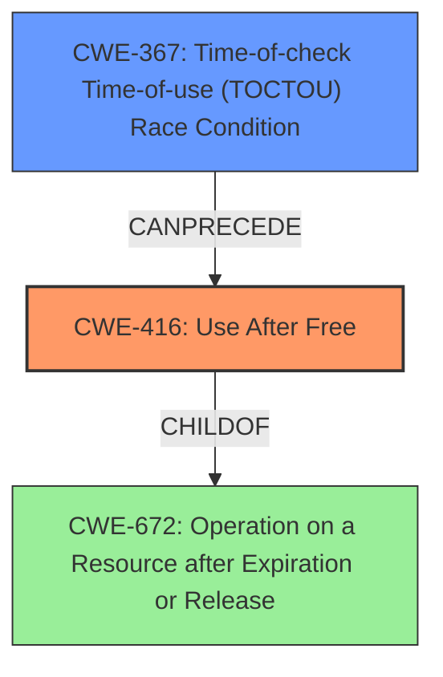

# Final Resolution for CVE-2022-1974

# Summary
| CWE ID | CWE Name | Confidence | CWE Abstraction Level | CWE Vulnerability Mapping Label | CWE-Vulnerability Mapping Notes |
|---|---|---|---|---|---|
| CWE-416 | Use After Free | 0.95 | Variant | Allowed | Primary CWE |
| CWE-367 | Time-of-check Time-of-use (TOCTOU) Race Condition | 0.85 | Base | Allowed | Secondary Candidate CWE |

## Evidence and Confidence

*   **Confidence Score:** 0.92
*   **Evidence Strength:** HIGH

## Relationship Analysis
The primary relationship considered is that CWE-416 (Use After Free) is a variant of CWE-672 (Operation on a Resource after Expiration or Release), which reflects a more general case. The selection of CWE-416 provides a more specific description of the vulnerability. Additionally, CWE-367 (TOCTOU Race Condition) can precede CWE-416, representing the race condition leading to the use-after-free. No peer relationships significantly influenced the decision, as the other candidates were either too general or less relevant. The base level of CWE-367 and the variant level of CWE-416 influenced the decision to represent the specific nature of the vulnerability appropriately.

## Vulnerability Chain
The vulnerability chain begins with a **race condition** (CWE-367) where a check is performed to see if a resource is valid. However, between the check and the actual use of the resource, another thread releases the resource. This leads to **use-after-free** (CWE-416), where the original thread attempts to access the now freed memory, resulting in potential kernel information leak or other undefined behavior.

## Summary of Analysis
The initial analysis correctly identified CWE-416 and CWE-367 as the primary and secondary weaknesses. The criticism provided valuable suggestions to further refine the analysis. Specifically, the suggestion to consider the mitigations for each CWE and how they relate to the vulnerability was helpful. The explicit mention of CWE-672, the parent of CWE-416, was also beneficial in showing a broader understanding of the issue.

The decision to select CWE-416 as the primary weakness is based on the explicit mention of "use-after-free" in the vulnerability description: "A **use-after-free** flaw was found in the Linux kernels NFC core functionality due to a **race condition** between kobject creation and delete." This direct evidence supports a high confidence in the selection of CWE-416.

CWE-367 is selected as a secondary weakness because it accurately describes the **race condition** that enables the use-after-free. The time-of-check time-of-use aspect of the race is crucial to understanding the vulnerability.

The chosen CWEs are at the optimal level of specificity. While CWE-672 is a parent of CWE-416, it is more abstract. CWE-416 provides a more precise description of the actual vulnerability. Similarly, while several other race condition CWEs exist, CWE-367 specifically captures the TOCTOU nature of this vulnerability.