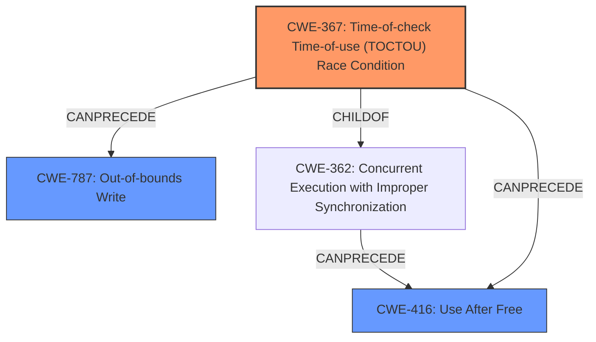

# Analysis Report for CVE-2022-20013

# Vulnerability Analysis Report: CVE-2022-20013

## Description

In vow driver, there is a possible memory corruption due to a race condition. This could lead to local escalation of privilege with System execution privileges needed. User interaction is not needed for exploitation. Patch ID ALPS05837742 Issue ID ALPS05837742.

## Vulnerability Description Key Phrases

**Rootcause:** race condition
**Weakness:** memory corruption
**Impact:** local escalation of privilege
**Product:** vow driver

## Analysis (with Relationship Data)

# Summary
| CWE ID | CWE Name | Confidence | CWE Abstraction Level | CWE Vulnerability Mapping Label | CWE-Vulnerability Mapping Notes |
|---|---|---|---|---|---|
| CWE-367 | Time-of-check Time-of-use (TOCTOU) Race Condition | 0.9 | Base | Allowed | Primary CWE |
| CWE-416 | Use After Free | 0.6 | Variant | Allowed | Secondary Candidate |
| CWE-787 | Out-of-bounds Write | 0.5 | Base | Allowed | Secondary Candidate |

## Evidence and Confidence

*   **Confidence Score:** 0.8
*   **Evidence Strength:** HIGH

- **Analysis and Justification:**  
  - *Explanation:* The vulnerability description explicitly states a **race condition** leads to possible **memory corruption** in the vow driver. The CVE Reference Link Content Summary confirms this, identifying the issue as CWE-367 (Time-of-check Time-of-use (TOCTOU) Race Condition) and indicating that the **race condition** can lead to **memory corruption**. CWE-367 is a Base level CWE, which is the preferred level of abstraction. The Retriever Results also list CWE-367 as the top candidate. The vulnerability involves checking the state of a resource before using it, but the state can change between the check and the use, which invalidates the results of the check - a hallmark of TOCTOU issues.

  - *Relationship Analysis:* CWE-367 doesn't have any direct relationships listed in the provided information. However, race conditions often lead to other memory corruption issues like use-after-free (CWE-416) or out-of-bounds write (CWE-787), since unsynchronized access can lead to unexpected states and data overwrites.

- **Confidence Score:**  
  - Confidence: 0.9 (High confidence because the CVE summary explicitly calls out CWE-367 and the vulnerability description aligns with the TOCTOU pattern)

---

- **Analysis and Justification:**  
  - *Explanation:* CWE-416 (Use After Free) is considered as a secondary candidate because the initial **memory corruption** caused by the **race condition** could potentially lead to a use-after-free scenario if a memory location is freed prematurely due to the timing issue and then subsequently accessed. While not explicitly stated, the **memory corruption** could manifest as a use-after-free. The Retriever Results list CWE-416 as a candidate, but its score is lower than CWE-367.

  - *Relationship Analysis:* CWE-416 is a variant and child of other weaknesses but none specifically stand out here. CWE-416 can be a consequence of a **race condition** when a resource is freed by one thread and then accessed by another that was expecting it to be valid.

- **Confidence Score:**  
  - Confidence: 0.6 (Medium confidence since it is a possible consequence of the **memory corruption** due to the **race condition**, but not explicitly stated)

---

- **Analysis and Justification:**  
  - *Explanation:* CWE-787 (Out-of-bounds Write) is also considered as a secondary candidate. Similar to CWE-416, the **memory corruption** stemming from the **race condition** could result in writing data outside the intended memory boundaries, thus triggering an out-of-bounds write. The similar CVE descriptions had CWE-787 as the top CWE.

  - *Relationship Analysis:* CWE-787 is a base level CWE. The **race condition** might allow one thread to overwrite memory belonging to another, thus writing out of bounds.

- **Confidence Score:**  
  - Confidence: 0.5 (Medium confidence since it is a possible consequence of the **memory corruption** due to the **race condition**, but not explicitly stated)

## Criticism of Analysis

Okay, here's a review of the provided analysis, considering the full CWE specifications:

**Overall Assessment:**

The analysis is well-structured, clearly explains the reasoning behind each CWE assignment, and provides confidence scores. The primary CWE assignment of CWE-367 (Time-of-check Time-of-use (TOCTOU) Race Condition) is accurate and well-supported. The secondary CWE candidates, CWE-416 (Use After Free) and CWE-787 (Out-of-bounds Write), are plausible consequences of the primary weakness, and the analysis adequately explains their potential relevance.  The confidence scores are also appropriate. The use of Base vs Variant CWEs is correct and appropriately reasoned.

**Detailed Review:**

**1. CWE-367 (Primary): Time-of-check Time-of-use (TOCTOU) Race Condition**

*   **Strengths:**
    *   The analysis correctly identifies the core issue as a race condition where the state of a resource changes between a check and its use.
    *   The CVE reference content directly supports the CWE-367 assignment.
    *   The justification is clear and concise.
    *   The confidence score of 0.9 is appropriate due to the explicit mention of TOCTOU in the CVE description.
    *   The analysis addresses the need for the attacker to influence the state of the resource as stated in the "Extended Description" portion of the CWE.
*   **Areas for Potential Improvement:**
    *   Could discuss potential mitigations from the CWE specifications, such as limiting the interleaving of operations on files from multiple processes or not performing a check before use. Although the latter is more about avoiding the *symptoms* of a TOCTOU and not solving the actual race.
    *   Mentioning how an attacker could *cause* the race condition may strengthen the evidence.

**2. CWE-416 (Secondary): Use After Free**

*   **Strengths:**
    *   The analysis correctly identifies a possible scenario where the memory corruption caused by the race condition could lead to a use-after-free.
    *   The confidence level is appropriate given that it is a *possible* consequence, not a certainty.
*   **Areas for Potential Improvement:**
    *   The analysis could benefit from a more concrete scenario of how the memory corruption leads to a use-after-free. For example:  "Thread A might free a memory buffer after Thread B checks if it is valid, but before Thread B uses the buffer."
    *   Discussing the mitigations for CWE-416 could add value. Specifically, the analysis could mention the possibility of setting pointers to NULL after freeing, or using a language with automatic memory management. This would highlight that the vulnerability could be mitigated by preventing the use-after-free *even if* the race condition leads to memory corruption.
    *   Consider the relationship with CWE-362. CWE-416 "CanFollow" CWE-362 (concurrent execution using shared resource with improper synchronization). But CWE-362 is a class level cwe, and CWE-367 is a child of CWE-362.

**3. CWE-787 (Secondary): Out-of-bounds Write**

*   **Strengths:**
    *   Similar to CWE-416, the analysis correctly identifies a possible out-of-bounds write scenario resulting from memory corruption due to the race condition.
    *   The confidence level is appropriate.
*   **Areas for Potential Improvement:**
    *   Like CWE-416, a more specific scenario would strengthen the justification. For example, "The race condition might allow one thread to overwrite a memory location outside the bounds of the buffer that another thread expects to own."
    *   The analysis could benefit from mentioning mitigation strategies from the CWE specification, such as using safer string-handling libraries or compiler-provided buffer overflow detection mechanisms.

**General Suggestions:**

*   **Chains and Composites:** The analysis mentions chains but could explicitly state that these relationships exist and why. For example, "This vulnerability is a chain consisting of a TOCTOU race condition (CWE-367) which leads to memory corruption. The memory corruption can manifest as either a use-after-free (CWE-416) or an out-of-bounds write (CWE-787), depending on the specific timing and memory management details."
*   **Mitigations:** While the primary focus is on identifying the CWE, briefly mentioning potential mitigations from the CWE specifications (even if not exhaustive) can add value to the analysis. It demonstrates a deeper understanding of the vulnerability and potential remediation strategies.

**Specific Points based on CWE Specifications:**

*   **CWE-367:**  The specification mentions that "TOCTOU issues do not always involve symlinks, and not every symlink issue is a TOCTOU problem."  This is not relevant to this vulnerability, but it is an example of specific information that could be used to add depth to the analysis (though only if relevant).
*   **CWE-416:** The specification notes that a key mitigation is to "set [freed] pointers to NULL."  This is a very straightforward mitigation to mention in the context of this vulnerability.  Also, CWE-416 is a child of CWE-672 ("Operation on a Resource after Expiration or Release"), indicating a broader class of vulnerabilities that may be helpful for understanding the problem.
*   **CWE-787:** The specifications highlight language selection as a mitigation strategy, such as choosing languages with built-in memory management or overflow protection.  Mentioning this could be beneficial.

**Revised Summary Table:**

| CWE ID  | CWE Name                                    | Confidence | CWE Abstraction Level | CWE Vulnerability Mapping Label | CWE-Vulnerability Mapping Notes                                                                                                                                                                                                                                                                                           |
| :------ | :------------------------------------------- | :--------- | :---------------------- | :----------------------------- | :----------------------------------------------------------------------------------------------------------------------------------------------------------------------------------------------------------------------------------------------------------------------------------------------------------------------- |
| CWE-367 | Time-of-check Time-of-use (TOCTOU) Race Condition | 0.9       | Base                    | Allowed                         | Primary CWE. The vow driver has a race condition where a resource's state changes between a check and its use, invalidating the results and causing memory corruption. Potential mitigation: Limit interleaving of operations on files from multiple processes.                                                         |
| CWE-416 | Use After Free                                 | 0.6       | Variant                  | Allowed                         | Secondary candidate.  The race condition leading to memory corruption *could* result in a use-after-free if a memory location is freed by one thread and accessed by another expecting it to be valid. Potential mitigation: Set pointers to NULL after freeing them.                                                        |
| CWE-787 | Out-of-bounds Write                            | 0.5       | Base                    | Allowed                         | Secondary candidate. The memory corruption resulting from the race condition *could* lead to data being written outside the intended memory boundaries. Potential mitigation: Use a language that provides automatic memory management or libraries with safe string handling functions.                                            |

By incorporating these suggestions, the analysis can be further strengthened by providing more context, demonstrating a more comprehensive understanding of the CWE specifications, and highlighting potential mitigation strategies.

## Final Resolution

# Summary

| CWE ID | CWE Name | Confidence | CWE Abstraction Level | CWE Vulnerability Mapping Label | CWE-Vulnerability Mapping Notes |
|---|---|---|---|---|---|
| CWE-367 | Time-of-check Time-of-use (TOCTOU) Race Condition | 0.9 | Base | Allowed | Primary CWE. The vow driver has a race condition where a resource's state changes between a check and its use, invalidating the results and causing memory corruption. Potential mitigation: Limit interleaving of operations on files from multiple processes. |
| CWE-416 | Use After Free | 0.6 | Variant | Allowed | Secondary candidate. The race condition leading to memory corruption *could* result in a use-after-free if a memory location is freed by one thread and accessed by another expecting it to be valid. Potential mitigation: Set pointers to NULL after freeing them. |
| CWE-787 | Out-of-bounds Write | 0.5 | Base | Allowed | Secondary candidate. The memory corruption resulting from the race condition *could* lead to data being written outside the intended memory boundaries. Potential mitigation: Use a language that provides automatic memory management or libraries with safe string handling functions. |

## Evidence and Confidence

*   **Confidence Score:** 0.8
*   **Evidence Strength:** HIGH

## Relationship Analysis
The primary weakness is identified as CWE-367 (**Time-of-check Time-of-use (TOCTOU) Race Condition**). While CWE-367 itself doesn't have explicit relationships defined in the provided data, its nature implies potential follow-on weaknesses related to memory corruption. The secondary candidates, CWE-416 (**Use After Free**) and CWE-787 (**Out-of-bounds Write**), are plausible consequences of the initial **race condition** leading to **memory corruption**. CWE-416 "CanFollows" CWE-362 (concurrent execution using shared resource with improper synchronization) and CWE-367 is a child of CWE-362. This strengthens the assessment of CWE-416 as a secondary candidate.

## Vulnerability Chain
The vulnerability chain starts with a **race condition** (CWE-367) in the vow driver. This **race condition** leads to **memory corruption**. The **memory corruption** can then manifest as either a **use-after-free** (CWE-416) if a memory location is freed prematurely and then accessed, or an **out-of-bounds write** (CWE-787) if data is written outside the intended memory boundaries.

## Summary of Analysis
The initial analysis and criticism both converge on CWE-367 as the primary weakness, supported by the explicit mention of a **race condition** in the vulnerability description: "In vow driver, there is a possible memory corruption due to a race condition." The CVE Reference Link Content Summary further confirms this, identifying the issue as CWE-367.

The relationship analysis supports the selection of CWE-416 and CWE-787 as secondary candidates because they are plausible consequences of the **memory corruption** resulting from the **race condition**. The fact that CWE-416 "CanFollows" CWE-362 and CWE-367 is a child of CWE-362, further supports the relationship between CWE-367 and CWE-416.

The selected CWEs are at the optimal level of specificity because CWE-367 is a Base level CWE that directly addresses the root cause (the **race condition**), while CWE-416 and CWE-787 are Variant and Base level CWEs, respectively, that describe the potential consequences of the **memory corruption**. Using Class level CWEs would be less specific and not as helpful in understanding the vulnerability.

The selection is evidence-based, using the vulnerability description and CVE summary as primary sources, and relationship analysis to strengthen the justification for the secondary candidates. The confidence scores reflect the level of certainty based on the available evidence and the plausibility of the potential consequences.

*Report generated on 2025-03-18 08:25:02*
