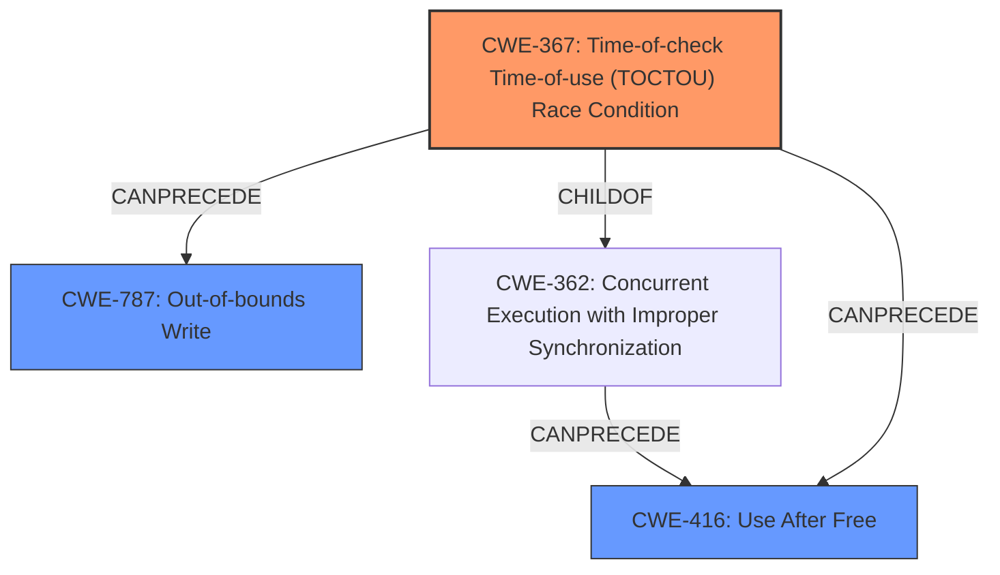

# Final Resolution for CVE-2022-20013

# Summary

| CWE ID | CWE Name | Confidence | CWE Abstraction Level | CWE Vulnerability Mapping Label | CWE-Vulnerability Mapping Notes |
|---|---|---|---|---|---|
| CWE-367 | Time-of-check Time-of-use (TOCTOU) Race Condition | 0.9 | Base | Allowed | Primary CWE. The vow driver has a race condition where a resource's state changes between a check and its use, invalidating the results and causing memory corruption. Potential mitigation: Limit interleaving of operations on files from multiple processes. |
| CWE-416 | Use After Free | 0.6 | Variant | Allowed | Secondary candidate. The race condition leading to memory corruption *could* result in a use-after-free if a memory location is freed by one thread and accessed by another expecting it to be valid. Potential mitigation: Set pointers to NULL after freeing them. |
| CWE-787 | Out-of-bounds Write | 0.5 | Base | Allowed | Secondary candidate. The memory corruption resulting from the race condition *could* lead to data being written outside the intended memory boundaries. Potential mitigation: Use a language that provides automatic memory management or libraries with safe string handling functions. |

## Evidence and Confidence

*   **Confidence Score:** 0.8
*   **Evidence Strength:** HIGH

## Relationship Analysis
The primary weakness is identified as CWE-367 (**Time-of-check Time-of-use (TOCTOU) Race Condition**). While CWE-367 itself doesn't have explicit relationships defined in the provided data, its nature implies potential follow-on weaknesses related to memory corruption. The secondary candidates, CWE-416 (**Use After Free**) and CWE-787 (**Out-of-bounds Write**), are plausible consequences of the initial **race condition** leading to **memory corruption**. CWE-416 "CanFollows" CWE-362 (concurrent execution using shared resource with improper synchronization) and CWE-367 is a child of CWE-362. This strengthens the assessment of CWE-416 as a secondary candidate.

## Vulnerability Chain
The vulnerability chain starts with a **race condition** (CWE-367) in the vow driver. This **race condition** leads to **memory corruption**. The **memory corruption** can then manifest as either a **use-after-free** (CWE-416) if a memory location is freed prematurely and then accessed, or an **out-of-bounds write** (CWE-787) if data is written outside the intended memory boundaries.

## Summary of Analysis
The initial analysis and criticism both converge on CWE-367 as the primary weakness, supported by the explicit mention of a **race condition** in the vulnerability description: "In vow driver, there is a possible memory corruption due to a race condition." The CVE Reference Link Content Summary further confirms this, identifying the issue as CWE-367.

The relationship analysis supports the selection of CWE-416 and CWE-787 as secondary candidates because they are plausible consequences of the **memory corruption** resulting from the **race condition**. The fact that CWE-416 "CanFollows" CWE-362 and CWE-367 is a child of CWE-362, further supports the relationship between CWE-367 and CWE-416.

The selected CWEs are at the optimal level of specificity because CWE-367 is a Base level CWE that directly addresses the root cause (the **race condition**), while CWE-416 and CWE-787 are Variant and Base level CWEs, respectively, that describe the potential consequences of the **memory corruption**. Using Class level CWEs would be less specific and not as helpful in understanding the vulnerability.

The selection is evidence-based, using the vulnerability description and CVE summary as primary sources, and relationship analysis to strengthen the justification for the secondary candidates. The confidence scores reflect the level of certainty based on the available evidence and the plausibility of the potential consequences.