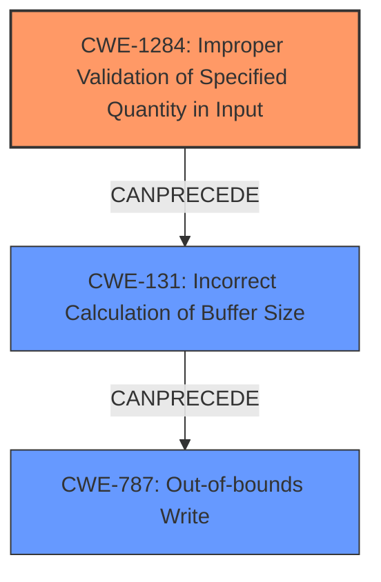

# Final Resolution for CVE-2022-20014

# Summary
| CWE ID | CWE Name | Confidence | CWE Abstraction Level | CWE Vulnerability Mapping Label | CWE-Vulnerability Mapping Notes |
|---|---|---|---|---|---|
| **CWE-1284** | Improper Validation of Specified Quantity in Input | 0.80 | Base | Allowed | Primary CWE. The vulnerability description indicates memory corruption due to **improper input validation**. This could involve failing to properly validate a size or length value provided in the input to the driver. An attacker might be able to specify an extremely large or negative size, which then leads to memory corruption. |
| **CWE-131** | Incorrect Calculation of Buffer Size | 0.70 | Base | Allowed | Secondary Candidate. The vulnerability description indicates a **memory corruption** due to **improper input validation**, which could involve incorrect calculation of buffer sizes. |
| **CWE-787** | Out-of-bounds Write | 0.60 | Base | Allowed | Secondary Candidate. The **memory corruption** is most likely an out-of-bounds write based on the context. |

## Evidence and Confidence

*   **Confidence Score:** 0.80
*   **Evidence Strength:** MEDIUM

## Relationship Analysis
- Parent-child hierarchical relationships: CWE-1284 is a child of CWE-20, making it more specific. CWE-787 is a child of CWE-119
- Chain relationships showing progression of vulnerability: **Improper input validation** (CWE-1284) can lead to incorrect buffer size calculation (CWE-131), which can lead to an **out-of-bounds write** (CWE-787), and ultimately, **memory corruption**.
- Peer relationships that offered alternative classifications: CWE-1285 was considered but determined to be less likely than CWE-1284, as the input is more likely specifying a quantity rather than an index/offset.
- Abstraction levels: Base level CWEs (CWE-1284, CWE-131, CWE-787) were preferred over class or pillar level CWEs (e.g., CWE-20) for greater specificity.

## Vulnerability Chain
- Initial flaw: **Improper input validation** of a specified quantity (CWE-1284)
- Sequence: This leads to an incorrect calculation of a buffer size (CWE-131). The undersized buffer is then written to out of bounds (CWE-787).
- Final impact: **Memory corruption**, leading to a local escalation of privilege.
- Missing links: The specific type of memory being corrupted (e.g., function pointer, kernel data structure) is not specified in the vulnerability description.

## Summary of Analysis
The analysis of the vulnerability description, along with the criticism provided, led to the conclusion that **CWE-1284 (Improper Validation of Specified Quantity in Input)** is the most appropriate primary CWE. The vulnerability description highlights "memory corruption due to **improper input validation**." Given this root cause, the most specific match is CWE-1284 because the input likely specifies a quantity (such as a size or length). This then leads to CWE-131 (Incorrect Calculation of Buffer Size) and ultimately to **CWE-787 (Out-of-bounds Write)**, causing memory corruption.

The decision to prioritize CWE-1284 over CWE-1285 was influenced by the observation that the vulnerability likely involves a size or length parameter. The criticism highlighted that CWE-1284 could be even *more* appropriate than CWE-1285 if the input is specifying a size or length, which aligns well with memory corruption scenarios.

The relationship analysis further supported the choice of these CWEs, as it demonstrated a clear chain from **improper input validation** to incorrect buffer size calculation and finally to **memory corruption**.

The chosen CWEs are at the optimal level of specificity because they are base-level CWEs that directly address the root cause and consequences of the vulnerability, rather than broad, high-level classifications such as CWE-20.

The vulnerability description states: "In vow driver, there is a possible memory corruption due to **improper input validation**." This statement is the primary evidence for selecting CWE-1284 and related CWEs. The phrase "local escalation of privilege" suggests that the memory corruption could allow an attacker to gain elevated privileges on the system.